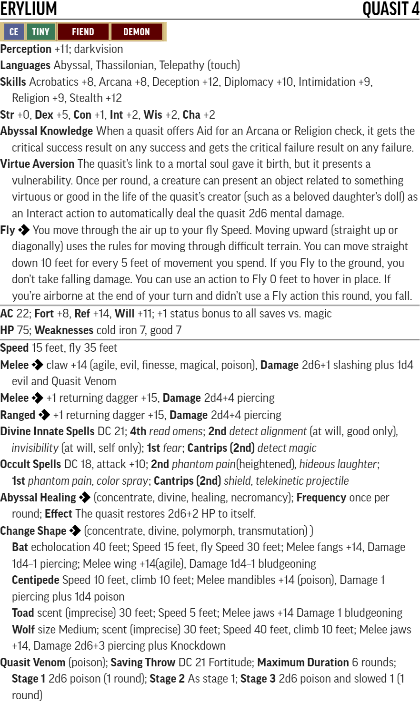
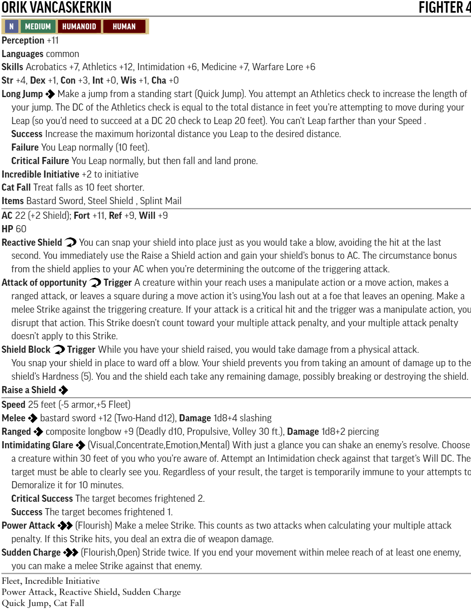
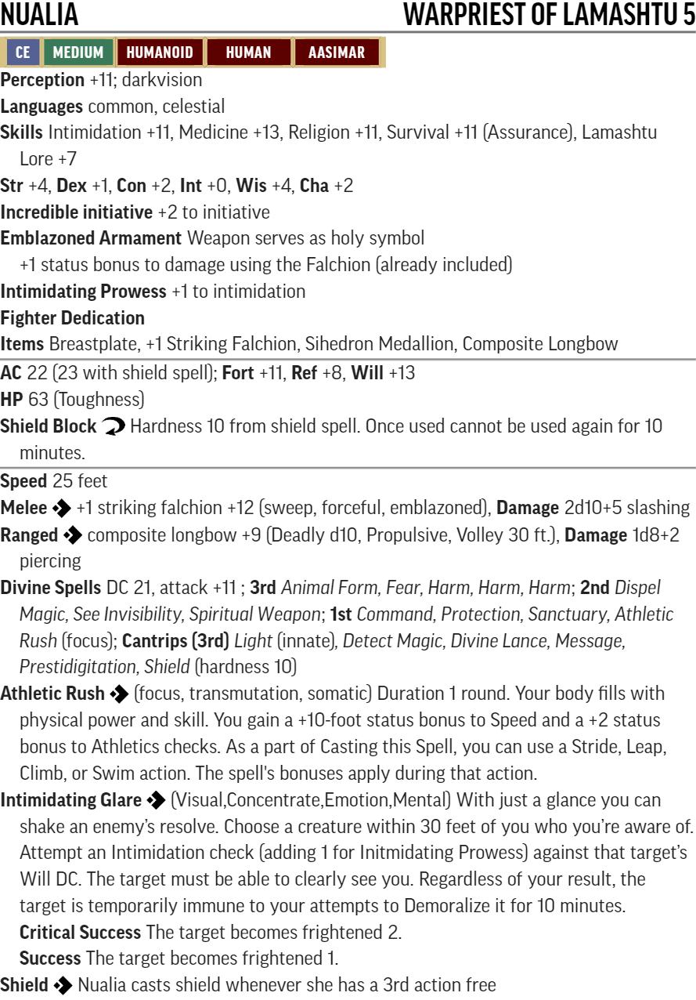

# RotR Burnt Offerings lv1-4

## Conversion Guide for Pathfinder second edition (2E)

  - This conversion guide only covers the items that have changed in 2E. This includes NPCs and monsters, hazards, DCs, XP, treasure, and occassionally tactics where they don't convert well from 1E.
  - The plot, backstory, color text, floor plans, maps, images and most tactics requires the original scenario.
  - Creatures are built using [Monster Builder](http://monster.pf2.tools/) and their JSON files are in a consolidated sub directory so that you can use or update them for your own campaign as required. In some instances there are several variants available.
  - The associated monster builder PDF and PNG files are also in this sub directory and referenced by this document (their unique numerical suffixes assigned by monster builder are removed to save updating this document every time the creature is tweaked)

## Party Level and Target Allocation of Treasure
- Lvl 1: up to the Catacombs of Wrath 
- Lvl 2: start Catacombs of Wrath (Pt3.5)
- Lvl 3: start Thistletop (Part 4)
- Lvl 4: conclusion of Thistletop (Part 4)

Level | Total gp | Permanent Items (P)   | Consumables (C)                  | Cash  | Part
------|----------|-----------------------|----------------------------------|-------|-----
Lv1   | 175gp    | **2nd:** 2 **1st:** 2 | **2nd:** 2 **1st:** 3            | 40gp  | 1 2
Lv2   | 300gp    | **3rd:** 2 **2nd:** 2 | **3rd:** 2 **2nd:** 2 **1st:** 2 | 70gp  | End of 3
Lv3   | 500gp    | **4th:** 2 **3rd:** 2 | **4th:** 2 **3rd:** 2 **2nd:** 2 | 120gp | 4
Lv4   | 860gp    | **5th:** 2 **4th:** 2 | **5th:** 2 **4th:** 2 **3rd:** 2 | 200gp | End of 4  

[Full Level to Wealth Chart](http://2e.aonprd.com/Rules.aspx?ID=581)

## Section status and rewards

Part | Title                   | Status                |  XP/total  | Items | Cash
-----|-------------------------|-----------------------|------------|-------|-----
1    | Festival and Fire       | creatures and XP done | 360 / 360  | P- C- | 140sp
2    | Local Heroes            | creatures and XP done | 240 / 600  | P- C- | 100sp
3A   | Glassworks              | creatures and XP done | 460 / 1060 |       | 
3B   | Catacombs               | creatures and XP done | 500 / 500  | |
4A   | Thistletop Approach     | most creatures/XP done | 560 / 1060 | |
4B   | Thistletop island top   | most creatures/XP done | 535 / 535  | |
4C   | Thistletop level 1      | most creatures/XP done | 340 / 875  | |
4D   | Thistletop level 2      | most creatures/XP done | 330 / 1205 | |
4E   | Malfeshnekor (optional) | done                  | 160 / 1365 | none | none

### General TO DO

  - DCs
  - Hazards
  - PF2 Treasure by level allocation - replace old treasure with new level guidelines

## Friendly NPC Roster (key stats only)

  - [Sherriff Belor Hemlock](https://2e.aonprd.com/NPCs.aspx?ID=936) - If required use the Watch Officer from the GMG.
  - 12x [Town Guard](https://2e.aonprd.com/NPCs.aspx?ID=933) - of which 3-4 are typically on duty at any one time with one on patrol. If required use the Guard from the GMG.
  - 60x Militia - combat trained weekly and can be activated at a few hours notice. If required use the Guard from the GMG. 
  - [Father Abstalar Zantus - cleric of Desna] - Cleric 4 
  - 4x [Cathedral Acolytes](https://2e.aonprd.com/NPCs.aspx?ID=893) using the Acolyte from the GMG.
  - [Ameiko Kaijutsu - tavern owner] Bard 4
  - [Ilsoari Gandethus - Headmaster] Wizard 4
  - [Daviren Hosk - stable owner] Ranger 4
  - [Shelelu Andosana - Elven Ranger] Ranger 5
  - [Brodert Quink - Sage] - Has the skill Thassilon Lore. Speaks Thassilonian and several other languages. 
  - townsfolk using the downtrodden, laborers, tradespeople, performers, publicans, foresters or other appropriate low level [NPCs](https://2e.aonprd.com/NPCs.aspx) from the GMG

  - Note there is a lot of background detail in the Sandpoint campaign setting that is useful, though with first edition stats. Be careful if using color text from it as it is set after the events of this adventure path and contains many subtle spoilers.
  
## Part 1: Festival and Fire (320xp, Party Level 1)

  - Part 1 shouldn't be brutal but rather fun and exciting. 
  - As the players run through Part 1, have Father Zantus or an acolyte come to their aid with healing if any of the PCs get too beat up. This is especially important before encounter 3 (Die Dog. Die!) which is a severe threat encounter. This is also a good intro to Father Zantus (cleric 4) who is protecting the Cathedral and directing his acolytes to help injured townsfolk.
  - Apply the [Weak](http://2e.aonprd.com/Rules.aspx?ID=791) template to creatures in later encounters if you need to reduce the difficulty for inexperienced or unlucky players.
  - Also possible is peripheral combat help from the town guard, militia and other key NPCs they may have met at the festival - such as tavern owner Ameiko Kaijutsu, schoolmaster Ilsoari Gandethus, stable owner Daviren Hosk - or just an arrow or crossbow bolt fired from a window or doorway by local militia. However, avoid taking agency away from the PCs.

### Goblin notes

  - During the festival raid the goblins use the opportunity to loot as much as possible and many will stuff their pockets or loot sacks with whatever they can lay their hands on: e.g. meat, fruit, (not vegetables!), bread, tankards, cups, cutlery, cooking utensils, pans, children's toys, wood carvings, souvenirs, jewellry, hats, chickens, butterflies, other tiny animals, babies...

### Initial Assault (60xp, low threat)

 - **Creatures:** 
    - 3x [Goblin Warriors](http://2e.aonprd.com/Monsters.aspx?ID=232)
 - **Loot:** none

### Goblin Pyros (120xp, severe threat)

  - **Creatures:** 
    - 2x[Goblin Pyro](http://2e.aonprd.com/Monsters.aspx?ID=234)
    - [Goblin War Chanter](http://2e.aonprd.com/Monsters.aspx?ID=235)
    - During Combat The warchanter casts bless and then uses her goblin song once each round until all PCs have been targeted. She rallies the goblins to focus on any PC who seems to be particularly dangerous. If she is wounded she casts soothe on herself.
    - **Loot:** none
 
### Die Dog Die! (140xp, severe threat)

  - **Creatures:** 
    - [Goblin Dog](http://2e.aonprd.com/Monsters.aspx?ID=236)
    - [Mounted Goblin Commando](http://2e.aonprd.com/Monsters.aspx?ID=233)
    - During Combat The goblin commando uses the superior mobilty of his mount by using the Command An Animal action each round to remain out of melee so he can shoot at the PCs with his bow from dogback. If all of his goblin warriors are defeated, he drops his bow and races in to fight the PCs in melee.
    - 3x [Goblin Warriors](http://2e.aonprd.com/Monsters.aspx?ID=232)
  - **Loot:** none

### Aftermath

  - **Loot:**
    - Ameiko rewards the Party with free lodging at the Rusty Dragon for a week (worth 35sp each = 140sp)

## Part 2: Local Heroes (240xp, Party level 1)

### Desecrated Vault (40xp, trivial threat)

  - **Creatures:** 
    - 2x [Skeleton Guard](http://2e.aonprd.com/Monsters.aspx?ID=372) - Explosive Death
    - add 1 or 2 additional skeletons if you want to increase the impact of this standalone encounter. Add 20xp for each skeleton added.
  - **Loot:** none

### The Shopkeepers Daughter (40-80xp, RP encounter)

  - **Creatures:** 
    - [Vin Vinder using Orc Brute for stats](https://2e.aonprd.com/Monsters.aspx?ID=324), AC15, HP15; (>>)Power Attack fist +7: dmg 2d4+3, nonlethal 
  - **XP:** - 40xp for beating him, 60xp for intimidate or deception, 80xp for Diplomacy without hurting his daughters feelings.

### The Boar Hunt (60xp, low threat)

  - **Creatures:**
    - 1x [Boar](https://2e.aonprd.com/Monsters.aspx?ID=52)
    - [Aldern Foxglove - Noble](http://www.pf2.easytool.es/tree/index.php?id=5645&name=noble) use the noble from the GMG (Creatures N - NPC Courtiers - Noble)
    - [Aldern's Servants](http://www.pf2.easytool.es/tree/index.php?id=5682&name=servant) use the servants from the GMG (Creatures N - NPC Laborers - Servant)
  - **Loot:**
    - 100sp reward from Aldern for rescuing him in the raid regardless of whether they accompany him on the boar hunt

### Trouble at the Rusty Dragon (30-40xp, RP encounter)

  - Conditional XP, 30xp for helping getting rid of Lonjiku, 40xp for doing so peacefully.

### Monster in the closet (40xp, trivial threat)

  - **Creatures:**
    - 1x [Goblin Commando](http://2e.aonprd.com/Monsters.aspx?ID=233) has only an improvised dagger.
  - **Loot:** None

## Part 3A: Glassworks (460xp, Party Level 1)

### The Missing Bartender / Investigating the glassworks (20-60xp, RP encounter) 

  - 20xp for following up on the missing bartender and investigating the glassworks
  - 20xp for entering without breaking the door down
  - 20xp for dispersing onlookers

### Against the goblins part 1 (up to 160xp, extreme threat)

  - **Creatures:**
    - 8x [Goblin Warriors](http://2e.aonprd.com/Monsters.aspx?ID=232)
  - **Loot:** None

### Against the Goblins Part 2 (120xp+, severe threat)

  - **Creatures:**
    - Any goblins that fled part 1 join Tsuto here
    - [Tsuto PDF](./NPC-Monsters-Statblocks/Tsuto.pdf)

  - **XP:** 
    - 120xp + 20xp per goblin who joined.
  - **Loot:**
    - [Handwraps of might blows](https://2e.aonprd.com/Equipment.aspx?ID=441) (P2)
    - [Composite Shortbow](https://2e.aonprd.com/Weapons.aspx?ID=75) (P1)
    - [Thieves Tools](https://2e.aonprd.com/Equipment.aspx?ID=58)

### Rescuing Ameiko (60xp, RP encounter)

  - 60xp for rescuing her.
  - Ameiko is unconscious and will wake at GM discretion or with any healing
  - **Loot:**
    - Ameiko rewards the Party with free lodging at the Rusty Dragon for life (worth 35sp per week each when in town). This is not included in the level based cash total.

### Interrogating Tsuto (0/60xp, RP encounter)

  - 60xp for finding a way of getting Tsuto to talk (if still alive)

### End of Level 1 (XP, cash and items cross check)

  - at this point the party should have:
    - enough XP to level up
    - cash: 40gp 
    - items: 2xP1, 2xP2, 2xC2, 3xC1

## Part 3B. Catacombs of Wrath (500xp, Party Level 2) 

### B1. Guard Cave (40xp, trivial threat)

  - **Creatures:**
    - [Wrathspawn](https://2e.aonprd.com/Monsters.aspx?ID=371)
  - **Loot:** None

### B3. Welcoming Chamber

  - **Loot:**
    - Ancient Ornamental Ranseur (a long trident with a central prong that's longer than the other two) moderate art object worth 250sp

### B4. Washing Pool (40xp, trivial threat)

  - **Creatures:**
    - [Vargouille PDF](./NPC-Monsters-Statblocks/Vargouille.pdf)  

    

    - Alternatively replace with [animated statue of Lamashtu](https://2e.aonprd.com/Monsters.aspx?ID=20)

### B6. Ancient Prison (80xp, moderate threat)

  - **Creatures:**
    - 2x [Wrathspawn](https://2e.aonprd.com/Monsters.aspx?ID=371)

### B8. Ancient Study

  - **Loot:**
    - [Scroll of Flaming Sphere heightened to level 3](https://2e.aonprd.com/Spells.aspx?ID=121) (C4), Perception DC 19

### B9. Prisoner Pits (60xp, moderate threat, plus 20xp for dealing with the zombies)

  - **Creatures:**
    - 11x [Zombie Shambler](https://2e.aonprd.com/Monsters.aspx?ID=423)
    - [Koruvus PDF](./NPC-Monsters-Statblocks/Koruvus.pdf)
    

  - **Loot:**
    - +1 weapon potency rune (P2)
    - low grade silver dagger (P2)
 
### B11. Meditation Chamber

  - **Loot:**
    - [Scroll of Burning Hands heightened to level 2](https://2e.aonprd.com/Spells.aspx?ID=30) (C2)
    - [Wand of Shocking Grasp](https://2e.aonprd.com/Spells.aspx?ID=283) (P3)

### B12. Shrine to Lamashtu

  - Waters of Lamashtu, Fortititude Save DC 22 
    - Drinking the Waters of Lamashtu temporarily twists your mind and body. Repeated doses over many weeks can cause permanent changes that are rarely beneficial.
    - Critical Success: No effect
    - Success: Sickened 1 as your body purges the waters from your system
    - Failure: Clumsy 1 and Stupefied 1 for 1 minute
    - Critical Failure: Clumsy 1 and Stupefied 1 for 1 day
    - Any failure gives visions of your worst mental character flaw or personal failure amplified and twisted to a horrific degree - and it feels like your body is being twisted into a dark mockery of your best physical features.
  - **Loot:**
    - 4 doses of unholy water (not included in level based treasure as highly unlikely to have any utility, though may have some creative uses)

### B13. Cathedral of Wrath (120xp, severe threat, plus 120xp for deactivating the runewell)

  - **Creatures:**
    - [Wrathspawn](https://2e.aonprd.com/Monsters.aspx?ID=371)
    - [Erylium PDF](./NPC-Monsters-Statblocks/Erylium.pdf)
    
    

    - Note that to stay flying Erylium must use at least one fly move action per turn. 
    - There are several ornamental wall features around the room she can fly between and perch on, though these are not large enough to give her cover. 

  - **Loot:**
    - +1 weapon potency rune (P2)
    - returning rune (P3)
    - low grade cold iron dagger

## Part 4A. Thistletop Approach (565xp, assumed party level 2)

  - A full frontal assault would be a serious mistake for the party. The encounters here require bypassing, splitting or neutralizing and at all costs to avoid them running together.
  - Shalelu should have forwarned them and, for inexperienced players, consider having her accompany them to provide tactical advice and/or combat support - though in a background way that does not take away from the party achievements.
  - The terrain for all encounters here increases the threat level by one step - and adds bonus XP appropriately (as if the creatures encountered were 1 level higher).

### C4. Refugees Nest (120xp, severe threat, plus 40xp for terrain)

  - **Creatures:**
    - 8x [Goblin Warriors](http://2e.aonprd.com/Monsters.aspx?ID=232)

### C5. Kennel (120xp, severe threat, plus 40xp for terrain)

  - **Creatures:**
    - 4x [Goblin Dog](http://2e.aonprd.com/Monsters.aspx?ID=236) 
  - this encounter can be bypassed. If successfully bypassed award the same xp.

### C6/7. Tangletooth's Den and Gogmurt's Lair (80xp, moderate threat, plus 40xp for terrain)

  - **Creatures:**
    - Tangletooth {Use cat Stats from CRB pg. 215}
    - Gogmurt {Goblin Druid/Rogue 5 - see below}

### Gogmurt and Tangletooth

Gogmurt {Goblin, Druid Archetype Rogue}
Perception: +9; Languages: Common, Goblin
Skills: +5; Athletics: +5, Crafting: +5, Nature: +10, Survival: +9, Thievery: +9
Str: 0, Dex: +4, Con: +2, Int: 0, Wis: +4, Cha: 0,
AC: 20, TAC: 17, Fort: +8, Ref: +9, Will: +10, Resistance: Fire 3
HP: 56
Weapon: Light Mace: +10 {1d4}
Actions: Savage Slice: Must have made an attack with the previous action; Make another Strike against the same target with the same weapon, if it hits add an additional damage die
Spell Roll: +9, DC: 19; Spell Points: 4
Cantrips: Produce Flame{2A}, Tanglefoot{2A}, Guidance{2A}, Know Direction{2A};
 {1st} Burning Hands{2A}, Goblin Pox{2A}, Magic Fang{2A},
{2nd}Barkskin{2A}, Entangle{2A}, Burning Hands{2A},
{3rd} Produce Flame, Wall of Thorns{3A}
Feats: Burn it{Ancestry}, Flame Heart{Ancestry}, Savage Slice{Druid}, Rogue Dedication{Druid}, Forager{Skill}, Natural Medicine{General}
Items: Expert Hide, Lesser Healing Potion, Holly Bush Feather Token pg571

Tangletooth {Cat Animal Companion, Small}
Perception: +7; Senses: Scent
Skills: Stealth: +7
HP: 34; Speed: 25
Str: +2, Dex: +2, Con: 0, Int: -4, Wis: +2, Cha: -1
Jaws{Finesse}: +7 {1d6+2 P}
Claw{Agile}: +3 {1d4+2 S}
Special: Deal 1d6 additional damage against a flatfooted foe
Work Together {Action}: If Tangletooth threatens the target of Gogmurts Strikes, Gogmurts strikes make the target flatfooted until the end of his next turn.

### C27. Bunyip Lair (60xp, low threat, plus 20xp terrain)

  - **Creatures:**
    - [Bunyip](http://2e.aonprd.com/Monsters.aspx?ID=62)
  - **Loot:** None

## Part 4B. Thistletop island top (545xp, assumed party level 3)

  - Note if the party is not level 3 by this point the encounters are probably too hard.

### C9. Rope Bridge (5xp Hazard)

  - Simple hazard, but potentially high damage and possibility of drowning.
  - DC 18 Stealth to detect, save as per scenario.
  - 80 foot fall into water = 60ft fall damage = 30HP.

### C10. Thistletop (120xp, severe threat)

  - **Creatures:**
    - 4x [Goblin Warriors](http://2e.aonprd.com/Monsters.aspx?ID=232)
    - 4x [Goblin Dog](http://2e.aonprd.com/Monsters.aspx?ID=236)

### C13. Pickle Thieves (40xp, trivial threat)

  - **Creatures:**
    - 2x [Goblin Commando](http://2e.aonprd.com/Monsters.aspx?ID=233)

### C14. Barracks (60xp, low threat)

  - **Creatures:**
    - 6x [Goblin Warriors](http://2e.aonprd.com/Monsters.aspx?ID=232)

### C15. Eastern Guard Tower (40xp, trivial threat)

  - **Creatures:**
    - 2x [Goblin Commando](http://2e.aonprd.com/Monsters.aspx?ID=233)

### C16. Exercise Yard (80xp)

  - **Creatures:**
    - 4x [Goblin Dog](http://2e.aonprd.com/Monsters.aspx?ID=236)

### C18. Caged Horse (30xp, trivial threat)

  - **Creatures:**
    - [War Horse](https://2e.aonprd.com/Monsters.aspx?ID=268)
    - If made friendly then Shadowmist the war horse can be calmed with the Command Animal action (untrained Nature check) vs the Horses will DC of 16.

### C19. Throne Room (160xp, extreme threat)

  - **Creatures:**
    - [Chief Ripnugget PDF](./NPC-Monsters-Statblocks/ChiefRipnugget.pdf)  
  
    - [Giant Gecko](https://2e.aonprd.com/Monsters.aspx?ID=288)
    - 3x [Goblin Commando](http://2e.aonprd.com/Monsters.aspx?ID=233)
    - 1x [Goblin Warchanter](http://2e.aonprd.com/Monsters.aspx?ID=235)

### C23. Chieftan's Room

  - **Loot:**
    - DC 16 Seek to find Iron Key to chest in C24.
    - DC ?? to find Silver Holy symbol of Lamashtu, ??sp

### C24. Treasury (10xp Hazard)

  - **Hazard:**    
    - [Rusty Scythe Blade](https://2e.aonprd.com/Hazards.aspx?ID=6) with only a single blade. If it hits target must save vs [Tetanus](https://2e.aonprd.com/Diseases.aspx?ID=3)  
  - **Loot:**
    - Assorted coinage to the value of 50gp
    - Gold Holy Symbol of Sarenrae worth 10gp
    - Jade Necklace worth 5gp
    - Blue Silk Gown worth 15gp.
    - Infiltrator’s Elixir pg548
    - Lesser Healing Potion

## Thistletop Dungeon Level 1 (340xp, Assumed party level 3)

### D2. Chieftan's Harem (80xp, moderate threat)

  - **Creatures:**
    - 4x [Goblin Warriors](http://2e.aonprd.com/Monsters.aspx?ID=232)
    - [Bruthazmus PDF](./NPC-Monsters-Statblocks/Bruthazmus.pdf)  

### D4b. Orik's Chambers (60xp, low threat)

  - **Creatures:**
    - [ Orik Vancaskerkin PDF](./NPC-Monsters-Statblocks/OrikVancaskerkin.pdf)  

  - **Tactics:**
    - When dropped below half HP, Orik can be persuaded to fight with the PC’s or to just leave.

### D7. Tentamort Hunting Grounds (60xp, low threat)

  - **Creatures:**
    - 1x [Tentamort PDF](./NPC-Monsters-Statblocks/Tentamort.pdf)  

### D12. Chapel to Lamashtu (80xp, moderate threat)

  - **Creatures:**
    - 2x [Yeth Hound](https://2e.aonprd.com/Monsters.aspx?ID=870)

### D15. Research Room (60xp, low threat)

  - **Creatures:**
    - [Lyrie Akenja PDF](./NPC-Monsters-Statblocks/LyrieAkenja.pdf)  

  - **Tactics** - Replace the "During Combat" tactics with the following:
    - Lyrie is a firm believer in the adage that wizards belong nowhere near the front line of combat. If she expects to be engaged in close range combat or to be targeted then she casts mirror image. When she is forced into combat, she prefers her long range offensive abilities, such as Magic Missile, Hand of the Apprentice and Reach Spell solutions. 

  - **Loot:**
    - Wand of Mage Armor (P3)
    - Spellbook worth 18GP (6x second level spells)

## Thistletop Dungeon Level 2 (490xp, Assumed party level 3)

### E3. Trapped Hall Level 4 (10xp)

Stealth DC 23,
Disable: Expert Crafting DC 17 or Trained Thievery DC 19
Reflex DC 17
Success: no Damage
Critical Success: Same as Success but Creature also takes a free Step Action in either direction and avoids being caught.
Failure: 2d8+6 Damage
Critical Failure: 4d8+12 Damage

### E4. Observation Deck (120xp, severe threat)

  - **Creatures:**
    - [Yeth Hound](https://2e.aonprd.com/Monsters.aspx?ID=870)
    - [Nualia PDF](./NPC-Monsters-Statblocks/Nualia.pdf) 
     

  - **Tactics**
    - Before combat: If forewarned: Nualia uses the Sihedron Medallion to cast False Life, then casts Protection (either Good of Lawful, depending on what she knows about the party), and finally Spiritual Weapon, though she is unlikely to be able to sustain it for long.
    - During Combat: Nualia uses her heightened Fear spell and Intimidating Glance to demoralize her enemies. Then follows up with sweeping Falchion attacks and harm. She uses her Shield spell if she has an action free.
    - Morale : if reduced to 21 or less HP, she tries to escape. She casts Sanctuary, Athletic Rush or Animal Form (for speed) as approprite to make good her escape.

  - **Loot**
    - Breastplate, Composite Longbow
    - Sihedron Medallion[P5], +1 Striking Falchion [P3], 
 
### E6. Crypt (80xp, moderate threat)

  - **Creatures:**
    - 2x weak [Shadows](https://2e.aonprd.com/Monsters.aspx?ID=362)
    - Note that standard Shadows are a much higher threat in 2E, so reduced numbers. 

### E7. Collapsed Treasury (80xp, moderate threat)

  - **Creatures:**
    - [Giant Hermit Crab PDF](./NPC-Monsters-Statblocks/GiantHermitCrab.pdf)

  - **Loot:**
    - 1400sp
    - Mistform Elixir
    - +1 Armor Rune

### E9. Transmutation Room

  - **Loot:**
    - Wand of 2nd level spell
    - Lesser Elixir of Life
    - Disrupting Rune
    - +1 Weapon Potency Rune
    - +1 Heavy Armor Rune

### E10. Malfeshnekors Prison (160xp, extreme threat)

  - **Creatures:**
    - [Greater Barghest](https://2e.aonprd.com/Monsters.aspx?ID=43)

### Returning to town (RP encounter and local reward)

  - **XP:** explaining that the threat from Thistletop is stopped. 
  - **Loot:**
    - TBD
    - 20gp.

# --- End of Burnt Offerings 2E conversion guide ---