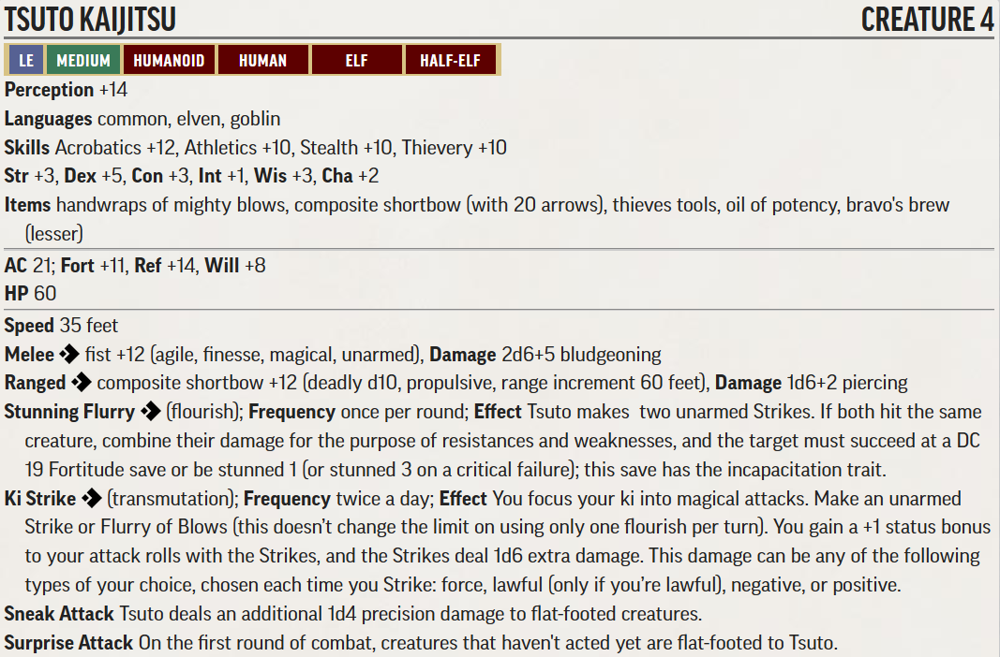
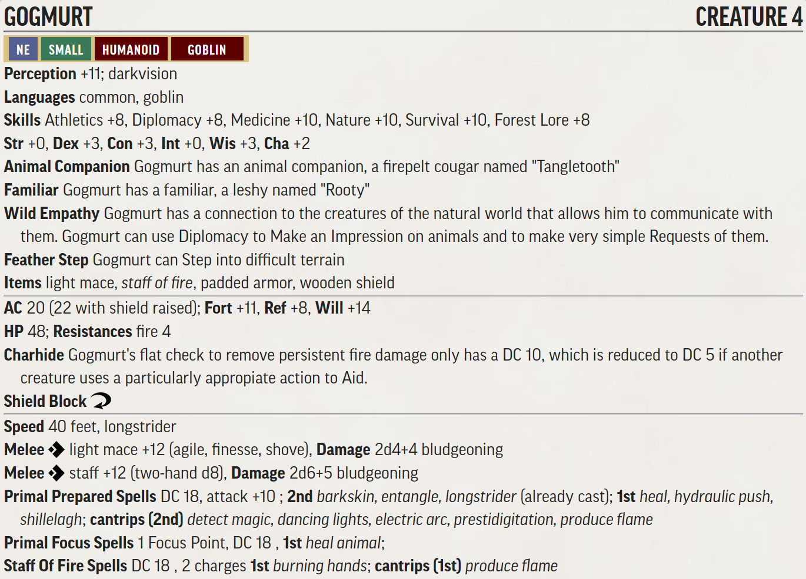
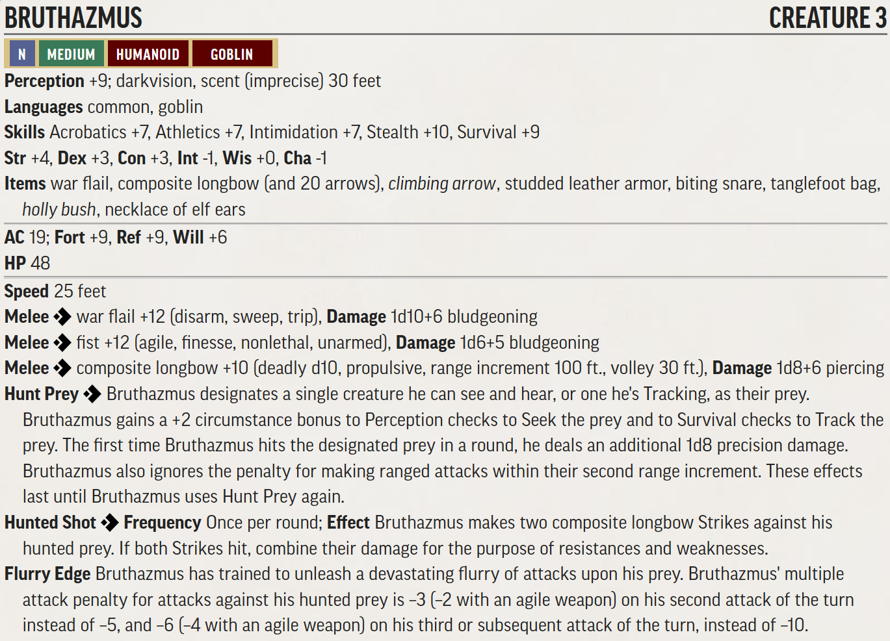
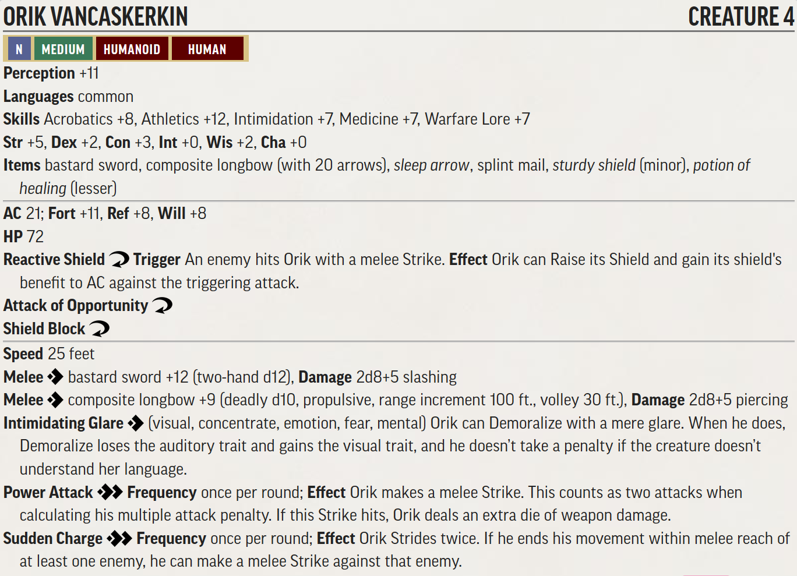

# RotR Burnt Offerings (Level 1-4)

## Conversion Guide for Pathfinder second edition (2E)

  - This conversion guide only covers the items that have changed in 2E. This includes NPCs and creatures, hazards, XP, treasure, and occassionally tactics where they don't convert well from 1E.
  - The plot, backstory, color text, floor plans, maps, images and most tactics requires the original scenario.
  - Creatures, hazards, items, poisons, adjustments, etc. that exist in second edition are usually linked to the relevant entry in [Archives of Nethys - second edition](https://2e.aonprd.com/).
  - Unique and missing 2E creatures are built using [Monster Builder](http://monster.pf2.tools/) and their JSON, PDF and PNG files are in the statblocks directory so that you can use or update them for your own campaign as required. In some instances there are several variants available.
  - If you find an issue, error or omission, have a suggestion for improvement, or a better version of something, then create a pull request. This is a community project and we welcome and rely on community contributions.

## TO DO
  - 2E Treasure by level allocation - replace old treasure with new level guidelines

## General GM information

  - This is a fan created unofficial guide, and what it contains is therefore a series of suggestions, that you can take, modify or leave as you see fit.
  - DCs are not converted to 2E, except where they are contained within a creature or hazard stat block, or are particularly significant. This is left up to GM discretion. See [level based DCs](https://2e.aonprd.com/Rules.aspx?ID=554) for guidance.
  - Note there is a lot of background detail in the Sandpoint campaign setting that is useful, though with first edition stats. Be careful if using color text from it as it is set after the events of this adventure path and contains many subtle spoilers.

## Party Levelling Milestones

- Level 1: up to the Catacombs of Wrath 
- Level 2: start Catacombs of Wrath (Pt3.5)
- Level 3: start Thistletop (Part 4)
- Level 4: conclusion of Thistletop (Part 4)
- Level 5: party should be close to (or just at) level 5 at the end of the book (within 200 XP). 

Using Fast Track Advancement, as per the original AP, the target for this book is therefore 3,000+ level adjusted XP. There is around 10% more than this available in the book, to allow for optional encounters.

## Section XP rewards

Part | Title                   | Max XP 
-----|-------------------------|-------
1    | Festival and Fire       |  350  
2    | Local Heroes            |  260 
3A   | Glassworks              |  410  
3B   | Catacombs               |  490 
4A   | Thistletop Approach     |  500 
4B   | Thistletop island top   |  540 
4C   | Thistletop level 1      |  340 
4D   | Thistletop level 2      |  530  

## Target Allocation of Treasure

Level | Total gp | Permanent Items (P)   | Consumables (C)                  | Cash  | Part
------|----------|-----------------------|----------------------------------|-------|-----
Lv1   | 175gp    | **2nd:** 2 **1st:** 2 | **2nd:** 2 **1st:** 3            | 40gp  | 1 2
Lv2   | 300gp    | **3rd:** 2 **2nd:** 2 | **3rd:** 2 **2nd:** 2 **1st:** 2 | 70gp  | End of 3
Lv3   | 500gp    | **4th:** 2 **3rd:** 2 | **4th:** 2 **3rd:** 2 **2nd:** 2 | 120gp | During 4
Lv4   | 860gp    | **5th:** 2 **4th:** 2 | **5th:** 2 **4th:** 2 **3rd:** 2 | 200gp | During 4  

[Full Level to Wealth Chart](http://2e.aonprd.com/Rules.aspx?ID=581)

Treasure allocation approach: https://docs.google.com/spreadsheets/d/1a_elP7ClHzSNUCdade_noig8yZDG5dQXmBSDK98G1_A/edit?usp=sharing

This adventure contains all treasure for 1st through 4th levels.

The wealth to level chart was followed such that the treasure explicitly laid out in the "loot" sections adds up to exactly 1,835 GP in value (175 gp + 300 gp + 500 gp + 860 gp). Permanent items and consumables matching the guidelines were provided (i.e. 2x 1st level and 2x 2nd level permanent items for Level 1).

It's assumed that even though NPCs may use consumable items in their possession, those items will still become part of the loot. If you decide not to do this, you should replace it with something else (or just increase the cash value of currency items).

Currency is lower than the guidelines, due to the cost of the permanent and consumable items.

Spellbooks are valued at 50% of the cost of "learn a spell" for the highest level spells only, usually those currently memorized by the NPC.

Sihedron Medallions are valued at 500 gp (equivalent to a 2nd level wand of False Life).

Treasure was provided for a party of 4. If you have additional party members, include additional treasure and items per the "Full level to Wealth Chart" and accompanying information linked above.

Note there is no contingency in the treasure. If your players miss something early on in the adventure, you may need to include additional items later.

## Friendly NPC Roster (key stats only)

  - [Sherriff Belor Hemlock](https://2e.aonprd.com/NPCs.aspx?ID=936) - If required use the Watch Officer from the GMG.
  - 12x [Town Guard](https://2e.aonprd.com/NPCs.aspx?ID=933) - of which 3-4 are typically on duty at any one time with one on patrol. If required use the Guard from the GMG.
  - 60x Militia - combat trained weekly and can be activated at a few hours notice. If required use the Guard from the GMG. 
  - [Father Abstalar Zantus - cleric of Desna] - Cleric 4 
  - 4x [Cathedral Acolytes](https://2e.aonprd.com/NPCs.aspx?ID=893) using the Acolyte from the GMG.
  - [Ameiko Kaijutsu - tavern owner] Bard 4
  - [Ilsoari Gandethus - Headmaster] Wizard 4
  - [Daviren Hosk - stable owner] Ranger 4
  - [Shelelu Andosana - Elven Ranger] Ranger 5
  - [Brodert Quink - Sage] - Has the skill Thassilon Lore. Speaks Thassilonian and several other languages. 
  - townsfolk using the downtrodden, laborers, tradespeople, performers, publicans, foresters or other appropriate low level [NPCs](https://2e.aonprd.com/NPCs.aspx) from the GMG

 
## Part 1: Festival and Fire (350xp, Party Level 1)

  - Part 1 shouldn't be brutal but rather fun and exciting. 
  - As the players run through Part 1, have Father Zantus or an acolyte come to their aid with healing if any of the PCs get too beat up. This is especially important before encounter 3 (Die Dog. Die!) which is a severe threat encounter. This is also a good intro to Father Zantus (cleric 4) who is protecting the Cathedral and directing his acolytes to help injured townsfolk.
  - Apply the [Weak](http://2e.aonprd.com/Rules.aspx?ID=791) template to creatures in later encounters if you need to reduce the difficulty for inexperienced or unlucky players.
  - Also possible is peripheral combat help from the town guard, militia and other key NPCs they may have met at the festival - such as tavern owner Ameiko Kaijutsu, schoolmaster Ilsoari Gandethus, stable owner Daviren Hosk - or just an arrow or crossbow bolt fired from a window or doorway by local militia. However, avoid taking agency away from the PCs. An unexpected arrow that misses can be an effective distraction and show the chaos that is the goblin attack. 

### Goblin notes

  - During the festival raid the goblins use the opportunity to loot as much as possible and many will stuff their pockets or loot sacks with whatever they can lay their hands on: e.g. meat, fruit, (not vegetables!), bread, tankards, cups, cutlery, cooking utensils, pans, children's toys, wood carvings, souvenirs, jewellry, hats, chickens, butterflies, other tiny animals, babies...

### Initial Assault (60xp, low threat)

 - **Creatures:** 
    - 3x [Goblin Warriors](http://2e.aonprd.com/Monsters.aspx?ID=232)
 - **Loot:** [Everburning Torch](https://2e.aonprd.com/Equipment.aspx?ID=255) that one of the goblins is using to try and set fire to things!

### Goblin Pyros (120xp, severe threat)

  - **Creatures:** 
    - 2x[Goblin Pyro](http://2e.aonprd.com/Monsters.aspx?ID=234)
    - [Goblin War Chanter](http://2e.aonprd.com/Monsters.aspx?ID=235)
    - During Combat The warchanter casts bless and then uses her goblin song once each round until all PCs have been targeted. She rallies the goblins to focus on any PC who seems to be particularly dangerous. If she is wounded she casts soothe on herself.
  - **Loot:** 3 vials of [Lesser Alchemists Fire](https://2e.aonprd.com/Equipment.aspx?ID=75) that the goblins are using to burn wooden houses.
 
### Die Dog Die! (140xp, severe threat)

  - **Creatures:** 
    - [Goblin Dog](http://2e.aonprd.com/Monsters.aspx?ID=236)
    - [Mounted Goblin Commando](http://2e.aonprd.com/Monsters.aspx?ID=233). The goblin commando has a [+1 Weapon Potency Rune](https://2e.aonprd.com/Equipment.aspx?Category=23&Subcategory=25) on his bow, increasing his to hit by 1.
    - During Combat The goblin commando uses the superior mobilty of his mount by using the Command An Animal action each round to remain out of melee so he can shoot at the PCs with his bow from dogback. If all of his goblin warriors are defeated, he drops his bow and races in to fight the PCs in melee.
    - 3x [Goblin Warriors](http://2e.aonprd.com/Monsters.aspx?ID=232)
    - [Aldern Foxglove - Noble](https://2e.aonprd.com/NPCs.aspx?ID=882) use the noble from the GMG if stats are required
  - **Loot:** [+1 Weapon Potency Rune](https://2e.aonprd.com/Equipment.aspx?Category=23&Subcategory=25)

### Aftermath (30xp and hero point)
  
  - for helping drive off a goblin attack 30xp

  - **Loot:**
    - Ameiko rewards the Party with free lodging at the Rusty Dragon for a week (worth 35sp each = 140sp)

## Part 2: Local Heroes (260xp, Party level 1)

### Desecrated Vault (80xp, moderate threat)

  - **Creatures:** 
    - 4x [Skeleton Guard](http://2e.aonprd.com/Monsters.aspx?ID=372) - Explosive Death
    - should be one skeleton for each PC in the investigating party.
  - **Loot:** none

### The Shopkeepers Daughter (20-40xp, RP encounter)

  - **Creatures:** 
    - [Ven Vinder using Orc Brute for stats](https://2e.aonprd.com/Monsters.aspx?ID=324), AC15, HP15; (>>)Power Attack fist +7: dmg 2d4+3, nonlethal 
  - **XP:** 20xp for beating him, 30xp for intimidate or deception, 40xp for Diplomacy without hurting his daughters feelings.

### The Boar Hunt (80xp, moderate threat)

  - **Creatures:**
    - 1x elite [Boar](https://2e.aonprd.com/Monsters.aspx?ID=52). The boar is a particularly large example of the species.
    - [Aldern Foxglove - Noble](https://2e.aonprd.com/NPCs.aspx?ID=882) use the noble from the GMG
    - [Aldern's Servants](https://2e.aonprd.com/NPCs.aspx?ID=912) use the servants from the GMG 
  - **Loot:**
    - Regardless of whether they accompany him on the boar hunt, Aldern rewards the party with 41gp, either as cash or as a package of old family heirlooms sent to the target of his obsession. (in the backstory Aldern is broke so choose whichever option you are comfortable with as GM). These items were were once very valuable but neglect has reduced their value. These represent the items he has not yet been able to pawn off, and in his growing insanity doesn't realize their value. They should be sent to "the heroes of sandpoint, care of ...the target of his obsession...".  
      - Aldern also magnanimously gives an interesting but what he secretly thinks is worthless [Dull Gray Aeon Stone](https://2e.aonprd.com/Equipment.aspx?ID=407), the magical properties of which he has no clue.
    - Aldern has a painting commissioned entitled "The Heroes of Sandpoint" showing him and the PCs in action against the goblins, which makes it look like he is part of the party. He donates it to the Rusty Dragon to be hung in the lounge. (Note this is useful if you have party member changes between now and book 2 as it provides continuity)

### Trouble at the Rusty Dragon (10-20xp, RP encounter)

  - 10xp for helping getting rid of Lonjiku, 20xp for doing so peacefully.

### Monster in the closet (40xp, trivial threat, mainly RP encounter)

  - **Creatures:**
    - 1x [Goblin Commando](http://2e.aonprd.com/Monsters.aspx?ID=233) has only an improvised dagger.
  - **Loot:** None

## Part 3A: Glassworks (410xp, Party Level 1)

### The Missing Bartender / Investigating the glassworks (40xp, RP encounter) 

  - 20xp for following up on the missing bartender and investigating the glassworks
  - 10xp for entering without breaking the door down
  - 10xp for dispersing onlookers

### Against the goblins part 1 (up to 160xp, extreme threat)

  - **Creatures:**
    - 8x [Goblin Warriors](http://2e.aonprd.com/Monsters.aspx?ID=232)
  - **Loot:** None

### Against the Goblins Part 2 (120xp+, severe threat)

  - **Creatures:**
    - Any goblins that fled part 1 join Tsuto here
    - [Tsuto PDF](./Statblocks/Tsuto.pdf)
    

  - **XP:** 
    - 120xp + 20xp per goblin who joined.
  - **Loot:**
    - [Handwraps of mighty blows](https://2e.aonprd.com/Equipment.aspx?ID=441) (P2)
    - [Composite Shortbow](https://2e.aonprd.com/Weapons.aspx?ID=75) (P1)
    - [Thieves Tools](https://2e.aonprd.com/Equipment.aspx?ID=58)
    - [Oil of Potency](https://2e.aonprd.com/Equipment.aspx?ID=179)
    - [Bravo's Brew](https://2e.aonprd.com/Equipment.aspx?ID=84)

### Rescuing Ameiko (30xp, RP encounter)

  - 30xp for rescuing her.
  - Ameiko is unconscious and will wake at GM discretion or with any healing
  - **Loot:**
    - Ameiko rewards the Party with free lodging at the Rusty Dragon for life (worth 35sp per week each when in town). This is not included in the level based cash total.

### Interrogating Tsuto (30xp, RP encounter)

  - 30xp for recovering Tsuto's journal or finding a way of getting Tsuto to talk (if still alive)

### Clearing the goblins from the Glassworks (30xp story award and hero point)

  - for eliminating the goblin menace and discovering the secret tunnels, which can now be guarded, award 30xp. 

## Part 3B. Catacombs of Wrath (490xp, Party Level 2) 

### B1. Guard Cave (40xp, trivial threat)

  - **Creatures:**
    - [Wrathspawn](https://2e.aonprd.com/Monsters.aspx?ID=371)
  - **Loot:** None

### B3. Welcoming Chamber

  - **Loot:**
    - Ancient Ornamental Ranseur (a long trident with a central prong that's longer than the other two) moderate art object worth 85gp

### B4. Washing Pool (40xp, trivial threat)

  - **Creatures:**
    - [Vargouille PDF](./Statblocks/Vargouille.pdf)  

    

    - Alternatively replace with [animated statue of Lamashtu](https://2e.aonprd.com/Monsters.aspx?ID=20)

### B6. Ancient Prison (80xp, moderate threat)

  - **Creatures:**
    - 2x [Wrathspawn](https://2e.aonprd.com/Monsters.aspx?ID=371)

### B8. Ancient Study

  - **Loot:**
    - [Scroll of Flaming Sphere level 2](https://2e.aonprd.com/Spells.aspx?ID=121) (C3), Perception DC 19

### B9. Prisoner Pits (60xp, moderate threat, plus 20xp for dealing with the zombies)

  - **Creatures:**
    - 11x [Zombie Shambler](https://2e.aonprd.com/Monsters.aspx?ID=423)
    - [Koruvus PDF](./Statblocks/Koruvus.pdf)
    

  - **Loot:**
    - [Low Grade Silver Dagger](https://2e.aonprd.com/Equipment.aspx?ID=277)(P2)
    - [Moderate Juggernaut Mutagen](https://2e.aonprd.com/Equipment.aspx?ID=94)
    - [Oil of Potency](https://2e.aonprd.com/Equipment.aspx?ID=179) 
    - [Wolf Fang Talisman](https://2e.aonprd.com/Equipment.aspx?ID=239) 
 
### B11. Meditation Chamber

  - **Loot:**
    - [Scroll of Burning Hands (Level 1)](https://2e.aonprd.com/Spells.aspx?ID=121)(situational spell) e.g. Dispel Magic, See Invisibility (C1)
    - [Wand of first level spell](https://2e.aonprd.com/Equipment.aspx?Category=34&Subcategory=35) (everyday spell) e.g. Mage Armor, Longstrider (P3)
    - [Oil of Weightlessness](https://2e.aonprd.com/Equipment.aspx?ID=181)

### B12. Shrine to Lamashtu

  - Waters of Lamashtu, Fortititude Save DC 22 
    - Drinking the Waters of Lamashtu temporarily twists your mind and body. Repeated doses over many weeks can cause permanent changes that are rarely beneficial.
    - Critical Success: No effect
    - Success: Sickened 1 as your body purges the waters from your system
    - Failure: Clumsy 1 and Stupefied 1 for 1 minute
    - Critical Failure: Clumsy 1 and Stupefied 1 for 1 day
    - Any failure gives visions of your worst mental character flaw or personal failure amplified and twisted to a horrific degree - and it feels like your body is being twisted into a dark mockery of your best physical features.
  - **Loot:**
    - 4 doses of unholy water (not included in level based treasure as unlikely to have any utility, though may have some creative uses)

### B13. Cathedral of Wrath (120xp, severe threat, plus 120xp for deactivating the runewell)

  - **Creatures:**
    - [Wrathspawn](https://2e.aonprd.com/Monsters.aspx?ID=371)
    - [Erylium PDF](./Statblocks/Erylium.pdf)
    

    - Note that to stay flying Erylium must use at least one fly move action per turn. 
    - There are several ornamental wall features around the room she can fly between and perch on, though these are not large enough to give her cover. 
    - Runewell - while active this is an ongoing threat to Sandpoint

  - **Loot:**
    - [+1 Weapon Potency Rune](https://2e.aonprd.com/Equipment.aspx?Category=23&Subcategory=25) (P2)
    - [Returning Rune](https://2e.aonprd.com/Equipment.aspx?ID=301) (P3)

### Eliminating the Catacombs threat (30xp story award and hero point)

  - for eliminating the threat the catacombs pose to Sandpoint, award 30xp

## Part 4A. Thistletop Approach (500xp, assumed party level 2)

  - A full frontal assault would be a serious mistake for the party. The encounters here require bypassing, splitting or neutralizing and at all costs to avoid them running together.
  - Shalelu should have forwarned them and consider having her accompany them to provide tactical advice and/or combat support - though in a background way that does not take away from the party achievements.
  - The terrain for all encounters here increases the threat level by one step - and adds bonus XP appropriately (as if the creatures encountered were 1 level higher).

### C4. Refugees Nest (120xp, severe threat, plus 40xp for terrain)

  - **Creatures:**
    - 8x [Goblin Warriors](http://2e.aonprd.com/Monsters.aspx?ID=232)

### C5. Kennel (120xp, severe threat, plus 40xp for terrain)

  - **Creatures:**
    - 4x [Goblin Dog](http://2e.aonprd.com/Monsters.aspx?ID=236) 
  - this encounter can be bypassed. If successfully bypassed award the same xp.

### C6/7. Tangletooth's Den and Gogmurt's Lair (80xp, moderate threat, plus 40xp for terrain)
  - Note that Gogmurt might be a good choice to start a goblin PC if that is wanted in your campaign. 
  - **Creatures:**
    - [Gogmurt PDF](./Statblocks/Gogmurt.pdf)
    
    - [Tangletooth PDF](./Statblocks/Tangletooth.pdf)
    

  - **Tactics:** Replace the before combat and during combat tactics as follows:
    - Before Combat: Gogmurt's leshy familiar Rooty is scouting above the briars, though spends more time enjoying flying on the breeze than scouting. If forewarned by Rooty or by combat elsewhere, Gogmurt uses his terrain stalker ability to watch the PCs to gauge their capabilities in combat and to judge whether to use his shield. When ready Gogmurt casts Shillagh on his mace. He sends Rooty to the island to deliver a bloodstained goblin tooth to Warchief Ripnugget — a prearranged code to warn that the adventurers have finally arrived to murder them all. Gogmurt calls Tangletooth to his side and directs her in combat using command an animal.
    - During Combat: Gogmurt casts entangle on the first round of combat, taking care to place the spell so that it blocks access to area C9 but doesn’t block his own possible escape routes (though he can move through it if needs must). He follows up with burning hands from the staff if he can do so safely and if he can avoid burning the bushes with it. On following rounds, he fights with his Shillelagh in one hand, using electric arc from the other when he needs to make ranged attacks. As soon as he’s brought below half hit points, he retreats by fleeing into the brambles using feather step, heals himself as best he can, and then returns to ambush the PCs from behind
    - If the opportunity arises Gogmurt uses hydraulic push to push someone into the bunyip hole or off a cliff edge or the bridge.
    - Gogmurt uses his feather step ability to make maximum use of the bushes for cover and for sneaking. Note this feat also allows him to step into an entangle spell.
    
 - **Loot:** 
    - [Staff of Fire](https://2e.aonprd.com/Equipment.aspx?ID=356)

### C27. Bunyip Lair (60xp, low threat, plus 20xp terrain)

  - **Creatures:**
    - [Bunyip](http://2e.aonprd.com/Monsters.aspx?ID=62)
  - **Loot:** 
    - As this is an optional encounter no loot has been placed here. If they do defeat the Bunyip, this would be a good place to put some treasure that was missed earlier. 

## Part 4B. Thistletop island top (540xp, assumed party level 3)

  - At some point during Thistletop the party will have enough XP to reach level 4. All the encounters assume the party is level 3. So if they do level up before completing Thistletop then consider adjusting the encounters by adding extra minions or using the elite template.

### C9. Rope Bridge (5xp Hazard)

  - Simple hazard, but potentially high damage and possibility of drowning.
  - DC 18 Stealth to detect, save as per scenario.
  - 80 foot fall into water = 60ft fall damage = 30HP.

### C10. Thistletop (120xp, severe threat)

  - **Creatures:**
    - 4x [Goblin Warriors](http://2e.aonprd.com/Monsters.aspx?ID=232)
    - 4x [Goblin Dog](http://2e.aonprd.com/Monsters.aspx?ID=236)
    
### C11. Trophy Hall
  - **Loot:**
    - A pearl handled dagger worth 13gp.

### C13. Pickle Thieves (40xp, trivial threat)

  - **Creatures:**
    - 2x [Goblin Commando](http://2e.aonprd.com/Monsters.aspx?ID=233)

### C14. Barracks (60xp, low threat)

  - **Creatures:**
    - 6x [Goblin Warriors](http://2e.aonprd.com/Monsters.aspx?ID=232)

### C15. Eastern Guard Tower (40xp, trivial threat)

  - **Creatures:**
    - 2x [Goblin Commando](http://2e.aonprd.com/Monsters.aspx?ID=233)

### C16. Exercise Yard (80xp)

  - **Creatures:**
    - 4x [Goblin Dog](http://2e.aonprd.com/Monsters.aspx?ID=236)

### C18. Caged Horse (30xp, trivial threat)

  - **Creatures:**
    - [War Horse](https://2e.aonprd.com/Monsters.aspx?ID=268)
    - If made friendly then Shadowmist the war horse can be calmed with the Command Animal action (untrained Nature check) vs the Horses will DC of 16.

### C19. Throne Room (160xp, extreme threat)

  - **Creatures:**
    - [Chief Ripnugget PDF](./Statblocks/ChiefRipnugget.pdf)  
      
    - [Giant Gecko](https://2e.aonprd.com/Monsters.aspx?ID=288)
    - 3x [Goblin Commando](http://2e.aonprd.com/Monsters.aspx?ID=233)
    - 1x [Goblin Warchanter](http://2e.aonprd.com/Monsters.aspx?ID=235)
  
  - **Loot:**
    - [+1 Weapon Potency Rune](https://2e.aonprd.com/Equipment.aspx?Category=23&Subcategory=25)
    - [+1 Striking Rune](https://2e.aonprd.com/Equipment.aspx?Category=23&Subcategory=25)
  
### C23. Chieftan's Room

  - **Loot:**
    - DC 16 Seek to find Iron Key to chest in C24.
    - Symbol of Sarenrae worth 5gp.
    
### C24. Treasury (5xp Hazard)

  - **Hazard:**    
    - [Rusty Scythe Blade](https://2e.aonprd.com/Hazards.aspx?ID=6) with only a single blade. If it hits target must save vs [Tetanus](https://2e.aonprd.com/Diseases.aspx?ID=3)  
  - **Loot:**
    - Assorted coinage worth 60gp
    - Gold Holy Symbol of Sarenrae worth 13gp
    - Jade Necklace worth 8gp
    - Blue Silk Gown worth 18gp
    - [Infiltrator's Elixir](https://2e.aonprd.com/Equipment.aspx?ID=93)
    - [Lesser Healing Potion](https://2e.aonprd.com/Equipment.aspx?ID=186)

## Thistletop Dungeon Level 1 (340xp, Assumed party level 3)

### D2. Chieftan's Harem (80xp, moderate threat)

  - **Creatures:**
    - 4x [Goblin Warriors](http://2e.aonprd.com/Monsters.aspx?ID=232)
    - [Bruthazmus PDF](./Statblocks/Bruthazmus.pdf)  
    
    - **Loot:**
      - [Biting Snare](https://2e.aonprd.com/Equipment.aspx?ID=329)
      - [Climbing Bolt](https://2e.aonprd.com/Equipment.aspx?ID=160)
      - [Tanglefoot bag, moderate](https://2e.aonprd.com/Equipment.aspx?ID=78)
      - [Feather Token, Holly Bush](https://2e.aonprd.com/Equipment.aspx?ID=244)

### D4b. Orik's Chambers (60xp, low threat)

  - **Creatures:**
    - [ Orik Vancaskerkin PDF](./Statblocks/OrikVancaskerkin.pdf)  
    
  - **Tactics:**
    - If his HP drop below half or his shield breaks, Orik can be persuaded to fight with the PCs or to just leave.
  - **Loot:**
    - [Minor Sturdy Shield](https://2e.aonprd.com/Equipment.aspx?ID=327)
    - [Lesser Healing Potion](https://2e.aonprd.com/Equipment.aspx?ID=186)
    - [Sleep Arrow](https://2e.aonprd.com/Equipment.aspx?ID=166)

### D7. Tentamort Hunting Grounds (60xp, low threat)

  - **Creatures:**
    - 1x [Tentamort PDF](./Statblocks/Tentamort.pdf)  
    

### D12. Chapel to Lamashtu (80xp, moderate threat)

  - **Creatures:**
    - 2x [Yeth Hound](https://2e.aonprd.com/Monsters.aspx?ID=870)

### D15. Research Room (60xp, low threat)

  - **Creatures:**
    - [Lyrie Akenja PDF](./Statblocks/LyrieAkenja.pdf)  
    
  - **Loot:**
    - [Wand of Mage Armor L1](https://2e.aonprd.com/Equipment.aspx?Category=34&Subcategory=35)
    - [Moderate Darkvision Elixr](https://2e.aonprd.com/Equipment.aspx?ID=89)
    - Spellbook worth 18gp

  - **Tactics** 
    - Lyrie has chosen Skivver's familiar abilites of darkvision and scent to give her warning of any approach
    - Replace the "During Combat" tactics with the following:
      - Lyrie is a firm believer in the adage that wizards belong nowhere near the front line of combat. If she expects to be engaged in close range combat or to be targeted then she casts mirror image. When she is forced into combat, she prefers her long range offensive abilities, such as Magic Missile, Hand of the Apprentice and Reach Spell solutions. 

  - **Loot:**
    - Wand of first level spell (everyday spell) e.g. Mage Armor (P3)
    - Spellbook worth 18GP (6x second level spells)

## Thistletop Dungeon Level 2 (530xp, Assumed party level 3)

### E3. Trapped Hall Level 4 (10xp)

  **Hazard:** 
    - Stealth DC 23,
    - Disable: Expert Crafting DC 17 or Trained Thievery DC 19
    - Reflex DC 17
    - Success: no Damage
    - Critical Success: Same as Success but Creature also takes a free Step Action in either direction and avoids being caught.
    - Failure: 2d8+6 Damage
    - Critical Failure: 4d8+12 Damage

### E4. Observation Deck (120xp, severe threat)

  - **Creatures:**
    - [Yeth Hound](https://2e.aonprd.com/Monsters.aspx?ID=870)
    - [Nualia PDF](./Statblocks/Nualia.pdf) 
     

  - **Tactics**
    - Before combat: If forewarned: Nualia uses the Sihedron Medallion to cast False Life, then casts Protection (either Good of Lawful, depending on what she knows about the party), and finally Spiritual Weapon, though she is unlikely to be able to sustain it for long.
    - During Combat: Nualia uses her heightened Fear spell and Intimidating Glance to demoralize her enemies. Then follows up with sweeping Falchion attacks and harm. She uses her Shield spell if she has an action free.
    - Morale : if reduced to 21 or less HP, she tries to escape. She casts Sanctuary, Athletic Rush or Animal Form (for speed) as approprite to make good her escape.
    - If the PCs retreat from Thistletop and Nualia thinks they have a few days grace she will birth a monster to add to the defences using [Lamashtu's Major Boon](https://2e.aonprd.com/Deities.aspx?ID=11). Likely another Yeth hound. 

  - **Loot**
    - [Sihedron Medallion PDF](../Thassilonian%20Magic/Sihedron%20Medallion.pdf) [P5]
    - [+1 Weapon Potency Rune](https://2e.aonprd.com/Equipment.aspx?Category=23&Subcategory=25)
    - [+1 Striking Rune](https://2e.aonprd.com/Equipment.aspx?Category=23&Subcategory=25)
    - [Fear Gem Talisman](https://2e.aonprd.com/Equipment.aspx?ID=211)
    - [Tiger Menuki Talisman](https://2e.aonprd.com/Equipment.aspx?ID=236)
    
 
### E6. Crypt (80xp, moderate threat)

  - **Creatures:**
    - 2x weak [Shadows](https://2e.aonprd.com/Monsters.aspx?ID=362)
    - Note that standard Shadows are a much higher threat in 2E, so reduced numbers. 

### E7. Collapsed Treasury (80xp, moderate threat)

  - **Creatures:**
    - [Giant Hermit Crab PDF](./Statblocks/GiantHermitCrab.pdf)
    

  - **Loot:**
    - Various coins worth 61gp, gems worth 25gp, and a  giant helm worth  200gp

### E9. Transmutation Room

  - **Loot:**
    - [Lesser Elixir of Life](https://2e.aonprd.com/Equipment.aspx?ID=91)
    - [+1 Weapon Potency Rune](https://2e.aonprd.com/Equipment.aspx?Category=23&Subcategory=25)
    - [+1 Armor Potency Rune](https://2e.aonprd.com/Equipment.aspx?Category=23&Subcategory=24)
    - Tools worth 5gp

### E10. Malfeshnekors Prison (160xp, extreme threat)

  - **Creatures:**
    - [Greater Barghest](https://2e.aonprd.com/Monsters.aspx?ID=43)

### Eliminating the Thistletop Menace (80xp major award and hero point)

  - **XP:** A major story award for eliminating the menace posed by Thistletop. This is also a major RP opportunity. 

## -- End of RotR Burnt Offerings 2E conversion guide --
