# RotR The Skinsaw Murders : level 4-7

## Conversion guide for Pathfinder second edition (2E) 

- This conversion guide covers the items that have changed in 2E. This includes NPCs and monsters, hazards, DCs, XP, level-based treasure, and some tactics.
- The plot, back story, color text, maps, floor plans, images and most tactics requires the original scenario.
- Creatures, hazards, items, poisons, adjustments, etc. that exist in second edition are usually linked to the relevant entry in [Archives of Nethys - second edition](https://2e.aonprd.com/).
- New creatures are built using [Monster Builder](http://monster.pf2.tools/) and their JSON, PNG and PDF files are in a sub directory so that you can use or update them for your own campaign as required. In many instances there are several variants available.
- If you find an issue, error, or omission, have a suggestion for improvement, or a better version of something, then create a pull request. This is a community project, and we welcome and rely on community contributions.

## General TO DO
  - Treasure by level allocation
  
### Party Level and Target Allocation of Treasure

- Level 4: At start of the book the party are at or within 200xp of level 5 and should have received all level 4 treasure in book 1
- Level 5: After the initial murder investigation
- Level 6: After they reach Foxglove Manor
- Level 7: After they reach Magnimar
- Level 8: The party should be close to level 8 at the end of the book and therefore should receive all of the level 7 treasure in this book

Target for this book is therefore 3000 level adjusted XP 

Level | Total gp | Permanent Items (P_)         | Consumables (C_)                       | Cash    | Part
------|----------|-------------------------|------------------------------------|---------|-----
  5   | 1,350gp  | **6th:** 2 **5th:** 2   | **6th:** 2 **5th:** 2 **4th:** 2   |   320gp | 
  6   | 2,000gp  | **7th:** 2 **6th:** 2   | **7th:** 2 **6th:** 2 **5th:** 2   |   500gp | 
  7   | 2,900gp  | **8th:** 2 **7th:** 2   | **8th:** 2 **7th:** 2 **6th:** 2   |   720gp | 

[Full Level to Wealth Chart](http://2e.aonprd.com/Rules.aspx?ID=581)

### General Notes and Advice

Apply [Weak](http://2e.aonprd.com/Rules.aspx?ID=791) or [Elite](http://2e.aonprd.com/Rules.aspx?ID=790) templates as appropriate to suit the capabilities of your party. 
If they are finding it hard going then liberally apply weak templates or remove minions. 
If they are breezing through, then liberally apply elite templates or add minions. 

## Part 1: Murder Most Foul (XP 240, Party Level 4)

### Sandpoint Lumber Mill (40+40+60xp)
  - **XP:** The XP awards in the book are divided by ten.

### Ibor Thorne (40xp)
  - **XP:** The XP awards in the book are divided by ten.

### The Sihedron Rune (60xp)
  - **XP:** The XP awards in the book are divided by ten.

## Part 2: The Thing in the Attic (210xp, Party Level 5)

### A5 (40xp, trivial threat)
  - For Gortus and Gurnak use [Elite](http://2e.aonprd.com/Rules.aspx?ID=790): [Ruffian](https://2e.aonprd.com/NPCs.aspx?ID=888) with darkvision and a level 2 innate darkness cantrip ability.

### A11 (40xp, trivial threat)
  - Pidget Tergelson (L5) [Elite](http://2e.aonprd.com/Rules.aspx?ID=790): [Large WereRat or WereFirepeltCougar (using the Weretiger)](https://2e.aonprd.com/Monsters.aspx?ID=858)

### A15 (60xp, low threat)
  - 4 (L2) [Elite](http://2e.aonprd.com/Rules.aspx?ID=790): [Plague Zombies](https://2e.aonprd.com/Monsters.aspx?ID=424)

### A16 (80xp, moderate threat)
  - Erin Habe [Elite](http://2e.aonprd.com/Rules.aspx?ID=790): [Surgeon](https://2e.aonprd.com/NPCs.aspx?ID=910)
  - Grayst Sevilla [Elite](http://2e.aonprd.com/Rules.aspx?ID=790): [Ruffian](https://2e.aonprd.com/NPCs.aspx?ID=888)
  - Caizarlu Zerren use either: [Necromancer](https://2e.aonprd.com/NPCs.aspx?ID=929)
  - or 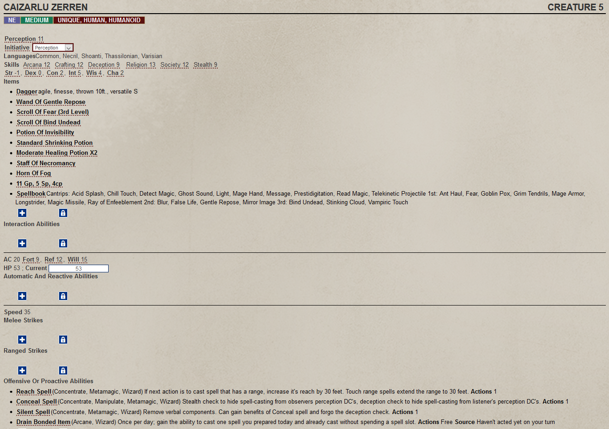
  - 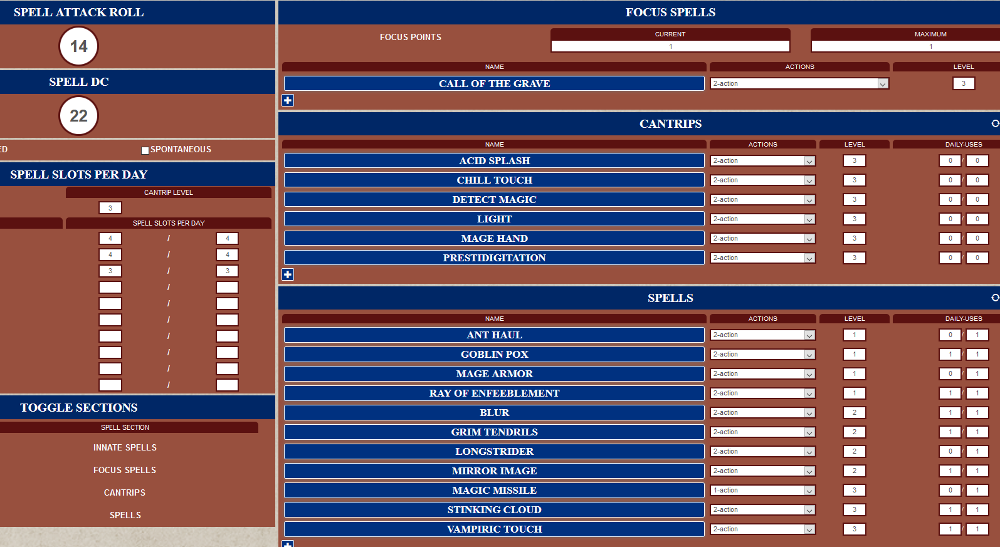

## Part 3: Walking Scarecrows (460xp, Party Level 5)

  - [Ghoul Scarecrow](./Statblocks/GhoulScarecrow.pdf)
  - 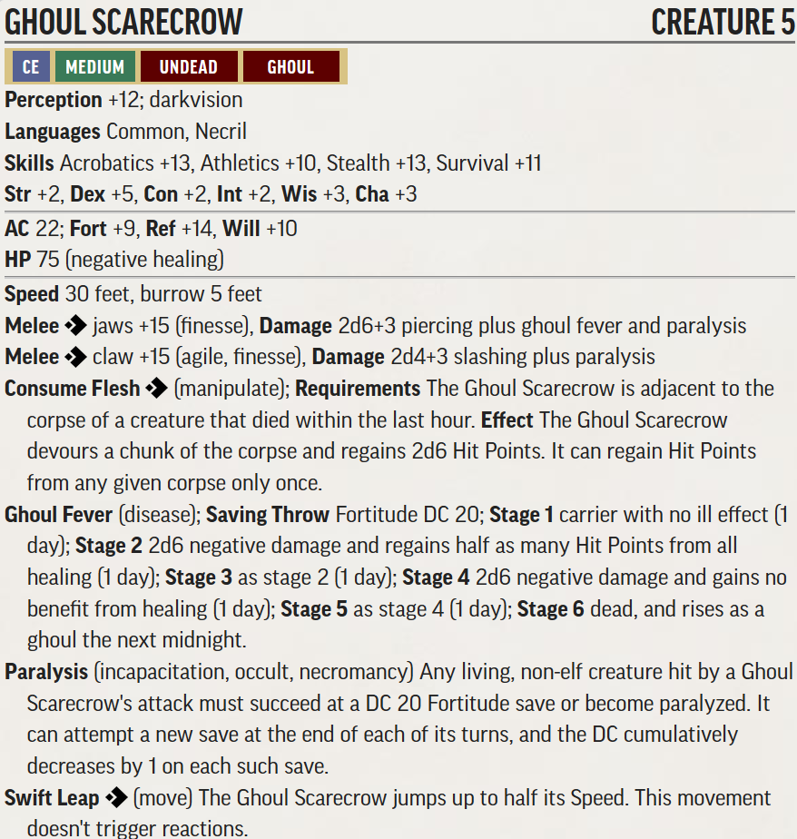

### The Hambley Farm fields (240xp, spread out in mostly trivial encounters)
  - 6 Ghoul Scarecrows 
  - There are 1.5 Ghoul Scarecrows for each PC (round up)

### A1 Barn (120xp, severe threat, though may split up)
  - 3 Ghoul Scarecrows 
  - Split them up or remove one Ghoul Scarecrow if your players are having difficulty with the paralysis effect

### A2 Farmhouse (100xp, moderate threat)
  - [Rogors Craesby Ghast](./Statblocks/RogorsCraesby.pdf)
  - 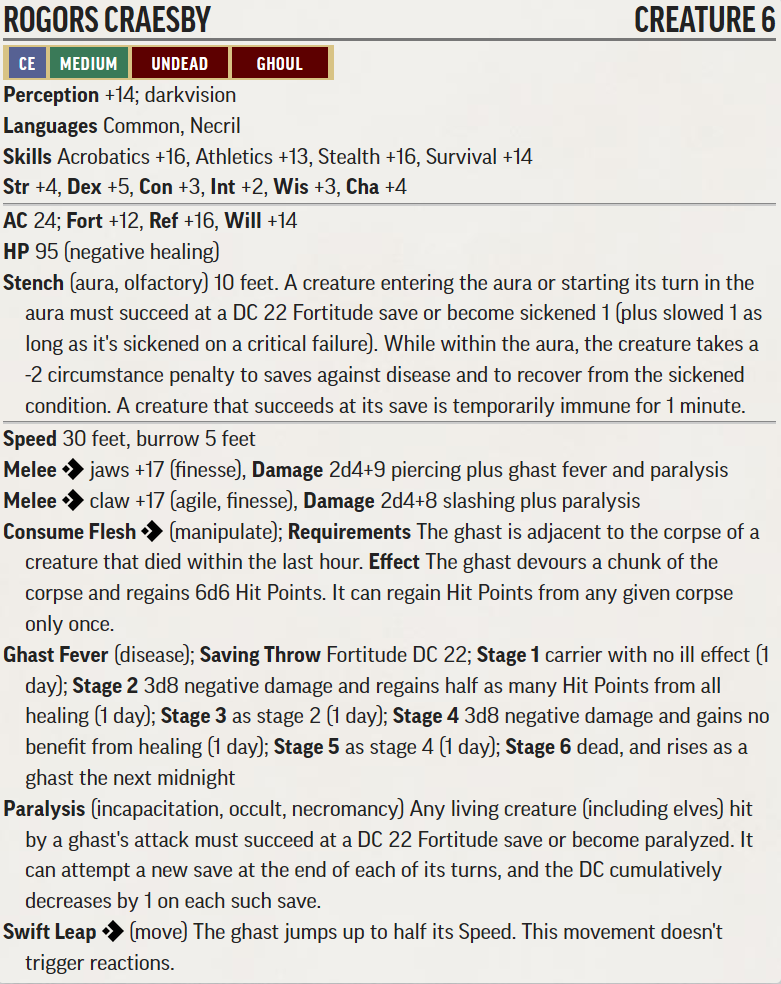
  - 1 Ghoul Scarecrow
  - add another Ghoul Scarecrow if more than 4 PCs or your party relishes the challenge
  - note multiple incapacitation effects can quickly overpower
## Part 4: Misgivings (80+160+135+120+390=885xp, Party Level 5/6)

## Ruined Outbuildings (80xp, Party Level 5 or 6)

### B1 (80xp, moderate threat)
  - For Carrionstorms use 4 [Undead Raven Swarms](http://2e.aonprd.com/Monsters.aspx?ID=782)
  - if party is level 6 add [Elite](http://2e.aonprd.com/Rules.aspx?ID=790)

## Ground Floor (160xp, Party Level 5)

### B2 (30xp, trivial threat)
  - Burning Manticore 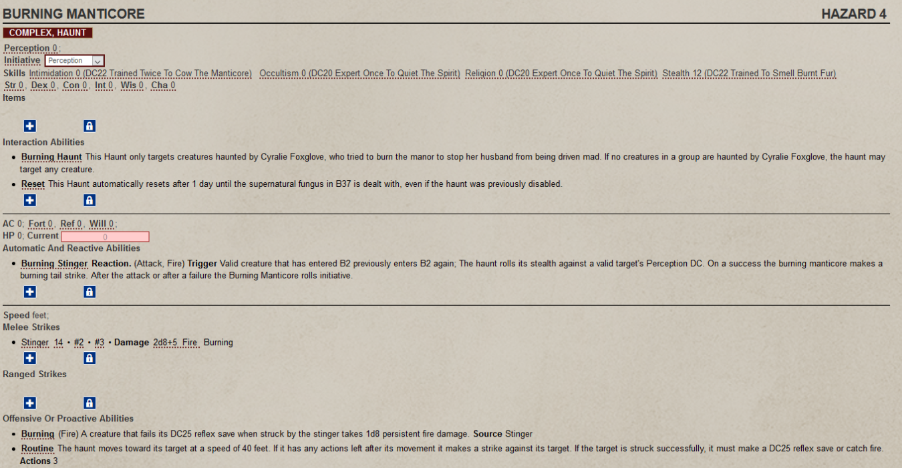

### B5 (30xp, trivial threat)
  - Worried Wife 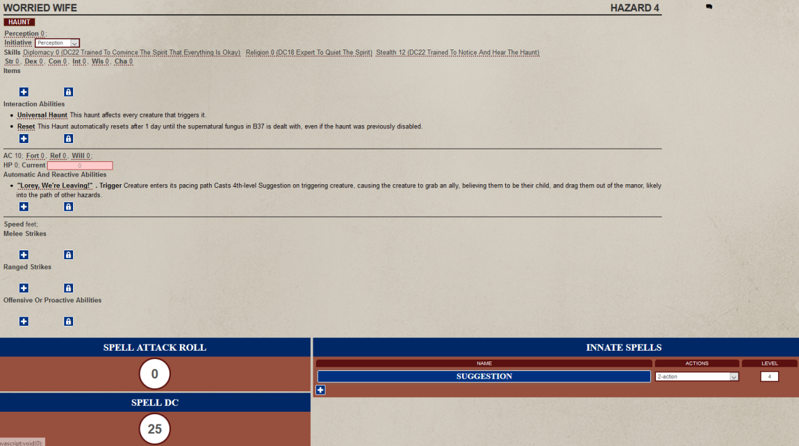

### B6 (40xp, trivial threat)
  - Vorel's Phage [Vorels Phage PDF](./Statblocks/VorelsPhage.pdf) 
  - 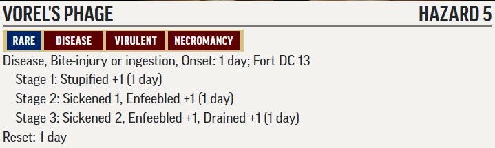

### B7 (20xp, trivial threat) 
  - Dance of Ruin 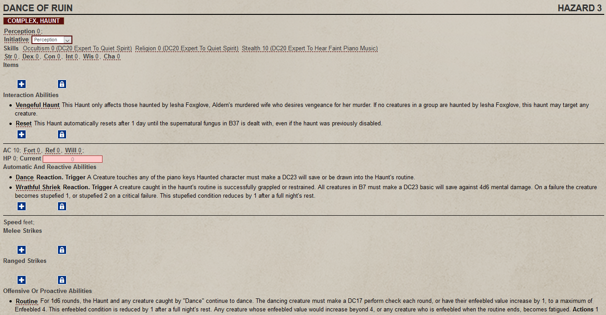

### B9 (40xp, trivial threat)
  - Iesha's Vengeance 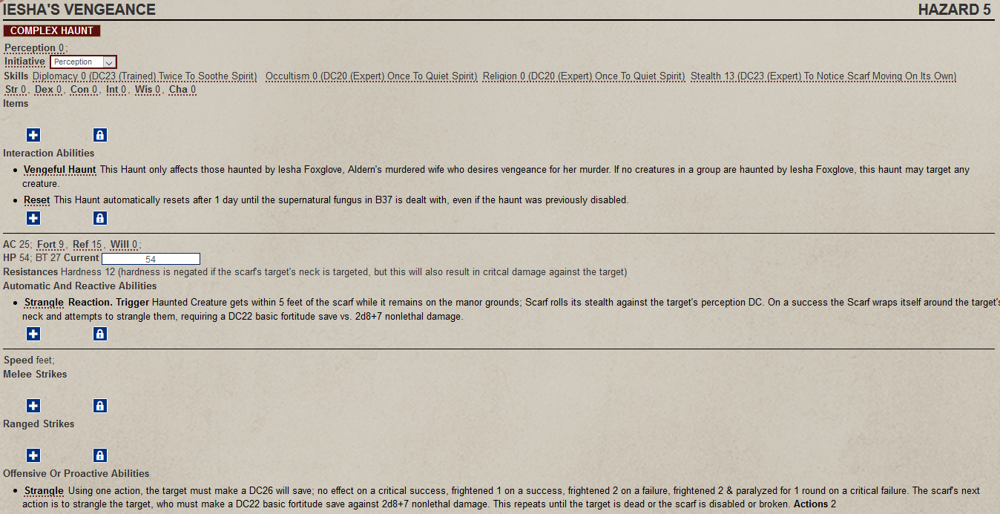
  
## Upper Floor (135xp,Party Level 6)

### B11 (15xp, trivial threat)
  - Frightened Child 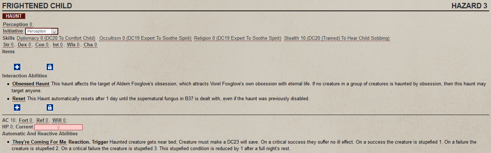
  
### B13 (20xp, trivial threat)
  - Phantom Phage 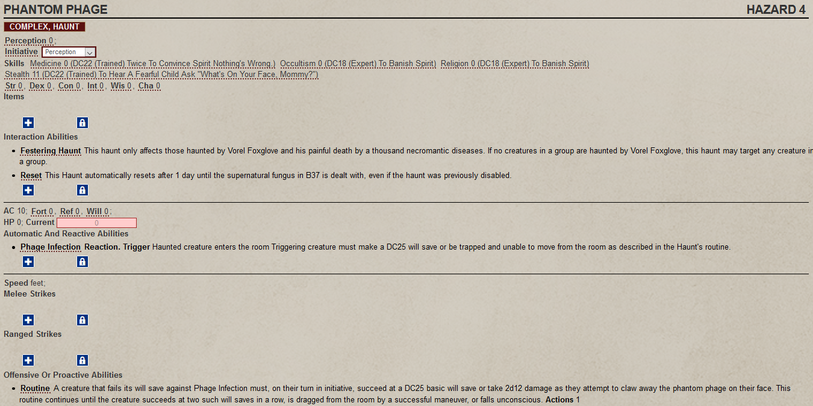
  
### B14 (10xp, trivial threat)
  - Collapsing Floor 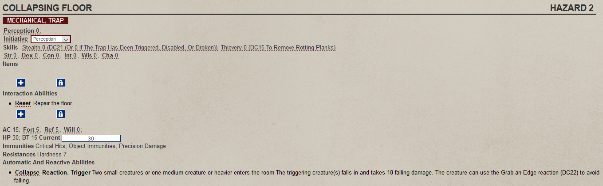
  
### B15 (40xp, trivial threat)
  - Misogynistic Rage 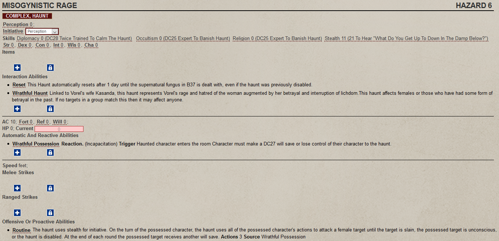

### B17 (20xp, trivial threat)
  - The Stricken Family 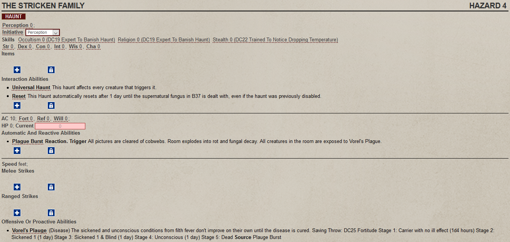

### B18 (30xp, trivial threat)
  - Suicide Compulsion 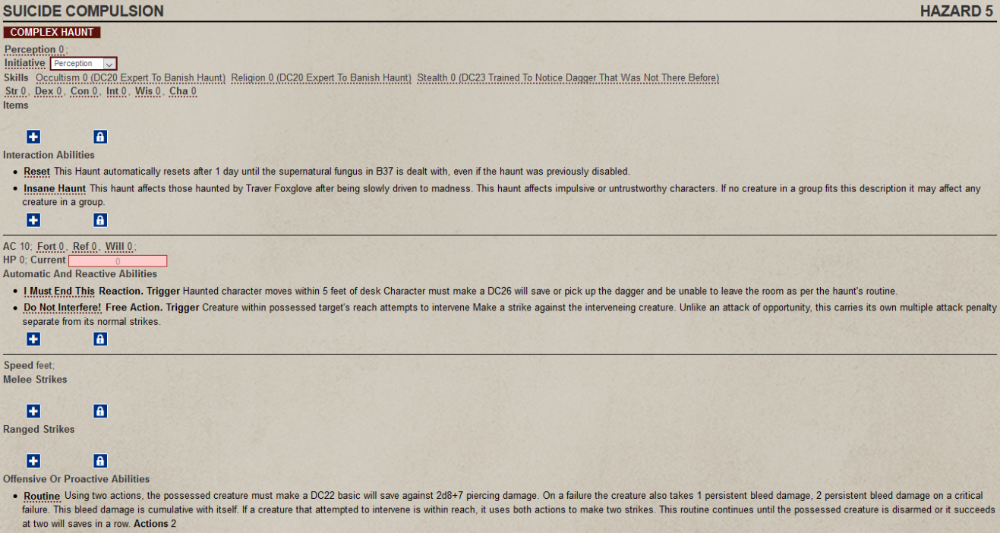

## Attic (120xp,Party Level 6)

### B22 (40xp, trivial threat)
  - Plummeting Inferno 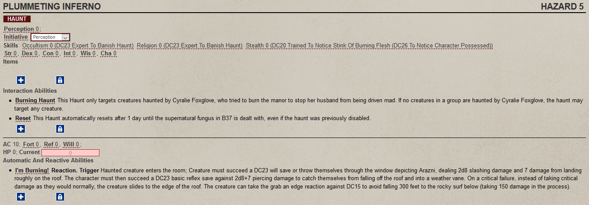

### B23 (40xp, trivial threat)
  - Unfulfilled Glories 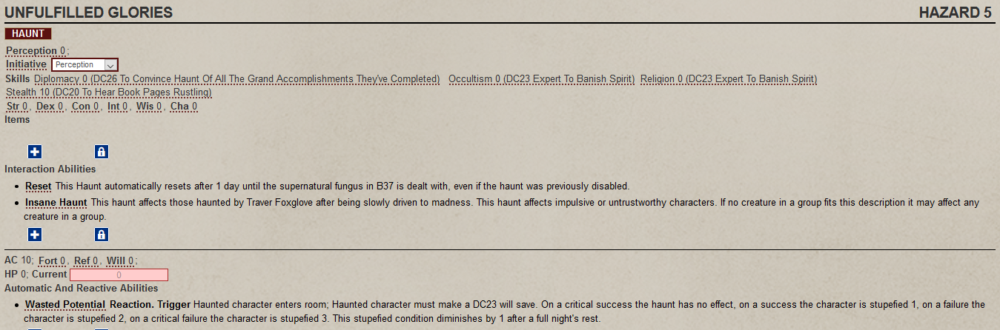

### B24 (40xp, trivial threat)
  - Iesha Foxglove [Revenant](http://2e.aonprd.com/Monsters.aspx?ID=787)

## Basement (410xp,Party Level 6)

### B25 (60xp, low threat)
  - 4x [Elite](http://2e.aonprd.com/Rules.aspx?ID=790): [Rat Swarm](http://2e.aonprd.com/Monsters.aspx?ID=347)

### B29 (40xp, trivial threat)
  - Origins of Lichdom 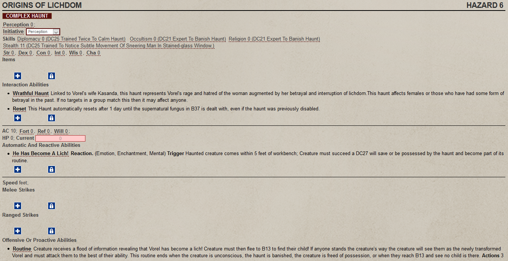

### B30 (20xp, trivial threat)
  - Ghoulish Uprising 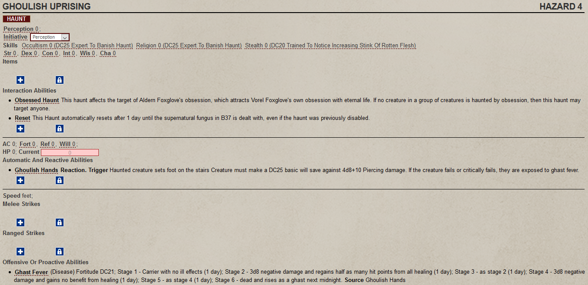

### B33 (10xp, trivial threat)
  - [Brown Mold](https://2e.aonprd.com/Hazards.aspx?ID=35)

### B34 (60xp, low threat)
  - 2 [Weak](http://2e.aonprd.com/Rules.aspx?ID=791) Rogors Craesby Ghasts (see above)

### B35 (80xp, moderate threat)
  - 2 Rogors Craesby Ghasts (see above)

### B36 (40xp, trivial threat)
  - 4 (L2) [Goblin Ghast PDF](./Statblocks/GoblinGhast.pdf)
  - 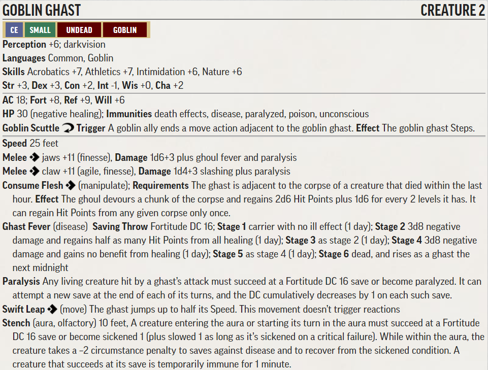
   
### B37 (100xp, moderate threat)
  - [Elite](http://2e.aonprd.com/Rules.aspx?ID=790): [The Skinsaw Man PDF](./Statblocks/TheSkinsawMan.pdf)
  - 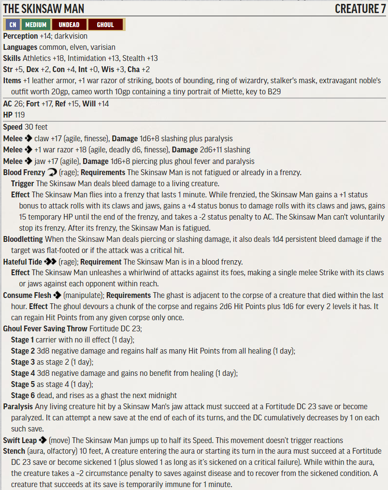

  - Vorel's Legacy 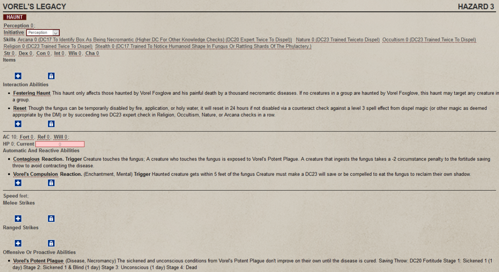

## Part 5: Chasing The Skinsaw (90xp, Party Level 6)

### Foxglove Townhouse (90xp, moderate threat)

  - **Creatures:** 3x (L5) [Elite](http://2e.aonprd.com/Rules.aspx?ID=790): [Faceless Stalkers](http://2e.aonprd.com/Monsters.aspx?ID=4)
  - Foxglove's housekeeper/cook/sister is also present as the third stalker as best fits your narrative

## Part 6: The Seven's Sawmill (190-320xp, Party Level 7)

  - **Creatures:**
    - Add [Elite](http://2e.aonprd.com/Rules.aspx?ID=790) to some of the cultists for a harder challenge and depending on encounter size.
    - 13 (L4/5) [Cultist (False Priest)](http://2e.aonprd.com/NPCs.aspx?ID=928) wearing [Skinsaw Masks](https://2e.aonprd.com/Equipment.aspx?ID=817)
    - Justice Ironbriar (L8) [Elite](http://2e.aonprd.com/Rules.aspx?ID=790): [Cult Leader](http://2e.aonprd.com/NPCs.aspx?ID=930)

## Part 7: Shadows of Time (285xp, Party Level 7)

### E1 (60xp, low threat)
  - Scarecrow
  - 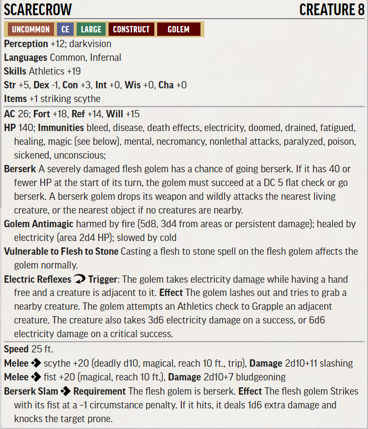

### E2 (15xp, trivial threat)
  - Falling Bell: Use the [Scythe Blades Hazard](https://2e.aonprd.com/Hazards.aspx?ID=6) with bludgeoning damage

### E3 (80xp, moderate threat)    
  - 4x (L5) [Elite](http://2e.aonprd.com/Rules.aspx?ID=790): [Faceless Stalkers](http://2e.aonprd.com/Monsters.aspx?ID=4)
  - Use a suitable form for the stalkers to throw your players off balance and make it chaotic e.g. Xanesha's human form, Ironbriar, The Mayor, City Guard

### E6 (80-120xp, moderate to severe threat) 
  - Note the terrain here adds to the threat level
  - Xanesha (L9) [Elite](http://2e.aonprd.com/Rules.aspx?ID=790): [Lamia Matriarch](http://2e.aonprd.com/Monsters.aspx?ID=278)
    - Add Feather Fall to her prepared spells
    - optionally use L10 Lucrecia from book 3 for a more challenging encounter.
  - Replace the scimitar with [Impaler of Thorns](./Statblocks/ImpalerOfThorns.pdf) (reach 10ft)
  - 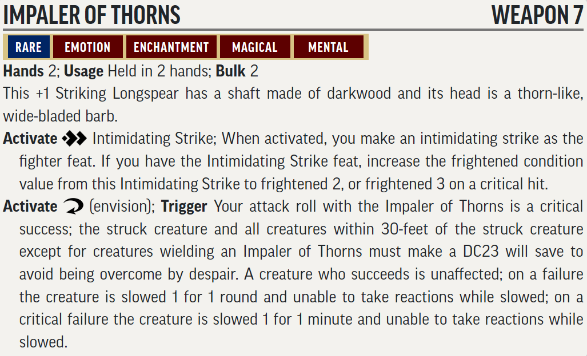
  - [Medusa Mask](./Statblocks/MedusaMask.pdf) 
  - 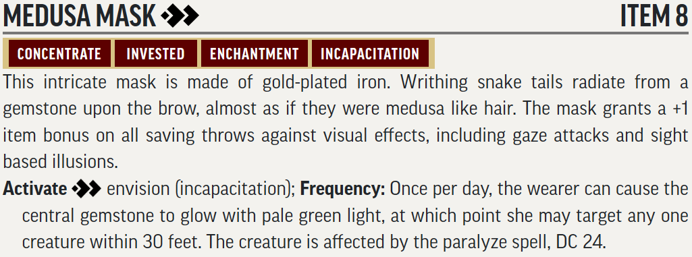
  # --- End of The Skinsaw Murders 2E Conversion Guide---
