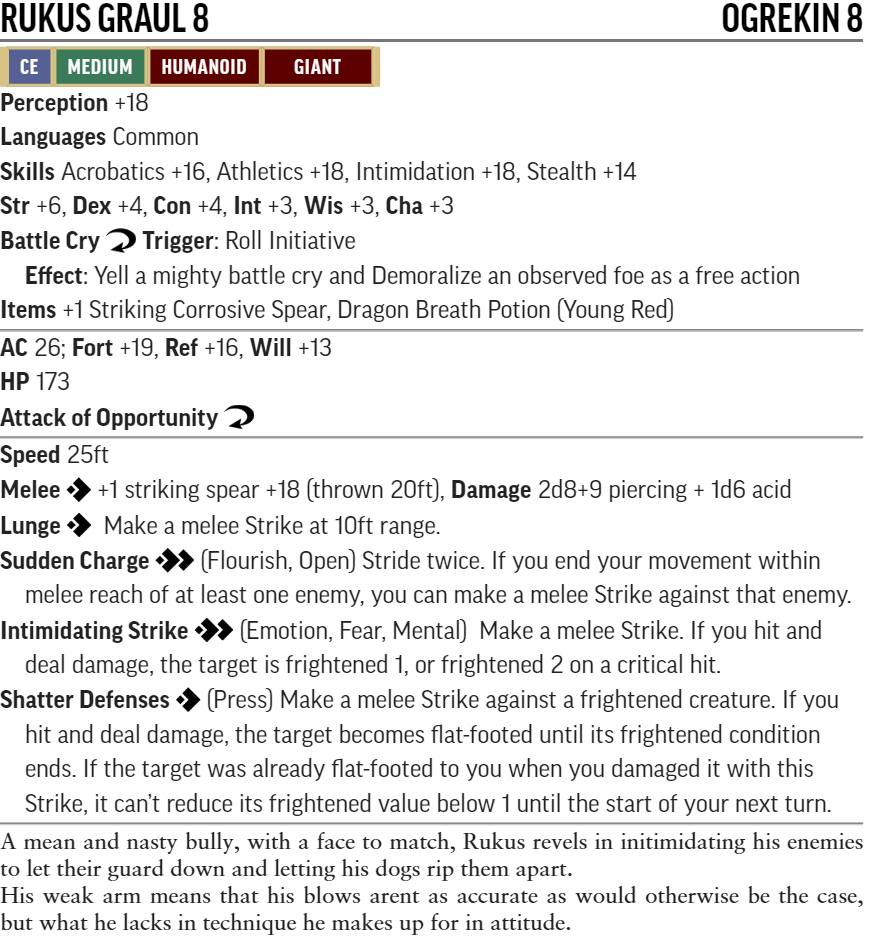
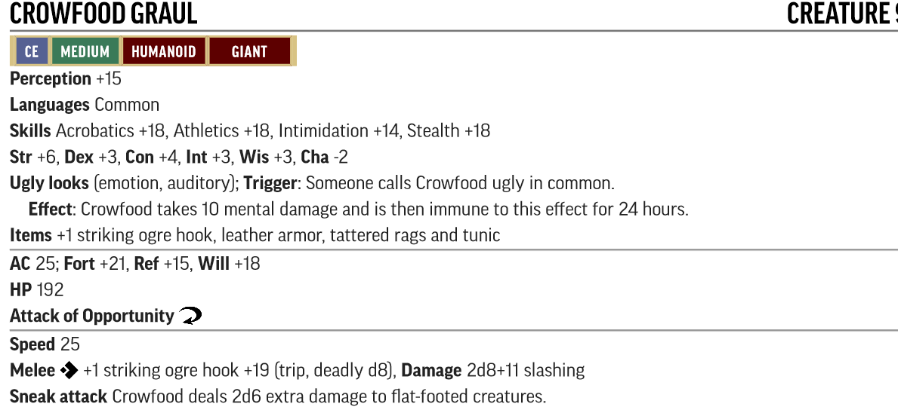
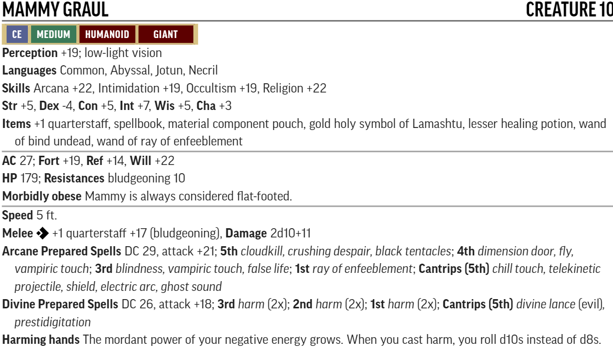
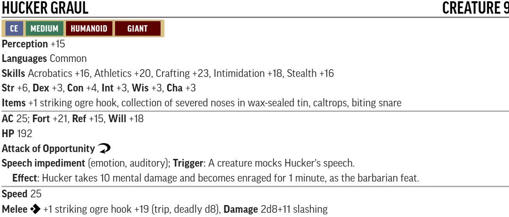
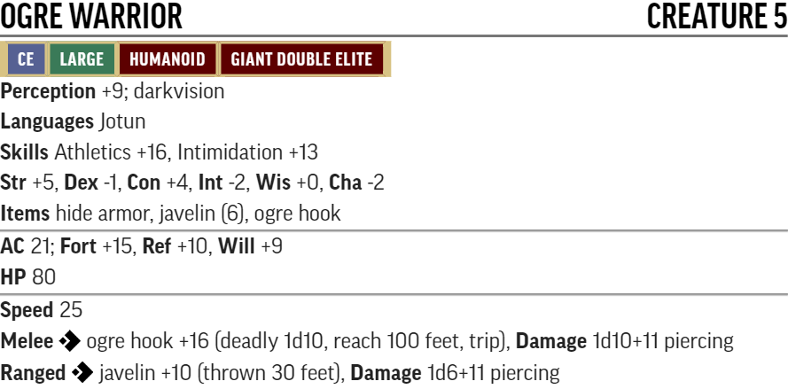
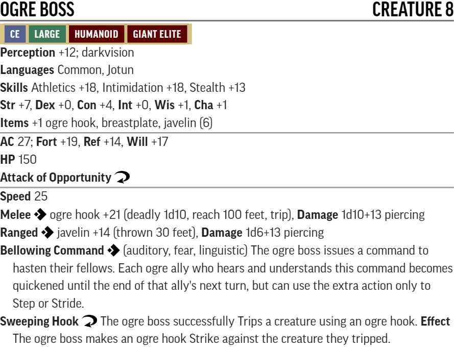
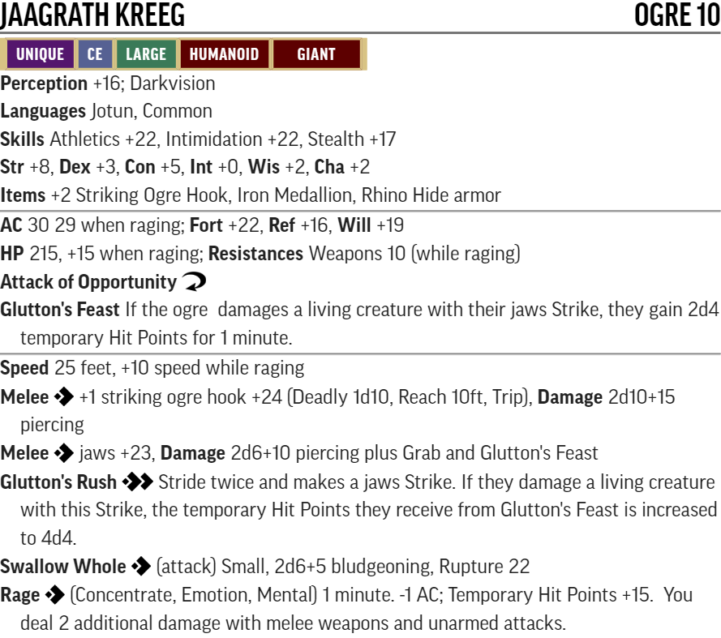
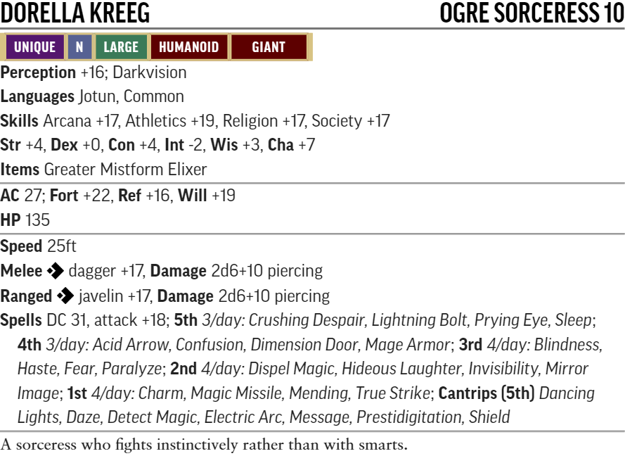
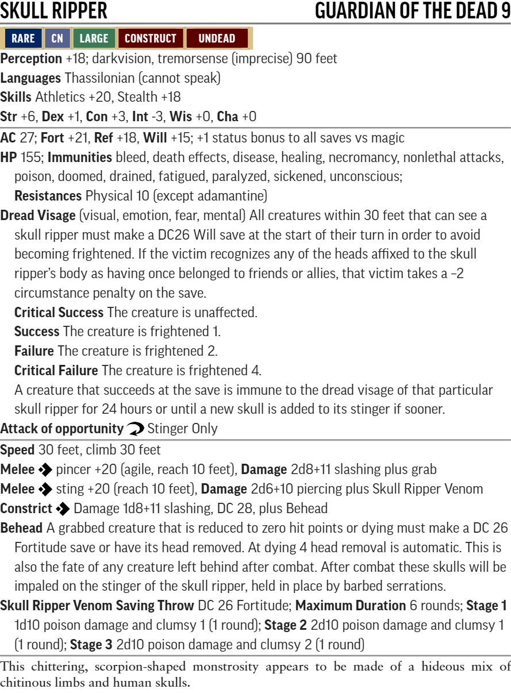
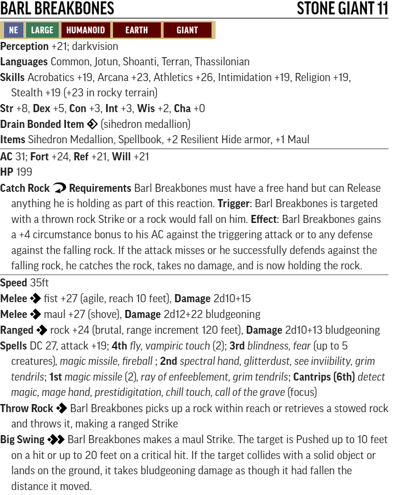

# Hook Mountain Massacre : level 7-10

## Conversion guide for Pathfinder 2

  - This is a conversion guide and as such only covers the items that have changed in PF2. This includes NPCs and monsters, hazards, DCs, XP, level based treasure, and occassionally tactics.
  - The plot, back story, color text, maps, floor plans, images and tactics requires the original scenario.
  - Creatures are built using [Monster Builder](http://monster.pf2.tools/) and their JSON files are in a consolidated sub directory so that you can use or update them for your own campaign as required. In some instances there are several variants available.
  - The associated monster builder PDF and PNG files are also in this sub directory and referenced by this document (their unique numerical suffixes assigned by monster builder are removed to save updating this document every time the creature is tweaked)

### Index and status
  - Part 1: In The Hook's Shadow - xp, creatures and hazards done
  - Part 2: Retaking Rannick - xp, creatures and hazards done
  - Part 3: Down Comes the Rain - xp, creatures done
  - Part 4: The Haunted Heart - xp, creatures done
  - Part 5: Harrowing the Hook - xp, creatures done 

### General TO DO
  - Treasure allocation - replace old treasure with new level guidelines

### Party Level and Target Allocation of Treasure

- Lvl 7: Party should be close to 8th level at start of the book 
- Lvl 8: After first encounter with the Grauls
- Lvl 9: Midway through Fort Rannick
- Lvl 10: Near end of Skull's Crossing

Level | Total gp | Permanent Items         | Consumables                        | Cash    | Part
------|----------|-------------------------|------------------------------------|---------|-----
  7   | 2,900gp  | **8th:** 2 **7th:** 2   | **8th:** 2 **7th:** 2 **6th:** 2   |   720gp | At start
  8   | 4,000gp  | **9th:** 2 **8th:** 2   | **9th:** 2 **8th:** 2 **7th:** 2   | 1,000gp | 1
  9   | 5,700gp  | **10th:** 2 **9th:** 2  | **10th:** 2 **9th:** 2 **8th:** 2	| 1,400gp | 2
  10  | 8,000gp  | **11th:** 2 **10th:** 2 | **11th:** 2 **10th:** 2 **9th:** 2 | 2,000gp | 3  

[Full Level to Wealth Chart](http://2e.aonprd.com/Rules.aspx?ID=581)

### General Notes and Advice

Apply (double) [Weak](http://2e.aonprd.com/Rules.aspx?ID=791) or (double) [Elite](http://2e.aonprd.com/Rules.aspx?ID=790) templates as appropriate to suit the capabilities of your party. 
If they are finding it hard going then liberally apply weak templates. 
If they are breezing through then liberally apply elite templates. 

Where creatures don't exist in the bestiary then close fit adaptations have been used or [Monster Builder](http://monster.pf2.tools/) has been used based on similar creatures and the original PF1 NPC. Traps have been similarly replaced with near fit Hazards.

## Part 1: In The Hook's Shadow (XP 570/490,Party Level 7-8)

For ogrekin, custom creatures have been created, based on ogre templates.

For Traps near fit Hazards have been used. Note the traps are unlikely to be a significant hazard on their own, but if they trigger other encounters or you have reckless adventurers they are much more serious.

Encounter notes sometimes includes suggested scaling for level 8 parties.

XP is shown as "XP L7/L8"

### The Strange Firepelt (XP 60/40, low/trivial threat)
 - **Creatures:** 
    - [Kibb - Firepelt Cougar Animal Companion]
    - 5x [Graul Hounds - Riding Dogs](http://2e.aonprd.com/Monsters.aspx?ID=125)
    - Note the level of the dogs is too low to be a challenge to the PCs - it is an interesting dilemma for them to fight and kill relatively harmless animals
    - [Rukus Graul PDF](./NPC-Monsters-Statblocks/rukus_graul.pdf)

 - **Loot:** +1 striking spear

### The Graul Farm (XP 80/60, moderate/low threat)
  - **Creatures:** 
    - [Crowfood Graul PDF](./NPC-Monsters-Statblocks/CrowfoodGraul.pdf)

  - **Loot:** +1 striking ogre hook
  
### A1. Farmhouse Porch (XP 10, trivial threat)
  - **Hazards:**
    - [Door Spear Launcher](https://2e.aonprd.com/Hazards.aspx?ID=4)
    - [Floor Saw - Scythe Blades](https://2e.aonprd.com/Hazards.aspx?ID=6)

### A2. Family Room (XP 10, trivial threat)
  - **Hazards:**
    - [Pit Trap](https://2e.aonprd.com/Hazards.aspx?ID=1). Anyone falling in sets off the inbuilt [Spear Launcher](https://2e.aonprd.com/Hazards.aspx?ID=4)

### A3. Dining Room (XP 10, trivial threat)
  - **Hazards:**
    - 3x [Coiled rope single Scythe Blade](https://2e.aonprd.com/Hazards.aspx?ID=6)
  
### A4. Kitchen (trivial threat)
  - **Hazards:**
    - Sickening Smell applies each round spent in the kitchen: DC 26 Fortitude save or become sickened 1 (sickened 2 on a crit fail). This condition cannot be cleared whilst in the kitchen. Unless a critical success is achieved this effect must be saved against each round. 
    
### A5. Playpen (XP 60/40, low/trivial threat)
  - **Creatures:** 
    - Lucky and Maulgro Graul - [Ogrekin Fighters PDF](./NPC-Monsters-Statblocks/ogrekin_fighter.pdf)

  - **Loot:** None

### A6. Rukus's Room
  - **Loot:** TBD

### A8. Mammy's Room (XP 120/120, severe/severe threat)
  - **Creatures:** 
    - Benk, Hadge, and Kunkel [Ogrekin Zombie Brutes](https://2e.aonprd.com/Monsters.aspx?ID=425)
    - [Mammy Graul PDF](./NPC-Monsters-Statblocks/MammyGraul.pdf)

  - **Encounter Notes:**   
    - Consider applying the weak template if this encounter will be too strong for your PCs
    - Party level 7: Mammy is a severe level threat by herself and the zombies should just be level 2 distractions as above
    - Party level 8: Raise the Zombies to level 4 using the [double Elite template](http://2e.aonprd.com/Rules.aspx?ID=790)
  - **Loot:** See Mammy Graul

### A9. Bedroom (XP 10, trivial threat)
  - **Hazards:**
    - [Hand Chopper - single Scythe Blade](https://2e.aonprd.com/Hazards.aspx?ID=6). Anyone injured by the blade also has to save vs [Ogre Spider Venom](https://2e.aonprd.com/Monsters.aspx?ID=814)

### A10. Attic
  - **Loot:** TBD

### A12. Hucker's Lair (XP 80/80, moderate threat)
  - **Creatures:** 
    - 2x [Weak : -15HP, -2 to AC and most rolls](http://2e.aonprd.com/Rules.aspx?ID=791): medium sized Dire Wolves [Chuckles and Drooler / Donkey Rats](https://2e.aonprd.com/Monsters.aspx?ID=416)
    - Note in PF1 these were scaled up Dire Rats. In PF2 they are scaled down Dire Wolves.
    - [Hucker Graul PDF](./NPC-Monsters-Statblocks/HuckerGraul.pdf)

  - **Encounter Notes:**
    - Party level 7: Hucker is a moderate challenge by himself. The Donkey Rats should be a level 2 distraction as above with the weak template.
    - Party level 8: Apply the [Elite template](http://2e.aonprd.com/Rules.aspx?ID=790) (instead of the weak template) to the Donkey Rats. 
  - **Loot:** TBD

### A14. Tendriculous Lair (XP 40/30, trivial threat)
  - **Creatures:** 
    - [Elite : +20 HP, +2 to AC and most rolls](http://2e.aonprd.com/Rules.aspx?ID=790): [Muck Graul - Awakened Tree](https://2e.aonprd.com/Monsters.aspx?ID=28)
  - **Encounter Notes:**
    - Can become a severe threat if combined with Hucker and the Donkey Rats
    - Party level 8: Apply the [double Elite template](http://2e.aonprd.com/Rules.aspx?ID=790) 
    - Awakened tree seems specifically designed for this purpose (it even matches the Fey color text)
  - **Loot:** TBD

### A15. The Graul Fortune
  - **Loot:** TBD

### A16. Kennel (XP 90/80, moderate threat)
  - **Creatures:** 
    - Hograth, Jeppo, and Sugar Graul - [Ogrekin Fighters PDF](./NPC-Monsters-Statblocks/ogrekin_fighter.pdf)
    - Party level 8: add an additional ogrekin fighter

  - **Loot:** TBD

### A17. Biggin (XP 40/30, trivial threat)
  - **Creatures:** 
    - [Double Elite : +40 HP, +4 to AC and most rolls](http://2e.aonprd.com/Rules.aspx?ID=790): [Ogre Spider](https://2e.aonprd.com/Monsters.aspx?ID=814)
  - **Captive Black Arrows:**
    - [Jakardros Savark PDF](./NPC-Monsters-Statblocks/Jakardros.pdf)
    - [Vale Temross PDF](./NPC-Monsters-Statblocks/ValeTemros.pdf) 
    - [Kaven Windstrike PDF](./NPC-Monsters-Statblocks/KavenWindstrike.pdf)

## Part 2: Retaking Rannick (XP 1060/750, Party Level 8-9)

Creatures are taken from existing bestiary entries and adjusted using weak and elite templates where practical. Sometimes using similar types of creatures where bestiary entries don't exist.  

Note these are mostly trivial and low threat individual encounters, but there is a high likelihood of two or more combining in this setting. Usually the most threatening thing they can do is yell for assistance. Also note large creatures hit very hard so crits are especially dangerous. Be wary of increasing their level. If you have an inexperienced or gung-ho players, or a sub-optimal PC mix, then scale back the use of elite templates. To up the challenge level you just need to make it more likely encounters will combine.

### Standard Ogre conversions (throughout rest of book 3):

To make ogres XP relevant to both level 8 and level 9 parties the following replacement standard ogres are used in PF2

PF1 Monster  | PF1 CR | PF2 Monster Base | PF2 Adjustment | PF2 Level | XP (party level 8/9)
-------------|--------|------------------|----------------|-----------|----------------------
Ogre         | 3      | [Ogre Warrior](https://2e.aonprd.com/Monsters.aspx?ID=317)     | Double [Elite](http://2e.aonprd.com/Rules.aspx?ID=790)   | 5 | 15/10
Ogre Fighter | 8      | [Ogre Boss](https://2e.aonprd.com/Monsters.aspx?ID=319)        | [Elite](http://2e.aonprd.com/Rules.aspx?ID=790)          | 8 | 40/30

These adjusted creatures are simply referred to as Ogre Warrior* and Ogre Boss* throughout the rest of this book.

  

The unique ogres are covered individually below.

### B2. East Gate (XP 15/10, trivial threat)
  - **Creatures:** 
    - Ogre Warrior*

### B4. Old Guard Post (XP 70/50, low threat)
  - **Creatures:** 
    - Ogre Boss*
    - 2x Ogre Warriors*

### B6. Cookhouse (XP 40/30, trivial threat)
  - **Creatures:** 
    - Ogre Boss*

### B7. Drainage Ditch
  - **Hazards:**
    - Using diseased entryway - save vs Filth Fever as if bitten by a [Giant Rat](https://2e.aonprd.com/Monsters.aspx?ID=346).  

### B8. South Gate (XP 55/40, low/trivial threat)
  - **Creatures:** 
    - Ogre Boss*
    - Ogre Warrior*

### B12. Barracks (XP 180/120 extreme/severe threat)
  - **Creatures:** 
    - 12x Sleeping Ogre Warriors*

### B13. Secret Armory (XP20, trivial threat)
  - **Creatures:** 
    - 2x [Elite](http://2e.aonprd.com/Rules.aspx?ID=790): [Shocker Lizard](https://2e.aonprd.com/Monsters.aspx?ID=802)

### B14. Ravine (XP 10, trivial threat)
  - **Hazards:**
    - [Collapsing Bridge - treat as Treacherous Scree](https://2e.aonprd.com/Hazards.aspx?ID=36). 
    
### B15 Crypt (XP 30/20, trivial threat)
  - **Creatures:**
    - Lorgus Fenker [Specter](https://2e.aonprd.com/Monsters.aspx?ID=812)
    - Note that the Spectral Corruption ability has the **incapacitation** trait and as the Specter is lower level than the party the critical failure result wont occur on any PCs, though may affect any accompanying black arrows or Shalelu. 

    - an alternative encounter if preferred is to use the [Confounding Betrayal haunt](https://2e.aonprd.com/Hazards.aspx?ID=45)
    
### B18. Workroom (XP 40/30, trivial threat)
  - **Creatures:**
    - Ogre Boss*

### B19. Armory (XP 30/20, trivial threat)
  - **Creatures:** 
    - 2x Ogre Warrior*
    
### B23. Library (XP 40/30, trivial threat)
  - **Creatures:**
    - Ogre Boss*
    
### B24. Barracks (XP 60/40, low/trivial threat)
  - **Creatures:**
    - 4x Ogre Warriors*

### B29. Chapel (XP 80/60, moderate/low threat)
  - **Creatures:**
    - [Jaagrath Kreeg PDF](./NPC-Monsters-Statblocks/jaagrath_kreeg.pdf)

  - **Encounter Notes:**
    - B29 and B30 are likely to run together and become a severe to extreme threat.
    
### B30. Commanders Quarters (120/90, severe/moderate threat)
  - **Creatures:**
    - Ogre Boss*
    - [Dorella Kreeg PDF](./NPC-Monsters-Statblocks/dorella_kreeg.pdf)

  - **Encounter Notes:**
    - B29 and B30 are likely to run together and become a severe to extreme threat.

### B31. Tribunal (XP 30/20, trivial threat)
  - **Creatures:**
    - 2x Ogre Warriors*

### B36. Lucrecia's Retreat (XP 120/80, severe/moderate threat)

  - **Creatures:**
    - [Lucrecia PDF](./NPC-Monsters-Statblocks/Lucrecia.pdf)

  - **Encounter Notes:**
    - note the threat level may rise due to unexpected assistance...

### B37. Lizard Warrens (XP 120/80, moderate/low threat)
  - **Creatures:** 
    - 12x [Elite](http://2e.aonprd.com/Rules.aspx?ID=790): [Shocker Lizard](https://2e.aonprd.com/Monsters.aspx?ID=802)

## Part 3: Down Comes the Rain (XP470, Party Level 9)

### Saving the Schoolchildren (XP 20, trivial threat)
  - **Creatures:** 
    - 1x [Weak : -20HP, -2 to AC and most rolls](http://2e.aonprd.com/Rules.aspx?ID=791): [Giant Anaconda](https://2e.aonprd.com/Monsters.aspx?ID=382)
  - **Encounter Notes:**    
    - This encounter is only a heroic scene setting distraction and should not deplete any resources. Consider applying double weak, or even replacing with some other low level emergency where the PCs can shine.

### Black Magga Rises (XP 160, beyond extreme temporary threat)

  - **Creatures:**
    - [Black Magga PDF](./NPC-Monsters-Statblocks/black_magga.pdf)

  - **Encounter Notes:**    
     - XP is awarded for the bravery of enagaging with Black Magga and driving her off
     - Make a note if any PCs name is spoken in earshot of Black Magga. She will remember this and use Dream Message later to taunt them.

### C4. Gorger and Chaw’s Lair (XP 20, trivial threat, terrain makes it more challenging)

  - **Creatures:**
    - [Double Elite](http://2e.aonprd.com/Rules.aspx?ID=790): [Ettin](https://2e.aonprd.com/Monsters.aspx?ID=204)
  - **Loot:** TBD

### C6. Ogre Demolition Crew (XP 70, low threat with severe terrain)

  - **Creatures:**
    - 1x Ogre Boss*
    - 4x Ogre Warriors*
  - **Encounter Notes:**
    - The terrain makes this low threat encounter potentially extremely dangerous. Being thrown off a dam could be life changing.

### C7. Battlefield (XP 60, low threat)

  - **Creatures:**
    - 4x [Elite](http://2e.aonprd.com/Rules.aspx?ID=790): [Trolls](https://2e.aonprd.com/Monsters.aspx?ID=395) 

### C13. Observation Deck (XP 60, low threat)

  - **Creatures:**
    - [Grazuul PDF](./NPC-Monsters-Statblocks/grazuul.pdf)

    - Grazuul is underwater when vistors arrive and he uses aquatic ambush to launch his attack

### C15. Floodgate Controls (XP 40, trivial threat)

  - **Creatures:**
    - [Skull Ripper PDF](./NPC-Monsters-Statblocks/skull_ripper.pdf)

### C16. Infernal Engines (XP 40)
  - award XP for figuring out how to open the floodgates, regardless of their negotiations with Avaxial
  - Infernal Engine: [Curse, Death]
    - The magical circle drains the life force of the creature within the circle to power the floodgate. Though the magic has waned over the millennia, it still requires a DC29 fortitude save or the creature within becomes drained 1 and sickened 1, or has its sickened and drained values increased by 1. The sickened value cannot be reduced below the drained value while afflicted with this curse. If the creature critically fails this save, the drained value gained from this failed save does not reduce by 1 with rest as it would normally, and must be magically restored.

 ## Part 4: The Haunted Heart (XP 70, Party Level 9/10)

### A Desperate Plea (XP 30 story reward for following)

  - **Creatures:**
	    - For Faerie Yap use a [Double Elite](http://2e.aonprd.com/Rules.aspx?ID=790): [Lyrakien](https://2e.aonprd.com/Monsters.aspx?ID=34)

### Heart of Sadness (XP 40 for permanently laying her to rest)

  - **Creatures:**
    - Recall Knowledge - Fey (Nature): DC 25 to identify a Naiad Queen
    - Recall Knowledge - Spirit (Occultism) or Undead (Religion): DC 27 to identify the Ghostly nature of her

    [Myriana PDF](./NPC-Monsters-Statblocks/myriana.pdf)

## Part 5: Harrowing the Hook (XP 400, Party Level 10)

  - Note that many of the encounters are trivial threat, but with a very alert guard, several encounters will run together. The total XP in the clan hold is around 300 - which is a well beyond extreme encounter and a TPK - if the party dont find a way to break it into smaller chunks.

### Valley of Broken Trees (40xp, trivial threat)

  - **Creatures:**
  - [Razmus PDF](./NPC-Monsters-Statblocks/razmus.pdf)
  

  - The same XP is awarded for whatever way they deal with Razmus - whether he ends up as a temporary ally or they defeat him

### D1 Entrance (40xp, trivial threat)

  - **Creatures:**
    - 2x Ogre Boss*
    
### D2 Bones of the Behenoth
  - Recall Knowledge - Dragon (Arcana): DC 40 to identify the bones

### D5 Chokepoint (60xp, low threat)

  - **Creatures:**
    - 2x Ogre Boss*
    - [Elite](http://2e.aonprd.com/Rules.aspx?ID=790): [Hill Giant](https://2e.aonprd.com/Monsters.aspx?ID=220)

### D6 The Clanhold (70xp, low threat)

  - **Creatures:**
    - Ogre Boss*
    - 10x Ogre Warriors*

### D7 Circle of the Sisters (60xp, low threat)

  - **Creatures:**
    - 3x [Elite](http://2e.aonprd.com/Rules.aspx?ID=790): [Annis Hags](https://2e.aonprd.com/Monsters.aspx?ID=256)
  - **Encounter Notes:**  
    - The [Coven](https://2e.aonprd.com/MonsterAbilities.aspx?ID=11) ability gives these 3 hags the Elite template and several other abilities that you need to be aware of.

### D8 Abandoned Shrine (40xp, trivial threat)
  - **Creatures:**
    - Either use the standard Grave Knight which is closer to the PF1 Lamatar or use the Betrayed Revivification Grave Knight which is closer to the backstory for Lamatar. 
    - [Betrayed Revivification Grave Knight](https://2e.aonprd.com/Monsters.aspx?ID=244). Replace cold with mental throughout. Devastating Blast (mental) has a Will save instead of Reflex.

### D9 As the Dread Kings of Old (80xp, moderate threat)

  - **Creatures:**
    - [Stone Giant](https://2e.aonprd.com/Monsters.aspx?ID=221)

    - [Barl Breakbones PDF](./NPC-Monsters-Statblocks/barl_breakbones.pdf)

# --- End of Hook Mountain Massacre ---
