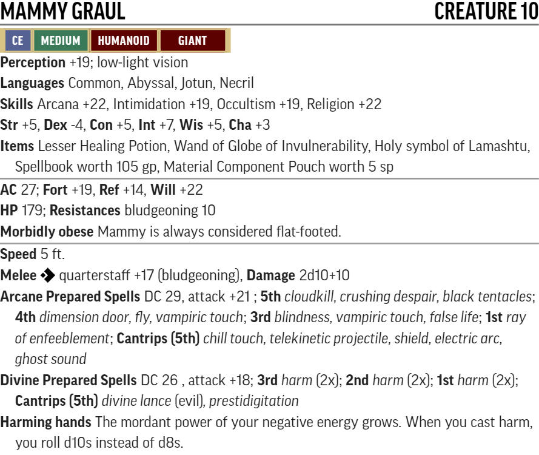
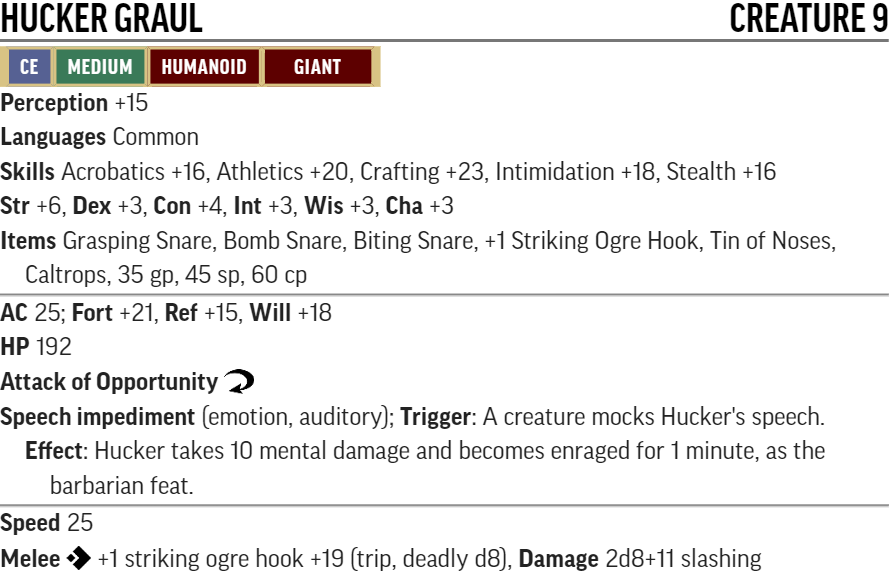
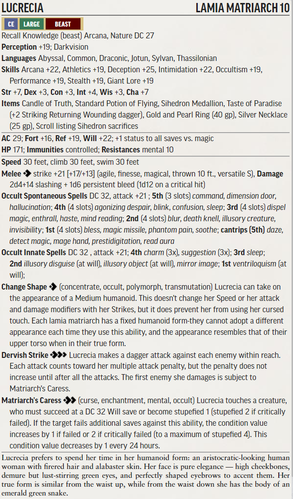
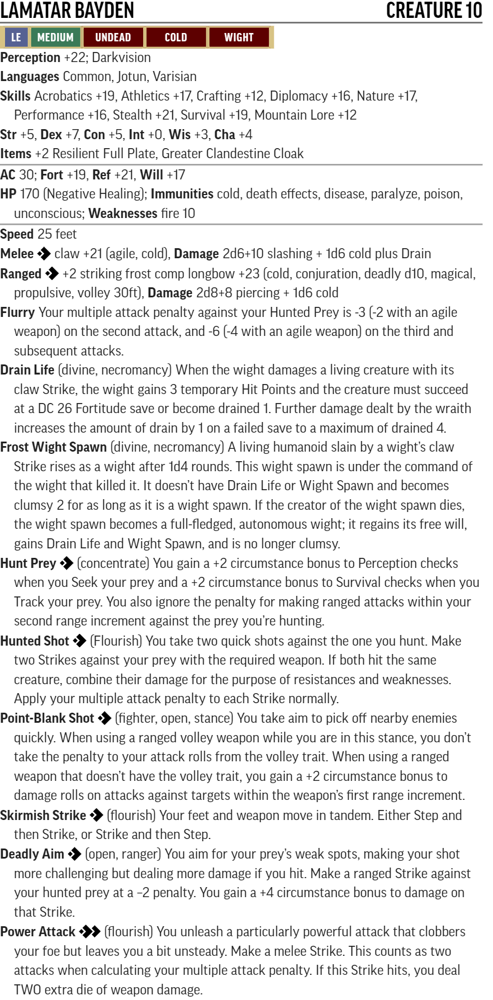
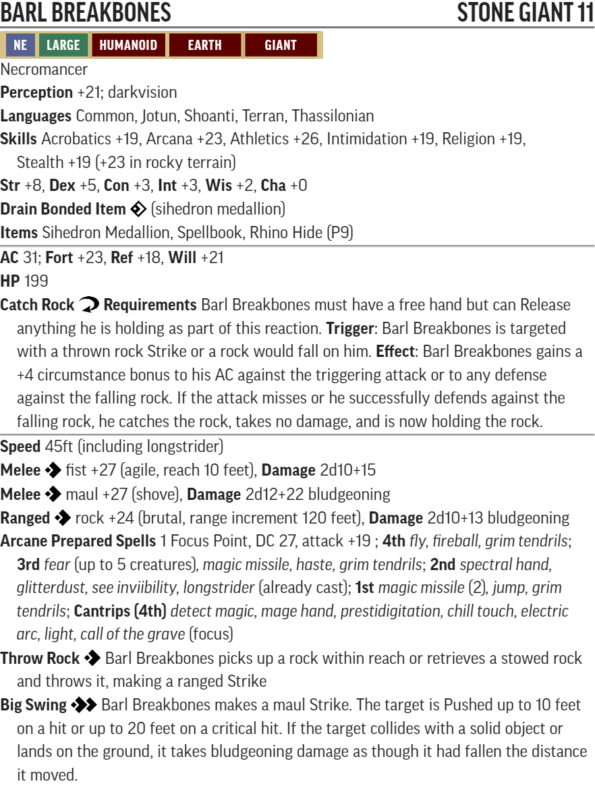

# RotR Hook Mountain Massacre (level 7-10)

## Conversion Guide for Pathfinder Second Edition (2E)

- This conversion guide covers the items that have changed in 2E. This includes NPCs and monsters, hazards, XP, level based treasure, and occasionally tactics.
- The plot, back story, color text, maps, floor plans, images and most tactics requires the original scenario.
- Creatures, hazards, items, poisons, adjustments, etc. that exist in second edition are usually linked to the relevant entry in [Archives of Nethys - second edition](https://2e.aonprd.com/)].
- Unique or missing 2E creatures are built using [Monster Builder](http://monster.pf2.tools/) and their JSON, PDF and PNG files are in a sub directory so that you can use or update them for your own campaign as required. In many instances there are several variants available. Note their unique numerical suffixes assigned by monster builder are removed to save updating this document every time the creature is updated.
- If you find an issue, error or omission, have a suggestion for improvement, or a better version of something, then create a pull request. This is a community project and we welcome and rely on community contributions.

## TO DO
  - Possibly update NPC stats to reflect updated equipment? (Hucker, Crowfood, Mammy, Lamatar, Lucrecia, Barl)

## General GM information
  - DCs are not converted to 2E, except where they are contained within a creature or hazard stat block, or are particularly significant. This is left up to GM discretion.
  - This is a fan created unofficial guide, and what it contains is therefore a series of suggestions, that you can take, modify or leave as you see fit.
  - For Shalelu Andosana it is suggested you use a level 6/7/8 [weak/normal/elite Hunter](https://2e.aonprd.com/NPCs.aspx?ID=907) as appropriate to your group.

## Party Levelling Milestones

- Level 7: Party should be over half way to 8th level at start of the book 
- Level 8: After first encounter with the Grauls
- Level 9: Midway through Fort Rannick
- Level 10: Near end of Skull's Crossing
- Level 11: Party should be close to level 11 at the end of the book.

Target for this book is therefore 2800 level adjusted XP

## Section XP Rewards
  
Part | Title | Max XP 
-----|-------|----
0 | Turtleback Ferry     | 100
1 | In The Hook's Shadow | 880
2 | Retaking Rannick     | 970
3 | Down Comes the Rain  | 600
4 | The Haunted Heart    | 90
5 | Harrowing the Hook   | 490

- As per the original AP, the guide assumes fast advancement of 800 XP per level.

- Encounters use the 1E Challenge Rating (CR) as their basis. Creature levels are usually the same as CR or 1 or 2 higher. Relatively low CRs tend to need to be raised more to work in 2E.

## Target Allocation of Treasure

Level | Total gp | Permanent Items         | Consumables                        | Cash    | Part
------|----------|-------------------------|------------------------------------|---------|-----
  8   | 4,000gp  | **9th:** 2 **8th:** 2   | **9th:** 2 **8th:** 2 **7th:** 2   | 1,000gp | 1
  9   | 5,700gp  | **10th:** 2 **9th:** 2  | **10th:** 2 **9th:** 2 **8th:** 2	| 1,400gp | 2
  10  | 8,000gp  | **11th:** 2 **10th:** 2 | **11th:** 2 **10th:** 2 **9th:** 2 | 2,000gp | 3  

[Full Level to Wealth Chart](http://2e.aonprd.com/Rules.aspx?ID=581)

[Treasure allocation approach](https://docs.google.com/spreadsheets/d/1a_elP7ClHzSNUCdade_noig8yZDG5dQXmBSDK98G1_A/edit?usp=sharing)

This adventure contains treasure for 8th, 9th, and 10th levels (it assumes that treasure for level 7 was acquired prior to the start of this adventure). 

The wealth to level chart was followed such that the treasure explicitly laid out in the "loot" sections adds up to exactly 17,700 GP in value (4000 gp + 5700 gp + 8000 gp). Permanent items and consumables matching the guidelines were provided (i.e. 2x 9th level and 2x 8th level for Level 8), and lower-level items were included as well for flavor. 

It's assumed that even though NPCs may use consumable items in their possession, those items will still become part of the loot. If you decide not to do this, you should replace it with something else (or just increase the cash value of currency items). 

Currency is lower than the guidelines, due to the cost of the permanent and consumable items. 

Spellbooks are valued at 50% of the cost of "learn a spell" for the highest-level spells only, usually those currently memorized by the NPC.

Sihedron Medallions are valued at 160 gp (equivalent to a 2nd level wand of False Life). 

GP value of currency items was scaled down to take into account the treasure guidelines and the fact that gold in 2E is worth considerably more than in 1E. However, the  value of non-magic item valuables (i.e. jewelry, maps, etc.) relative to each other as laid out in the original RotR AP is more or less maintained. For example, Lucrecia's silver necklace was originally worth 200 gp and her ring was worth 300 gp. They are now worth 25 and 40 gp (keeping the ratios approximately the same). 

Treasure was provided for a party of 4. If you have additional party members, include additional treasure and items per the "Full level to Wealth Chart" and accompanying information linked above.  

Note there is no contingency in the treasure. If your players miss something early on in the adventure, you may need to include additional items later.

### General Encounter Advice

Apply [Weak](http://2e.aonprd.com/Rules.aspx?ID=791) or [Elite](http://2e.aonprd.com/Rules.aspx?ID=790) templates as appropriate, or add/remove minions, to suit the capabilities and size of your party.  

If they are finding it hard going then liberally apply weak templates or remove minions.  

If they are breezing through then liberally apply elite templates or add minions. 

Usually, it is more interesting to have several low to moderate threat creatures in the encounter rather than a single severe one.

## Part 0: Turtleback ferry (XP 100, Party Level 7)

These investigations and encounters could happen at any point during the book.  

### Investigating the story of The Paradise and Lucrecia (10xp story award)

  - Award story XP for following up on the story of the Paradise to get further information on Lucrecia and the Paradise, and for noticing the sihedron tattoos on the villagers.

### Wreck of the Paradise (XP 80, Moderate Threat, +10xp story award, optional encounter)

  - **Creatures**
    - Use either a [Giant Snapping Turtle](https://2e.aonprd.com/Monsters.aspx?ID=837) or a giant gar [huge Megaladon](https://2e.aonprd.com/Monsters.aspx?ID=366)
    - If the party are higher than level 7 when they investigate The Paradise, then apply the Elite template accordingly

  - **Encounter Notes:**   
    - The Paradise sank near the edge of the territory of a giant gar / snapping turtle (locally infamous "Old Pinkeye") and anyone in a craft 20ft long or smaller or anyone entering the water here will draw its hostile attention in a few minutes at most.
    - Killing Old Pinkeye will make the PCs local heroes and improve the attitude of everyone in Turtleback Ferry towards them for social interactions.
    - Their meat is a delicacy and there is enough in a huge creature to provide a much-needed boost to the local economy.
    - Turtle shell is a prized hull for local fishing boats as it has a reputation for preventing giant gar attacks.
    - Successfully investigating the wreck of the Paradise provides some clues and a story award of 10xp.

## Part 1: In The Hook's Shadow (XP 880, Party Level 7/8)

For ogrekin, custom creatures have been created, based on ogre templates.

For traps, near fit hazards have been used. Note the traps are unlikely to be a significant hazard on their own, but if they trigger other encounters or happen during an encounter, they are more serious.

Encounters include scaling for level 8 parties.

### The Strange Firepelt (XP 90, moderate threat)
 - **Creatures:** 
    - [Kibb PDF](./Statblocks/Kibb.pdf)  
  
    - Kibb is obviously intelligent and unnaturally friendly towards any rescuers, and, for example, provides flanking bonuses. 
    - 5x [Graul Hounds - Riding Dogs](http://2e.aonprd.com/Monsters.aspx?ID=125)
    - Note the level of the dogs is too low to be a challenge to the PCs - it is an interesting dilemma for them to fight and kill relatively harmless doggies
    - [Rukus Graul PDF](./Statblocks/RukusGraul.pdf)  

      
  
    - If the party is not Level 8 yet, consider applying the weak template to Rukus.

 - **Loot:**
   - +1 striking [corrosive](https://2e.aonprd.com/Equipment.aspx?ID=292) spear [P8]
   - [Dragon Breath Potion (young red)](https://2e.aonprd.com/Equipment.aspx?ID=185) [C7]

### The Graul Farm (XP 80, moderate threat)
  - **Creatures:** 
    - [Crowfood Graul PDF](./Statblocks/CrowfoodGraul.pdf)  

    
  
    - If the party is not Level 8 yet, consider applying the weak template to Crowfood.

  - **Loot:**
    - +1 striking ogre hook [P4]
    - +1 [Resilient](https://2e.aonprd.com/Equipment.aspx?ID=279) Armor [P8]
    - [Greater Smokestick](https://2e.aonprd.com/Equipment.aspx?ID=135) [C7]
  
### A1. Farmhouse Porch (XP 10, trivial threat)
  - **Hazards:**
    - [Door Spear Launcher](https://2e.aonprd.com/Hazards.aspx?ID=4)
    - [Floor Saw - Scythe Blades](https://2e.aonprd.com/Hazards.aspx?ID=6)

### A2. Family Room (XP 5, trivial threat)
  - **Hazards:**
    - [Pit Trap](https://2e.aonprd.com/Hazards.aspx?ID=1). Anyone falling in sets off the inbuilt [Spear Launcher](https://2e.aonprd.com/Hazards.aspx?ID=4)

### A3. Dining Room (XP 15, trivial threat)
  - **Hazards:**
    - 3x [Coiled rope single Scythe Blade](https://2e.aonprd.com/Hazards.aspx?ID=6)
  
### A4. Kitchen (trivial threat)
  - **Hazards:**
    - Sickening Smell applies each round spent in the kitchen: DC 26 Fortitude save or become sickened 1 (sickened 2 on a crit fail). This condition cannot be cleared whilst in the kitchen. Unless a critical success is achieved this effect must be saved against each round. 
    
### A5. Playpen (XP 60, low threat)
  - **Creatures:** 
    - 2x [Ogrekin Fighters PDF](./Statblocks/OgrekinFighter.pdf)
    - Level 8 adjustment: either apply the Elite template OR add a third ogrekin fighter

    

### A6. Rukus's Room
  - **Loot:** Jade Ring worth 60 gp

### A8. Mammy's Room (XP 130, severe threat)

  - **Creatures:** 
    - Benk, Hadge, and (at level 8) Kunkel [Ogrekin Zombie Brutes](https://2e.aonprd.com/Monsters.aspx?ID=425)
    - [Mammy Graul PDF](./Statblocks/MammyGraul.pdf)

    

  - **Encounter Notes:**   
    - Strongly consider applying the weak template to Mammy if this encounter will be too strong for your PCs
    - Party Level 7: Mammy is a severe level threat by herself and the zombies should be level 2 distractions as above
    - Party level 8: Add [Elite](http://2e.aonprd.com/Rules.aspx?ID=790) to the Zombies.

  - **Loot:**
    - Lesser Healing Potion [C3]
    - Wand of [Globe of Invulnerability](https://2e.aonprd.com/Spells.aspx?ID=137) [P9]
    - Holy symbol of Lamashtu
    - Spellbook worth 105 gp. Suggestion for spells in the spellbook: all common necromancy and evocation spells up to spell level 4, plus fly, dimension door, black tentacles, crushing despair, and cloudkill.
    - Material Component Pouch worth 5 sp

### A9. Bedroom (XP 10, trivial threat)
  - **Hazards:**
    - [Hand Chopper - single Scythe Blade](https://2e.aonprd.com/Hazards.aspx?ID=6). Anyone injured by the blade also has to save vs [Ogre Spider Venom](https://2e.aonprd.com/Monsters.aspx?ID=814)
    
  - **Loot:** There are 5 gold, 12 silver, and 30 copper coins in the in the Hand Chopper.

### A12. Hucker's Lair (XP 100, moderate threat)
  - **Creatures:** 
    - 2x **medium** sized Dire Wolves [Donkey Rats](https://2e.aonprd.com/Monsters.aspx?ID=416)
    - [Hucker Graul PDF](./Statblocks/HuckerGraul.pdf)

    

    - Party level 8: Apply the [Elite template](http://2e.aonprd.com/Rules.aspx?ID=790) to the Donkey Rats. 

  - **Loot:**
    - [Grasping Snare](https://2e.aonprd.com/Equipment.aspx?ID=334) [C8]
    - [Bomb Snare](https://2e.aonprd.com/Equipment.aspx?ID=331) [C8]
    - [Biting Snare](https://2e.aonprd.com/Equipment.aspx?ID=329) [C4]
    - +1 Striking Ogre Hook
    - Tin of Noses, Caltrops
    - 35 gp, 45 sp, 60 cp

### A14. Tendriculous Lair (XP 40, trivial threat)

  - **Creatures:** 
    - [Tendriculos](https://2e.aonprd.com/Monsters.aspx?ID=823)

  - **Encounter Notes:**
    - Can become a severe threat if combined with Hucker and the Donkey Rats
    - Party level 8: Apply the [Elite template](http://2e.aonprd.com/Rules.aspx?ID=790) 

### A15. The Graul Fortune

  - **Loot:**
    - Gold Ring worth 10 gp
    - Emerald Necklace worth 65 gp
    - Ruby Inlaid Red Dragon Scale Clasp worth 110 gp
    - 41 gp, 53 sp, 130 cp
    - Weapons and equipment belonging to the Black Arrows (including Kaven's gear - see A17 below). 

### A16. Kennel (XP 90, moderate threat)

  - **Creatures:** 
    - 3x [Ogrekin Fighters PDF](./Statblocks/OgrekinFighter.pdf)
    - Party level 8: add an additional ogrekin fighter

### A17. Biggin (XP 40, low threat with terrain advantage, +80xp for rescuing the black arrows)

  - **Creatures:** 
    - [Elite](http://2e.aonprd.com/Rules.aspx?ID=790): [Ogre Spider](https://2e.aonprd.com/Monsters.aspx?ID=814)

  - **Captive Black Arrows:**
    - [Jakardros Savark PDF](./Statblocks/Jakardros.pdf)
    - [Vale Temross PDF](./Statblocks/ValeTemros.pdf) 
    - [Kaven Windstrike PDF](./Statblocks/KavenWindstrike.pdf)

  - **Loot:** (Kaven's gear from the haul in A15)
    - [Greater Coyote Cloak](https://2e.aonprd.com/Equipment.aspx?ID=426) [P9]
    - +1 Striking Rapier
    - +1 Dagger

### Ending the ogrekin menace (XP 80 and hero point)

  - Award story xp of 80 for successfuly ending the ogrekin threat (either killing mammy graul, over half the total ogrekin, or similarly disrupting the threat)

### Exposing the traitor (XP 30)

  - If the PCs expose the traitor in any part of this book then award 30xp
  - If you think any of your players may have foreknowledge consider switching who the traitor is

## Part 2: Retaking Rannick (XP 970, Party Level 8-9) 

Note these are mostly lower threat individual encounters, but there is a high likelihood of two or more combining in this setting. Usually the most threatening thing they can do is yell for assistance. Also note large creatures hit very hard so crits are especially dangerous. Be wary of increasing their level. If you have an inexperienced or gung-ho players, or a sub-optimal PC mix, then scale back the use of elite templates. To up the challenge level you just need to make it more likely encounters will combine.

If there are additional NPCs tagging along such as the rescued Black Arrows and/or Shelalu then you likely have more flexibility in managing threat levels, adding minions to balance and running low threat encounters together.

### Standard Ogre conversions (throughout rest of book 3):

To make ogres XP relevant to both level 8 and level 9 parties the following replacement standard ogres are used in PF2

PF1 Monster  | PF1 CR | PF2 Monster Base | PF2 Adjustment | PF2 Level | XP (party level 8/9)
-------------|--------|------------------|----------------|-----------|----------------------
Ogre         | 3      | [Ogre Warrior](https://2e.aonprd.com/Monsters.aspx?ID=317)     | +2 Levels   | 5 | 15/10
Ogre Fighter | 8      | [Ogre Boss](https://2e.aonprd.com/Monsters.aspx?ID=319)        | +1 Level | 8 | 40/30

These adjusted creatures are simply referred to as Kreeg Warrior and Kreeg Boss throughout the rest of this book.

  [Kreeg Warrior PDF](./Statblocks/KreegWarrior.pdf)  
    

  [Kreeg Boss PDF](./Statblocks/KreegBoss.pdf)  
    

The other unique ogres are covered individually below.

### B2. East Gate (XP 15/10, trivial threat)
  - **Creatures:** 
    - Kreeg Warrior

### B4. Old Guard Post (XP 70, moderate threat)
  - **Creatures:** 
    - Kreeg Boss
    - 2x Kreeg Warriors
    - Adjustment for level 9 - add 2x Kreeg Warriors

  - **Loot:** +1 Ogre Hook

### B6. Cookhouse (XP 40, trivial threat)
  
  - **Creatures:**
    - Kreg Boss
    - Adjustment for level 9 - add 1x Kreeg Warrior

  - **Loot:** +1 Ogre Hook

### B7. Drainage Ditch
  
  - **Hazards:** Using diseased entryway - save vs Filth Fever as if bitten by a [Giant Rat](https://2e.aonprd.com/Monsters.aspx?ID=346).  

### B8. South Gate (XP 55/60, low threat)

  - **Creatures:** 
    - Kreeg Boss
    - Kreeg Warrior
    - Adjustment for level 9 - add 2x Kreeg Warriors*

  - **Loot:** +1 Ogre Hook

### B12. Barracks (XP 120 severe threat)

  - **Creatures:**
    - 8x Sleeping Kreeg Warriors
    - Adjustment for level 9 - add 4x Kreeg Warriors

### B13. Secret Armory (XP20, trivial threat)

  - **Creatures:** 
    - 2x [Elite](http://2e.aonprd.com/Rules.aspx?ID=790): [Shocker Lizard](https://2e.aonprd.com/Monsters.aspx?ID=802)
    
  - **Loot:** 
    - 2x [Storm Arrows](https://2e.aonprd.com/Equipment.aspx?ID=169) [2x C9]
    - Various mundane weapons

### B14. Ravine (XP 10, trivial threat)
  - **Hazards:**
    - [Collapsing Bridge - treat as Treacherous Scree](https://2e.aonprd.com/Hazards.aspx?ID=36). 
    
### B15 Crypt (XP 45, trivial threat)

  - **Creatures:**
    - [Specter](https://2e.aonprd.com/Monsters.aspx?ID=812)
    - Kreeg Warrior Thrall under control of Lorgus
    - Note that the Spectral Corruption ability has the **incapacitation** trait and as the Specter is lower-level than the party the critical failure result wont occur on any PCs, though may affect any accompanying black arrows or Shalelu. 
    - Adjustment for level 9 - add a second Kreeg Warrior Thrall

    - If an alternative encounter if preferred use the [Confounding Betrayal haunt](https://2e.aonprd.com/Hazards.aspx?ID=45) as Lorgus' spirit feels betrayed by the black arrows, suspicion of the betrayal to help end the haunt is in the papers in the commanders quarters 
    
### B18. Workroom (XP 40, trivial threat)

  - **Creatures:**
    - Kreeg Boss
    - Adjustment for level 9 - add 1x Kreeg Warrior

  - **Loot:** +1 Ogre Hook

### B19. Armory (XP 30, trivial threat)

  - **Creatures:**
    - 2x Kreeg Warrior
    - Adjustment for level 9 - add 1x Kreeg Warrior
    
### B23. Library (XP 40/30, trivial threat)

  - **Creatures:** Kreeg Boss

  - **Loot:** +1 Ogre Hook
    
### B24. Barracks (XP 60, low threat)

  - **Creatures:**
    - 4x Kreeg Warriors
    - Adjustment for level 9 - add 2x Kreeg Warriors

### B29. Chapel (XP 80/60, moderate/low threat)
  
  - **Creatures:**
    - [Jaagrath Kreeg PDF](./Statblocks/JaagrathKreeg.pdf)

    

  - **Encounter Notes:**
    - B29 and B30 are likely to run together and become a severe to extreme threat. If they do then don't add any more reinforcements unless you are sure they can handle them. 

  - **Loot:** 
    - +2 Striking Ogre Hook [P10]
    - [Rhino Hide Armor](https://2e.aonprd.com/Equipment.aspx?ID=158) [P9]
    - [Iron Medallion](https://2e.aonprd.com/Equipment.aspx?ID=221) [C10]

### B30. Commanders Quarters (XP 80/90, moderate threat)

  - **Creatures:**
    - [Dorella Kreeg PDF](./Statblocks/DorellaKreeg.pdf)

    

  - **Encounter Notes:**
    - Adjustment for level 9 - add 1x Kreeg Boss
    - B29 and B30 are likely to run together and become a severe to extreme threat. If they do then don't add any more reinforcements unless you are sure they can handle them.

- **Loot:** [Boots of Elvenkind](https://2e.aonprd.com/Equipment.aspx?ID=413) [P5], Love letters, nymph hair, silver locket in a jewelry box
- **Loot:** (Dorella) [Greater Mistform Elixir](https://2e.aonprd.com/Equipment.aspx?ID=96) [C10] 
- **Loot:** (Kreeg Boss) +1 Ogre Hook

### B31. Tribunal (XP 30, trivial threat)

  - **Creatures:**
    - 2x Kreeg  Warriors
    - Adjustment for level 9 - add 1x Kreeg Warrior

### B32. Map Room

  - **Loot:** Map of Riddleport (10 gp), Map of Viperwall (50 gp), Map of Lurkwood (100 gp) 

### B36. Lucrecia's Retreat (XP 120, severe threat)

  - **Creatures:**
    - 2 [Lamias](https://2e.aonprd.com/Monsters.aspx?ID=277)
      - Adjustment for level 9 - add the Elite template to the Lamias
      - If you want a less challenging encounter (in line with the 1E AP) then omit the Lamias
    - [Lucrecia PDF](./Statblocks/Lucrecia.pdf)

    

  - **Encounter Notes:**
    - Be aware that Lucrecia has several **incapacitation** effects, and you need to use these carefully as these have full effect on lower-level PCs 
    - The lamias will use deception and disguise as they see fit (and they have had lots of practice and enjoy doing it). Create or choose a deception that will resonate with your players or you feel you can roleplay well. Some examples:
      - If Kaven is with the party they will weave him into the deception by using his name as they recognize him from The Paradise
      - Lucrecia might also thank the black arrows (or Jakardros personally if someone uses his name) for conveniently leading the patrol away from the fort on the day of the attack
      - If they are aware of the parties approach the Lamias could be in human form posing as black arrows using the humanoid form and illusory disguise spells.
        - They claim that any black arrows accompanying the party are either imposters or deserters (except Kaven) as best fits the circumstance.
        - They say they are holed up in here as they were driven back by the ogres and they are grateful to be rescued. 
      - They may all be playing a friendly gambling game and invite the PCs to join them. Lucrecia says she made a deal with the ogres that allows this secret black arrows gambling den to continue operating for a share of the profits.
      - They could create a model of The Paradise barge using the illusory object spell and claim it is the real thing shrunk and threaten to smash it and kill the occupants.

  - **Loot:**
    - [Candle of Truth](https://2e.aonprd.com/Equipment.aspx?ID=240) [C8]
    - [Standard Potion of Flying](https://2e.aonprd.com/Equipment.aspx?ID=189) [C8]
    - [Sihedron Medallion](../BackgroundsAndReference/ThassilonianMagic/SihedronMedallion.pdf) [P5]
    - Taste of Paradise (+2 Striking Returning dagger) [P10]
    - Gold and Pearl Ring (40 gp), Silver Necklace (25 gp) 
    - Scroll listing Sihedron Sacrifices 

### B37. Lizard Warrens (XP 40, low threat)

  - **Creatures:** 
    - 8x [Elite](http://2e.aonprd.com/Rules.aspx?ID=790): [Shocker Lizard](https://2e.aonprd.com/Monsters.aspx?ID=802)
    - Adjustment for level 9 - add 8x Shocker Lizards

### Liberating Fort Rannick (XP 80 story award and hero point)

  - For successfully liberating Fort Rannick from ogre control award 80xp.

## Part 3: Down Comes the Rain (XP 600, Party Level 9)

### Saving the Schoolchildren (XP 30, trivial threat, +10xp story award)
  - **Creatures:** 
    - 1x [Giant Anaconda](https://2e.aonprd.com/Monsters.aspx?ID=382)
  - **Encounter Notes:**    
    - For saving the children award an additional 10xp, and gain the gratitude of their parents - which improves the attitude of everyone in Turtleback Ferry towards them for any social interaction checks

### Black Magga Rises (XP 80, beyond extreme temporary threat)

  - **Creatures:**
    - [Black Magga PDF](./Statblocks/BlackMagga.pdf)

    
    
  - **Encounter Notes:**    
     - Make a note if any PCs name is spoken in earshot of Black Magga. She will remember this and use Dream Message later to taunt them.
     - XP is awarded for the bravery of engaging with Black Magga and defending the church / driving her off
     - This improves the attitude of everyone in Turtleback Ferry towards them for any social interaction checks

### C4. Gorger and Chaw’s Lair (XP 30, trivial Roleplaying opportunity, terrain makes it more challenging)

  - **Creatures:**
    - [Elite](http://2e.aonprd.com/Rules.aspx?ID=790): [Ettin](https://2e.aonprd.com/Monsters.aspx?ID=204)

  - **Loot:**
    - [Hat of Disguise](https://2e.aonprd.com/Equipment.aspx?ID=442) [P2]
    - [Greater Hat of the Magi](https://2e.aonprd.com/Equipment.aspx?ID=443) [P9]
    - [Serum of Sex Shift](https://2e.aonprd.com/Equipment.aspx?ID=198) [C7]
    - Jade and Ivory Scroll Case (40 gp) containing a Scroll of Shadow Walk [C9] and a Scroll of Illusory Scene [C9]
    - 72 gp, 285 sp, 450 cp, pearls (80 gp) 

### C6. Ogre Demolition Crew (XP 70, moderate threat with potentially severe terrain)

  - **Creatures:**
    - 1x Kreeg Boss
    - 4x Kreeg Warriors
    
    - **Loot:** +1 Ogre Hook

  - **Encounter Notes:**
    - The terrain makes this moderate threat encounter potentially extremely dangerous. Being thrown off a dam could be life changing.

### C7. Battlefield (XP 60, low threat)

  - **Creatures:**
    - 4x [Elite](http://2e.aonprd.com/Rules.aspx?ID=790): [Trolls](https://2e.aonprd.com/Monsters.aspx?ID=395)
    
### C9.

  - **Loot:** Cracked Emerald (50 gp), Gold Comb (115 gp)

### C13. Observation Deck (XP 120, severe threat including terrain advantage)

  - **Creatures:**
    - 2x [Elite](http://2e.aonprd.com/Rules.aspx?ID=790): [Skulltaker Trolls](https://2e.aonprd.com/Monsters.aspx?ID=395) are here paying tribute to Papi Grazuul, praying either side of the mound of skulls.

    - [Grazuul PDF](./Statblocks/Grazuul.pdf)

    

  - **Encounter Notes:**   
    - Grazuul is underwater when visitors arrive and he uses aquatic ambush to launch his attack and then makes a bestial roar that sounds a lot like "Grazuul"
    - He is likely to have partial cover for most of this encounter.
    - Grazuul has terrain advantage which adds to the challenge level of this encounter (included in XP reward) 

  - **Loot:** +1 Returning Trident [P3]

### C15. Floodgate Controls (XP 60, low threat)

  - **Creatures:**
    - [Skull Ripper PDF](./Statblocks/SkullRipper.pdf)

    

### C16. Infernal Engines (XP 80-120 plus hero point)

  - Recall Knowledge - Fiend (Religion): DC 40 to identify the creature
  - award 80 XP for figuring out how to open the floodgates  (and saving tens of thousands of lives) regardless of their negotiations with Avaxial
  - If they do so without killing a creature (other than Avaxial; and summons or evil creatures don't count) award an additional 40XP
  - Infernal Engine: [Curse, Death]
    - The magical circle drains the life force of the creature within the circle to power the floodgate. Though the magic has waned over the millennia, it still requires a DC29 fortitude save or the creature within becomes drained 1 and sickened 1, or has its sickened and drained values increased by 1. The sickened value cannot be reduced below the drained value while afflicted with this curse. If the creature critically fails this save, the drained value gained from this failed save does not reduce by 1 with rest as it would normally, and must be magically restored. 
    - Avaxial is currently drained 16 and sickened 16, and has been for several decades, and will say and do almost anything to end his suffering.

## Part 4: The Haunted Heart (XP 90, Party Level 9/10)

### A Desperate Plea (XP 30 story reward for following Yap or following up concerns over the commander)

  - **Creatures:**
	    - For Faerie Yap use an [Elite](http://2e.aonprd.com/Rules.aspx?ID=790): [Lyrakien](https://2e.aonprd.com/Monsters.aspx?ID=34)

	- **Loot:** Yap will provide two doses of Dust of Disappearance [2x C9]. 

### Haunts
  - Whispers Of Regret 

  - Apparitions Of Death 

  - Dead Pool 

  - Ghostly Revels 

  - Ghostly Revels Routine 

### Mysterious Derelict

  - **Loot:** Musical Score worth 300 GP

### Heart of Sadness (XP 60 for permanently laying her to rest)

  - **Creatures:**
    - Recall Knowledge - Fey (Nature): DC 25 to identify a Naiad Queen
    - Recall Knowledge - Spirit (Occultism) or Undead (Religion): DC 27 to identify the Ghostly nature of her

    - [Myriana PDF](./Statblocks/Myriana.pdf)

    

## Part 5: Harrowing the Hook (XP 490, Party Level 10)

  - Note that many of the encounters are lower threat, but with a very alert guard, several encounters will run together. The total XP of encounters in the clanhold is over 400 - which is a well beyond extreme encounter and a TPK - if the party dont find a way to break it into smaller chunks.

### Valley of Broken Trees (40xp, trivial threat)

  - **Creatures:**
    - [Razmus PDF](./Statblocks/Razmus.pdf)
  
    

    - The same XP is awarded for whatever way they deal with Razmus - whether he ends up as a temporary ally or they defeat him

### D1 Entrance (40xp, trivial threat)

  - **Creatures:**
    - 2x Kreeg Boss
  - **Loot:** 2x +1 Ogre Hook
    
### D2 Bones of the Behenoth
  - Recall Knowledge - Dragon (Arcana): DC 40 to identify the bones
  
### D3 The Rune-Bound King
  - **Loot:** Giant Armor worth 300 GP

### D5 Chokepoint (60xp, low threat)

  - **Creatures:**
    - 2x Kreeg Boss
    - [Elite](http://2e.aonprd.com/Rules.aspx?ID=790): [Hill Giant](https://2e.aonprd.com/Monsters.aspx?ID=220)

  - **Loot:** 2x +1 Ogre Hook

### D6 The Clanhold (70xp, low threat)

  - **Creatures:**
    - Kreeg Boss
    - 10x Kreeg Warriors

  - **Loot:** +1 Ogre Hook

### D7 Circle of the Sisters (60xp, low threat)

  - **Creatures:**
    - 3x [Elite](http://2e.aonprd.com/Rules.aspx?ID=790): [Annis Hags](https://2e.aonprd.com/Monsters.aspx?ID=256)

    - The [Coven](https://2e.aonprd.com/MonsterAbilities.aspx?ID=11) ability gives these 3 hags the Elite template and several other abilities that you need to be aware of.

  - **Loot:** [Explorer's Yurt](https://2e.aonprd.com/Equipment.aspx?ID=365) [P10]

### D8 Abandoned Shrine (40xp, trivial threat)

  - **Creatures:**
    - [Lamatar Bayden PDF](./Statblocks/LamatarBayden.pdf)
    

    - Alternatively use a Grave Knight. The standard Grave Knight is closer to the 1E Lamatar and the Betrayed Revivification Grave Knight is closer to the backstory for Lamatar. 
      - [Betrayed Revivification Grave Knight](https://2e.aonprd.com/Monsters.aspx?ID=244). Replace cold with mental throughout. Devastating Blast (mental) has a Will save instead of Reflex.

  - **Loot:**
    - +2 [Resilient](https://2e.aonprd.com/Equipment.aspx?ID=279) Full Plate [P11]
    - [Greater Clandestine Cloak](https://2e.aonprd.com/Equipment.aspx?ID=423) [P10]

### D9 As the Dread Kings of Old (120xp, severe threat, +60xp story award)

  - **Creatures:** 
    - If Lucrecia has retreated here then just she and Barl are here together
    - Otherwise add up to 3x [Stone Giants](https://2e.aonprd.com/Monsters.aspx?ID=221)
    - [Barl Breakbones PDF](./Statblocks/BarlBreakbones.pdf)

    
  
  - **Loot:**
    - 29 pp, 222 gp, 483 sp, 1369 cp
    - [Mummified Bat Talisman](https://2e.aonprd.com/Equipment.aspx?ID=227) [C10]
    - [Greater Bestial Mutagen](https://2e.aonprd.com/Equipment.aspx?ID=82) [C11]
    - [Greater Cognitive Mutagen](https://2e.aonprd.com/Equipment.aspx?ID=87) [C11]
    - [Greater Antiplague Elixir](https://2e.aonprd.com/Equipment.aspx?ID=81) [C10]
   
  - **Loot: (Barl)** 
    - [Sihedron Medallion PDF](../BackgroundsAndReference/ThassilonianMagic/SihedronMedallion.pdf) [P5]
    - +2 [Resilient](https://2e.aonprd.com/Equipment.aspx?ID=279) Armor [P11]
    - Spellbook (all memorised spells and all Common Core Necromantic spells up to 3rd level) worth 35 gp
    - Black Onyx Gems (60 gp)

  - **XP** Returning the black arrows equipment gains an additional 60xp story award and hero point. 

## -- End of RotR Hook Mountain Massacre 2E Conversion Guide --
