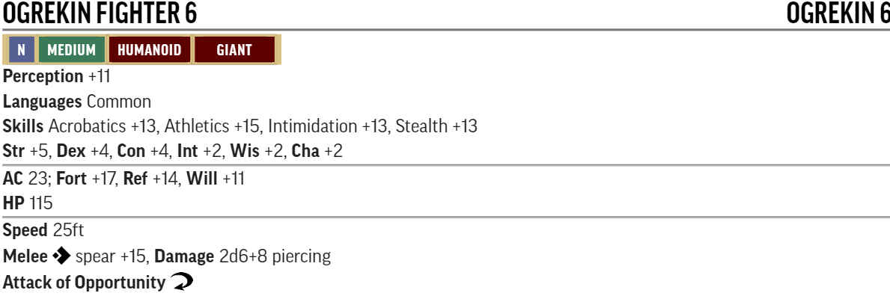
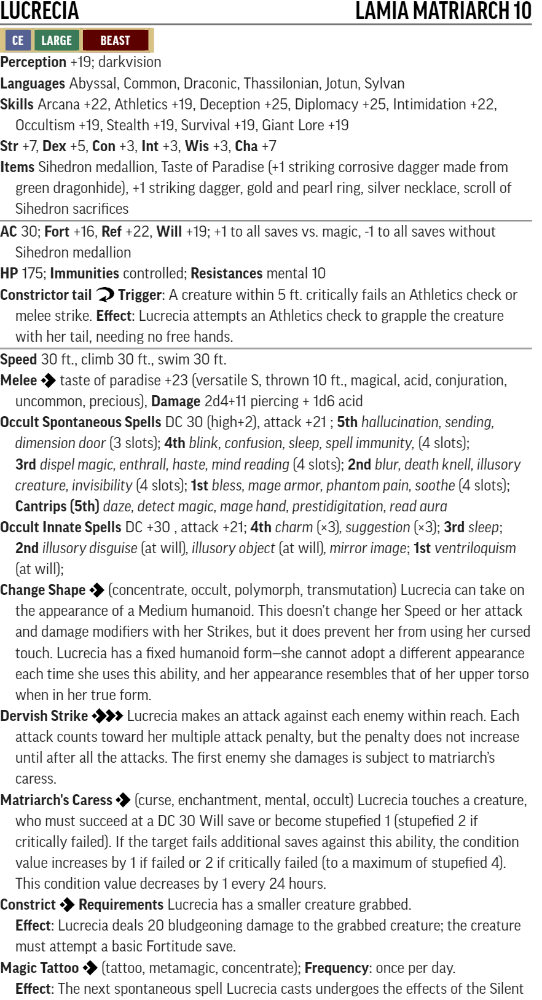

# Hook Mountain Massacre : level 7-10

## Conversion Guide for Pathfinder Second Edition (2E)

- This conversion guide only covers the items that have changed in 2E. This includes NPCs and monsters, hazards, DCs, XP, level based treasure, and occassionally tactics.
- The plot, back story, color text, maps, floor plans, images and tactics requires the original scenario.
- Creatures, hazards, items, poisons, adjustments, etc. that exist in second edition are linked to the relevant entry in [Archives of Nethys - second edition](https://2e.aonprd.com/)].
- New creatures are built using [Monster Builder](http://monster.pf2.tools/) and their JSON, PDF and PNG files are in a consolidated sub directory so that you can use or update them for your own campaign as required. In many instances there are several variants available. Note their unique numerical suffixes assigned by monster builder are removed to save updating this document every time the creature is tweaked.
- If you find an issue, error or omission, have a suggestion for improvement, or a better version of something, then create a pull request. This is a community project and we welcome and rely on community contributions.

### Index
  
Part | Title | XP | Target XP
-----|-------|----|----
0 | Turtleback Ferry     | 150      | -
1 | In The Hook's Shadow | 750      | 800
2 | Retaking Rannick     | 1060/750 | 1200 and eliminate level differneces
3 | Down Comes the Rain  | 590      | 600
4 | The Haunted Heart    | 90       | 150
5 | Harrowing the Hook   | 470      | 500

### TO DO
  - Increase book XP to over 3000.
    - Increase Rukus to Level 9
  - Treasure allocation - review and confirm treasure, then final clean up.

### Party Level and Target Allocation of Treasure

- Lvl 7: Party should be close to 8th level at start of the book 
- Lvl 8: After first encounter with the Grauls
- Lvl 9: Midway through Fort Rannick
- Lvl 10: Near end of Skull's Crossing

Level | Total gp | Permanent Items         | Consumables                        | Cash    | Part
------|----------|-------------------------|------------------------------------|---------|-----
  7   | 2,900gp  | **8th:** 2 **7th:** 2   | **8th:** 2 **7th:** 2 **6th:** 2   |   720gp | At start
  8   | 4,000gp  | **9th:** 2 **8th:** 2   | **9th:** 2 **8th:** 2 **7th:** 2   | 1,000gp | 1
  9   | 5,700gp  | **10th:** 2 **9th:** 2  | **10th:** 2 **9th:** 2 **8th:** 2	| 1,400gp | 2
  10  | 8,000gp  | **11th:** 2 **10th:** 2 | **11th:** 2 **10th:** 2 **9th:** 2 | 2,000gp | 3  

[Full Level to Wealth Chart](http://2e.aonprd.com/Rules.aspx?ID=581)

### General Notes and Advice

Apply (double) [Weak](http://2e.aonprd.com/Rules.aspx?ID=791) or (double) [Elite](http://2e.aonprd.com/Rules.aspx?ID=790) templates as appropriate to suit the capabilities of your party. 
If they are finding it hard going then liberally apply weak templates. 
If they are breezing through then liberally apply elite templates. 

## Part 0: Turtleback ferry (XP 150, Party Level 7)

These investigations and encounters could happen at any point during the book.  

### Paradise and Lucrecia (30xp story award)

  - For following up on the story of the Paradise to get further information on Lucrecia and what the Paradise was doing, and for noticing the sihedron tattoos.

### Wreck of the Paradise (XP 80, Moderate Threat, +40xp story award)

  - **Creatures**
    - [Giant Snapping Turtle](https://2e.aonprd.com/Monsters.aspx?ID=837)
    - If the party are higher than level 7 when they investigate the paradise then apply the Elite or double Elite template accordingly

  - **Encounter Notes:**   
    - The paradise sank near the edge of the territory of a giant snapping turtle and anyone in a craft 20ft long or smaller or anyone entering the water will draw its hostile attention in a few minutes at most
    - Killing a giant snapping turtle will make the PCs local heroes and improve the attitude of everyone in Turtleback Ferry towards them for the purposes of any social interation checks
    - Turtle meat is a delicacy and there is enough in a gaint turtle to provide a much needed boost to the local economy
    - Turtle shell is a prized hull for local boats
    - Succesfully investigating the wreck of the Paradise provides some clues and a story award of 40xp

## Part 1: In The Hook's Shadow (XP 760, Party Level 7/8)

For ogrekin, custom creatures have been created, based on ogre templates.

For Traps near fit Hazards have been used. Note the traps are unlikely to be a significant hazard on their own, but if they trigger other encounters, or happen during an encounter they are more serious.

Encounters include scaling for level 8 parties.

### The Strange Firepelt (XP 60, low threat)
 - **Creatures:** 
    - [Kibb PDF](./NPC-Monsters-Statblocks/Kibb.pdf)  
  
    - Kibb is obviously intelligent and unnaturally friendly towards any rescuers, and for example provides flanking bonuses. 
    - 5x [Graul Hounds - Riding Dogs](http://2e.aonprd.com/Monsters.aspx?ID=125)
    - Note the level of the dogs is too low to be a challenge to the PCs - it is an interesting dilemma for them to fight and kill relatively harmless doggies
    - [Rukus Graul PDF](./NPC-Monsters-Statblocks/rukus_graul.pdf)  

  
    - Level 8 adjustment: apply the Elite template

 - **Loot:** +1 striking corrosive spear, Dragon Breath Potion (young red)

### The Graul Farm (XP 80, moderate threat)
  - **Creatures:** 
    - [Crowfood Graul PDF](./NPC-Monsters-Statblocks/CrowfoodGraul.pdf)  

  
    - Level 8 adjustment: apply the Elite template

  - **Loot:** +1 striking ogre hook, +1 Resilient Armor, Greater Smokestick
  
### A1. Farmhouse Porch (XP 10, trivial threat)
  - **Hazards:**
    - [Door Spear Launcher](https://2e.aonprd.com/Hazards.aspx?ID=4)
    - [Floor Saw - Scythe Blades](https://2e.aonprd.com/Hazards.aspx?ID=6)

### A2. Family Room (XP 10, trivial threat)
  - **Hazards:**
    - [Pit Trap](https://2e.aonprd.com/Hazards.aspx?ID=1). Anyone falling in sets off the inbuilt [Spear Launcher](https://2e.aonprd.com/Hazards.aspx?ID=4)

### A3. Dining Room (XP 10, trivial threat)
  - **Hazards:**
    - 3x [Coiled rope single Scythe Blade](https://2e.aonprd.com/Hazards.aspx?ID=6)
  
### A4. Kitchen (trivial threat)
  - **Hazards:**
    - Sickening Smell applies each round spent in the kitchen: DC 26 Fortitude save or become sickened 1 (sickened 2 on a crit fail). This condition cannot be cleared whilst in the kitchen. Unless a critical success is achieved this effect must be saved against each round. 
    
### A5. Playpen (XP 60, low threat)
  - **Creatures:** 
    - Lucky and Maulgro Graul - [Ogrekin Fighters PDF](./NPC-Monsters-Statblocks/ogrekin_fighter.pdf)
    - Level 8 adjustment: apply the Elite template

  

  - **Loot:** Jade Ring worth 79 gp

### A6. Rukus's Room
  - **Loot:** none

### A8. Mammy's Room (XP 130, severe threat)
  - **Creatures:** 
    - Benk, Hadge, and Kunkel [Ogrekin Zombie Brutes](https://2e.aonprd.com/Monsters.aspx?ID=425)
    - [Mammy Graul PDF](./NPC-Monsters-Statblocks/MammyGraul.pdf)

  

  - **Encounter Notes:**   
    - Consider applying the weak template if this encounter will be too strong for your PCs
    - Party level 7: Mammy is a severe level threat by herself and the zombies should just be level 2 distractions as above
    - Party level 8: Raise the Zombies to level 4 using the [double Elite template](http://2e.aonprd.com/Rules.aspx?ID=790)

  - **Loot:** Lesser Healing Potion, Wand of Globe of Invulnerability, Spell Book worth 79 gp, Material Component Pouch worth 3 gp, Gold Holy Symbol of Lamashtu worth 79 gp

### A9. Bedroom (XP 10, trivial threat)
  - **Hazards:**
    - [Hand Chopper - single Scythe Blade](https://2e.aonprd.com/Hazards.aspx?ID=6). Anyone injured by the blade also has to save vs [Ogre Spider Venom](https://2e.aonprd.com/Monsters.aspx?ID=814)
    
  - **Loot:** The Hand Chopper itself is worth 66 gp to a buyer interested in the macabre. There are various coins worth 16 gp in the Hand Chopper. 
  
### A10. Attic
  - **Loot:** none

### A12. Hucker's Lair (XP 90, moderate threat)
  - **Creatures:** 
    - 2x [Weak : -15HP, -2 to AC and most rolls](http://2e.aonprd.com/Rules.aspx?ID=791): medium sized Dire Wolves [Chuckles and Drooler / Donkey Rats](https://2e.aonprd.com/Monsters.aspx?ID=416)
    - Note in PF1 these were scaled up Dire Rats. In PF2 they are scaled down Dire Wolves.
    - [Hucker Graul PDF](./NPC-Monsters-Statblocks/HuckerGraul.pdf)

  - **Encounter Notes:**
    - Party level 7: Hucker is a moderate challenge by himself. The Donkey Rats should be a level 2 distraction as above with the weak template.
    - Party level 8: Apply the [Elite template](http://2e.aonprd.com/Rules.aspx?ID=790) (instead of the weak template) to the Donkey Rats. 
  - **Loot:** Grasping Snare, Bomb Snare, Biting Snare, Tin of Noses worth 3 gp, Various Coins worth 62 gp, +1 Striking Ogre Hook, Caltrops

### A14. Tendriculous Lair (XP 40, trivial threat)

  - **Creatures:** 
    - [Elite : +20 HP, +2 to AC and most rolls](http://2e.aonprd.com/Rules.aspx?ID=790): [Muck Graul - Awakened Tree](https://2e.aonprd.com/Monsters.aspx?ID=28)

  - **Encounter Notes:**
    - Can become a severe threat if combined with Hucker and the Donkey Rats
    - Party level 8: Apply the [double Elite template](http://2e.aonprd.com/Rules.aspx?ID=790) 

  - **Loot:** none

### A15. The Graul Fortune

  - **Loot:** Gold Ring worth 13 gp, Emerald Necklace worth 93 gp, Engraved Clasp worth 60 gp, various coins worth 68 gp, weapons and equipment belonging to the Black Arrows. 

### A16. Kennel (XP 90, moderate threat)

  - **Creatures:** 
    - Hograth, Jeppo, and Sugar Graul - [Ogrekin Fighters PDF](./NPC-Monsters-Statblocks/ogrekin_fighter.pdf)
    - Party level 8: add an additional ogrekin fighter

  - **Loot:** Moonshine worth 3 gp to anyone who's into that kind of thing.

### A17. Biggin (XP 60, low threat with terrain advantage, +80xp for rescuing the black arrows)

  - **Creatures:** 
    - [Double Elite : +40 HP, +4 to AC and most rolls](http://2e.aonprd.com/Rules.aspx?ID=790): [Ogre Spider](https://2e.aonprd.com/Monsters.aspx?ID=814)
  - **Captive Black Arrows:**
    - [Jakardros Savark PDF](./NPC-Monsters-Statblocks/Jakardros.pdf)
    - [Vale Temross PDF](./NPC-Monsters-Statblocks/ValeTemros.pdf) 
    - [Kaven Windstrike PDF](./NPC-Monsters-Statblocks/KavenWindstrike.pdf)
  - **Loot:** (Kaven) Greater Coyote Cloak, +1 Striking Rapier, +1 Dagger

### Ending the ogrekin menace (XP 80)

  - award story xp of 80 for succesfuly ending the ogrekin threat (either killing mammy graul, or over half the total ogrekin)

### Exposing the traitor (XP 30)

  - if the PCs expose the traitor in any part of this book then award 30xp

## Part 2: Retaking Rannick (XP 1060/750, Party Level 8-9)

Note these are mostly lower threat individual encounters, but there is a high likelihood of two or more combining in this setting. Usually the most threatening thing they can do is yell for assistance. Also note large creatures hit very hard so crits are especially dangerous. Be wary of increasing their level. If you have an inexperienced or gung-ho players, or a sub-optimal PC mix, then scale back the use of elite templates. To up the challenge level you just need to make it more likely encounters will combine.

### Standard Ogre conversions (throughout rest of book 3):

To make ogres XP relevant to both level 8 and level 9 parties the following replacement standard ogres are used in PF2

PF1 Monster  | PF1 CR | PF2 Monster Base | PF2 Adjustment | PF2 Level | XP (party level 8/9)
-------------|--------|------------------|----------------|-----------|----------------------
Ogre         | 3      | [Ogre Warrior](https://2e.aonprd.com/Monsters.aspx?ID=317)     | Double [Elite](http://2e.aonprd.com/Rules.aspx?ID=790)   | 5 | 15/10
Ogre Fighter | 8      | [Ogre Boss](https://2e.aonprd.com/Monsters.aspx?ID=319)        | [Elite](http://2e.aonprd.com/Rules.aspx?ID=790)          | 8 | 40/30

These adjusted creatures are simply referred to as Ogre Warrior* and Ogre Boss* throughout the rest of this book.

    

    

The other unique ogres are covered individually below.

### B2. East Gate (XP 15/10, trivial threat)
  - **Creatures:** 
    - Ogre Warrior*

### B4. Old Guard Post (XP 70/50, low threat)
  - **Creatures:** 
    - Ogre Boss*
    - 2x Ogre Warriors*
- **Loot:** +1 Ogre Hook

### B6. Cookhouse (XP 40/30, trivial threat)
  - **Creatures:** 
    - Ogre Boss*
    - **Loot:** +1 Ogre Hook

### B7. Drainage Ditch
  - **Hazards:**
    - Using diseased entryway - save vs Filth Fever as if bitten by a [Giant Rat](https://2e.aonprd.com/Monsters.aspx?ID=346).  

### B8. South Gate (XP 55/40, low/trivial threat)
  - **Creatures:** 
    - Ogre Boss*
    - Ogre Warrior*
    - **Loot:** +1 Ogre Hook

### B12. Barracks (XP 180/120 extreme/severe threat)
  - **Creatures:** 
    - 12x Sleeping Ogre Warriors*

### B13. Secret Armory (XP20, trivial threat)
  - **Creatures:** 
    - 2x [Elite](http://2e.aonprd.com/Rules.aspx?ID=790): [Shocker Lizard](https://2e.aonprd.com/Monsters.aspx?ID=802)
    
    - **Loot:** 2 Storm Arrows, Various mundane weapons

### B14. Ravine (XP 10, trivial threat)
  - **Hazards:**
    - [Collapsing Bridge - treat as Treacherous Scree](https://2e.aonprd.com/Hazards.aspx?ID=36). 
    
### B15 Crypt (XP 30/20, trivial threat)
  - **Creatures:**
    - Lorgus Fenker [Specter](https://2e.aonprd.com/Monsters.aspx?ID=812)
    - Note that the Spectral Corruption ability has the **incapacitation** trait and as the Specter is lower level than the party the critical failure result wont occur on any PCs, though may affect any accompanying black arrows or Shalelu. 

    - if an alternative encounter if preferred use the [Confounding Betrayal haunt](https://2e.aonprd.com/Hazards.aspx?ID=45) as Lorgus' spirit feels betrayed by the black arrows, suspicion of the betrayal to help end the haunt is in the papers in the commanders quarters 
    
### B18. Workroom (XP 40/30, trivial threat)
  - **Creatures:**
    - Ogre Boss*
    - **Loot:** +1 Ogre Hook

### B19. Armory (XP 30/20, trivial threat)
  - **Creatures:** 
    - 2x Ogre Warrior*
    
### B23. Library (XP 40/30, trivial threat)
  - **Creatures:**
    - Ogre Boss*
    - **Loot:** +1 Ogre Hook
    
### B24. Barracks (XP 60/40, low/trivial threat)
  - **Creatures:**
    - 4x Ogre Warriors*

### B29. Chapel (XP 80/60, moderate/low threat)
  - **Creatures:**
    - [Jaagrath Kreeg PDF](./NPC-Monsters-Statblocks/jaagrath_kreeg.pdf)

  
  - **Encounter Notes:**
    - B29 and B30 are likely to run together and become a severe to extreme threat.
- **Loot:** +2 Striking Ogre Hook, Rhino Hide Armor, Iron Medallion

### B30. Commanders Quarters (120/90, severe/moderate threat)
  - **Creatures:**
    - Ogre Boss*
    - [Dorella Kreeg PDF](./NPC-Monsters-Statblocks/dorella_kreeg.pdf)

  

  - **Encounter Notes:**
    - B29 and B30 are likely to run together and become a severe to extreme threat.

- **Loot:** Boots of Elvenkind, Love letters, nymph hair, silver locket in a jewelry box worth a total of 32 gp
- **Loot:** (Dorella) Greater Mistform Elixir, 
- **Loot:** (Ogre Boss) +1 Ogre Hook

### B31. Tribunal (XP 30/20, trivial threat)
  - **Creatures:**
    - 2x Ogre Warriors*

### B32. Map Room
- **Loot:** Map of Riddleport (5 gp), Map of Viperwall (42 gp), Map of Lurkwood (74 gp) 

### B36. Lucrecia's Retreat (XP 120/80, severe/moderate threat)

  - **Creatures:**
    - [Lucrecia PDF](./NPC-Monsters-Statblocks/Lucrecia.pdf)

  

  - **Encounter Notes:**
    - note the threat level may rise due to unexpected assistance...
  - **Loot:** Candle of Truth, Standard Potion of Flying, Sihedron Medalion, Taste of Paradise (+2 Striking Returning dagger), Rings, Pearls, and other Jewelry worth 53 GP, Scroll Sihedron Sacrifices

### B37. Lizard Warrens (XP 120/80, moderate/low threat)
  - **Creatures:** 
    - 12x [Elite](http://2e.aonprd.com/Rules.aspx?ID=790): [Shocker Lizard](https://2e.aonprd.com/Monsters.aspx?ID=802)

### Liberating Fort Rannick (XP 120)
  - for succesfully liberating Fort Rannick from ogre control award 120xp.

## Part 3: Down Comes the Rain (XP 590, Party Level 9)

### Saving the Schoolchildren (XP 30, trivial threat, +30xp story award)
  - **Creatures:** 
    - 1x [Giant Anaconda](https://2e.aonprd.com/Monsters.aspx?ID=382)
  - **Encounter Notes:**    
    - For saving the children award an additional 30xp, and gain the gratitude of their parents - which improves the attitude of everyone in Turtleback Ferry towards them for the purposes of any social interation checks

### Black Magga Rises (XP 160, beyond extreme temporary threat)

  - **Creatures:**
    - [Black Magga PDF](./NPC-Monsters-Statblocks/black_magga.pdf)

  

  - **Encounter Notes:**    
     - Make a note if any PCs name is spoken in earshot of Black Magga. She will remember this and use Dream Message later to taunt them.
     - XP is awarded for the bravery of enagaging with Black Magga and defending the church / driving her off
     - This improves the attitude of everyone in Turtleback Ferry towards them for the purposes of any social interation checks

### C4. Gorger and Chaw’s Lair (XP 40, trivial threat, terrain makes it more challenging)

  - **Creatures:**
    - [Double Elite](http://2e.aonprd.com/Rules.aspx?ID=790): [Ettin](https://2e.aonprd.com/Monsters.aspx?ID=204)
  - **Loot:** Hat of Disguise, Greater Hat of the Magi, Serum of Sex Shift, Jade Scroll Case (worth 32 gp) containing a Scroll of Shadow Walk and a Scroll of Illusory Scene, coins worth 85 gp, pearls worth 64 gp, 

### C6. Ogre Demolition Crew (XP 70, moderate threat with severe terrain)

  - **Creatures:**
    - 1x Ogre Boss*
    - 4x Ogre Warriors*
  - **Encounter Notes:**
    - The terrain makes this low threat encounter potentially extremely dangerous. Being thrown off a dam could be life changing.

### C7. Battlefield (XP 60, low to moderate threat)

  - **Creatures:**
    - 4x [Elite](http://2e.aonprd.com/Rules.aspx?ID=790): [Trolls](https://2e.aonprd.com/Monsters.aspx?ID=395)
    
### C9.
  - ** Loot:** Cracked Emerald worth 42 GP, Gold Comb worth 85 GP

### C13. Observation Deck (XP 80, moderate threat)

  - **Creatures:**
    - [Grazuul PDF](./NPC-Monsters-Statblocks/grazuul.pdf)

  - **Encounter Notes:**   
    - Grazuul is underwater when vistors arrive and he uses aquatic ambush to launch his attack
    - He is likely to have partial cover for most of this encounter.
    - Grazuul also has terrain advantage which adds to the challenge level of this encounter (included in XP reward) 
  - **Loot:** +1 Returning Trident

### C15. Floodgate Controls (XP 40, trivial threat)

  - **Creatures:**
    - [Skull Ripper PDF](./NPC-Monsters-Statblocks/skull_ripper.pdf)

  

### C16. Infernal Engines (XP 60)
  - Recall Knowledge - Fiend (Religion): DC 40 to identify the creature
  - award XP for figuring out how to open the floodgates, regardless of their negotiations with Avaxial
  - Infernal Engine: [Curse, Death]
    - The magical circle drains the life force of the creature within the circle to power the floodgate. Though the magic has waned over the millennia, it still requires a DC29 fortitude save or the creature within becomes drained 1 and sickened 1, or has its sickened and drained values increased by 1. The sickened value cannot be reduced below the drained value while afflicted with this curse. If the creature critically fails this save, the drained value gained from this failed save does not reduce by 1 with rest as it would normally, and must be magically restored. 
    - Avaxial is currently drained 16 and sickened 16; and will say and do almost anything to end his suffering.

## Part 4: The Haunted Heart (XP 90, Party Level 9/10)

### A Desperate Plea (XP 30 story reward for following Yap or following concerns over the commander)

  - **Creatures:**
	    - For Faerie Yap use a [Double Elite](http://2e.aonprd.com/Rules.aspx?ID=790): [Lyrakien](https://2e.aonprd.com/Monsters.aspx?ID=34)
	- **Loot:** Yap will provide two doses of Dust of Disappearance. 

### Mysterious Derelict    
	- **Loot:** Musical Score worth 321 GP

### Heart of Sadness (XP 60 for permanently laying her to rest)

  - **Creatures:**
    - Recall Knowledge - Fey (Nature): DC 25 to identify a Naiad Queen
    - Recall Knowledge - Spirit (Occultism) or Undead (Religion): DC 27 to identify the Ghostly nature of her

    [Myriana PDF](./NPC-Monsters-Statblocks/myriana.pdf)

  

## Part 5: Harrowing the Hook (XP 470, Party Level 10)

  - Note that many of the encounters are lower threat, but with a very alert guard, several encounters will run together. The total XP of encounters in the clanhold is around 350 - which is a well beyond extreme encounter and a TPK - if the party dont find a way to break it into smaller chunks.

### Valley of Broken Trees (40xp, trivial threat)

  - **Creatures:**
  - [Razmus PDF](./NPC-Monsters-Statblocks/razmus.pdf)
  
  
  - The same XP is awarded for whatever way they deal with Razmus - whether he ends up as a temporary ally or they defeat him

### D1 Entrance (40xp, trivial threat)

  - **Creatures:**
    - 2x Ogre Boss*
  - **Loot:** 2x +1 Ogre Hook
    
### D2 Bones of the Behenoth
  - Recall Knowledge - Dragon (Arcana): DC 40 to identify the bones
  
### D3 The Rune-Bound King
  - **Loot:** Giant Armor worth 317 GP

### D5 Chokepoint (60xp, low threat)

  - **Creatures:**
    - 2x Ogre Boss*
    - [Elite](http://2e.aonprd.com/Rules.aspx?ID=790): [Hill Giant](https://2e.aonprd.com/Monsters.aspx?ID=220)
  - **Loot:** 2x +1 Ogre Hook

### D6 The Clanhold (70xp, low threat)

  - **Creatures:**
    - Ogre Boss*
    - 10x Ogre Warriors*
- **Loot:** +1 Ogre Hook

### D7 Circle of the Sisters (60xp, low threat)

  - **Creatures:**
    - 3x [Elite](http://2e.aonprd.com/Rules.aspx?ID=790): [Annis Hags](https://2e.aonprd.com/Monsters.aspx?ID=256)
  - **Encounter Notes:**  
    - The [Coven](https://2e.aonprd.com/MonsterAbilities.aspx?ID=11) ability gives these 3 hags the Elite template and several other abilities that you need to be aware of.
  - **Loot:** Explorer's Hut

### D8 Abandoned Shrine (40xp, trivial threat)
  - **Creatures:**
    - Either use the standard Grave Knight which is closer to the PF1 Lamatar or use the Betrayed Revivification Grave Knight which is closer to the backstory for Lamatar. 
    - [Betrayed Revivification Grave Knight](https://2e.aonprd.com/Monsters.aspx?ID=244). Replace cold with mental throughout. Devastating Blast (mental) has a Will save instead of Reflex.
  - **Loot:** +2 Resilient Full Plate, Greater Clandestine Cloak

### D9 As the Dread Kings of Old (80xp, moderate threat, +80xp story award)

  - **Creatures:**
    - [Stone Giant](https://2e.aonprd.com/Monsters.aspx?ID=221)

    - [Barl Breakbones PDF](./NPC-Monsters-Statblocks/barl_breakbones.pdf)

  
  
  - **Loot:** Various Gems and Coins worth 590 GP, Mummified Bat Talisman, Greater Bestial Mutagen, Greater Cognitive Mutagen, Greater Antiplague Elixir
  - **Loot:** (Barl) Sihedron Medalion, +2 Resilient Armor, Spellbook, Black Onyx Gems, +1 Ogre Hook
  - **XP** Returning the black arrows equipment gains 80xp 

# --- End of Hook Mountain Massacre 2E Conversion Guide ---
