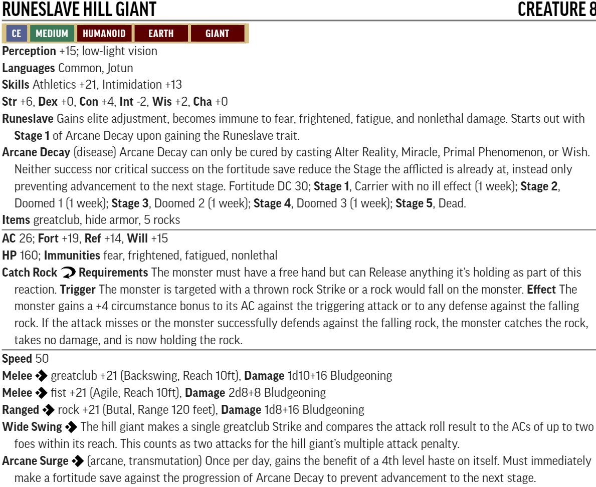

# RotR Fortress of the Stone Giants

## Conversion Guide for Pathfinder Second Edition (2E)

- This conversion guide covers the items that have changed in 2E. This includes NPCs and monsters, hazards, DCs, XP, level based treasure, and occassionally tactics.
- The plot, back story, color text, maps, floor plans, images and most tactics requires the original scenario.
- Creatures, hazards, items, poisons, adjustments, etc. that exist in second edition are usually linked to the relevant entry in [Archives of Nethys - second edition](https://2e.aonprd.com/)].
- New creatures are built using [Monster Builder](http://monster.pf2.tools/) and their JSON, PDF and PNG files are in a consolidated sub directory so that you can use or update them for your own campaign as required. In many instances there are several variants available. Note their unique numerical suffixes assigned by monster builder are removed to save updating this document every time the creature is tweaked.
- If you find an issue, error or omission, have a suggestion for improvement, or a better version of something, then create a pull request. This is a community project and we welcome and rely on community contributions.

### Index and XP distribution
  
Part | Title | Max XP 
-----|-------|----
0 | A | 1

- The encounters presented here assume medium advancement of 1000 XP per level, as that is the challenge level that the community contributions have been for. 
- XP is allocated, and encounters adjusted, to match the original AP levelling guidelines at medium advancement. There is a small contingency added such that a few encounters can be missed and the levelling guidelines met. 
- However the original AP was designed with a fast advancement assumption. Therefore the encounters herein are designed so that you can remove minions or apply weak templates to make them easier and follow fast advancement of 800 XP per level if preferred.
- Encounters use the 1E Challenge Rating (CR) as their basis. Creature levels are usually the same as CR or 1 or 2 higher. Relatively low CRs tend to need to be raised more to work in 2E.

### TO DO
  - everything

### Party Level and Target Allocation of Treasure

[Full Level to Wealth Chart](http://2e.aonprd.com/Rules.aspx?ID=581)

### General Encounter Advice

Apply (double) [Weak](http://2e.aonprd.com/Rules.aspx?ID=791) or (double) [Elite](http://2e.aonprd.com/Rules.aspx?ID=790) templates as appropriate, or add/remove minions, to suit the capabilities and size of your party.  
If they are finding it hard going then liberally apply weak templates or remove minions.  
If they are breezing through then liberally apply elite templates or add minions. 
Usually it is more interesting to have several low to moderate threat creatures in the encounter rather than a single severe one.

 - **Creatures:** 
    - [Runeslave Hill Giant PDF](./NPC-Monsters-Statblocks/RuneslaveHillGiant.pdf)  
    

# --- End of RotR Fortress of the Stone Giants 2E Conversion Guide ---
