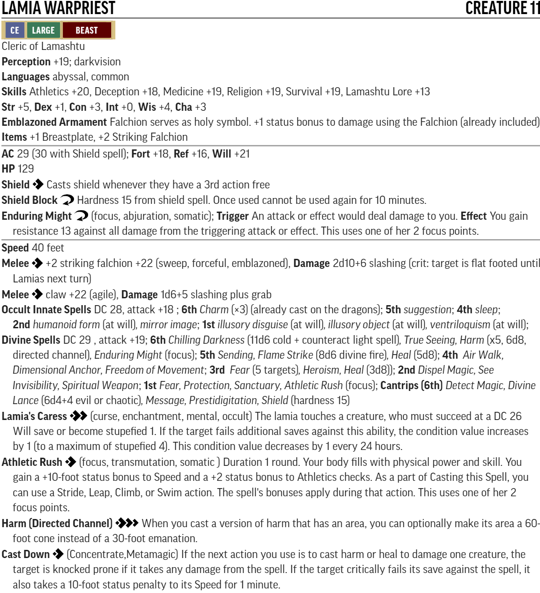

# RotR Fortress of the Stone Giants (levels 10-13)

## Conversion Guide for Pathfinder Second Edition (2E)

- This conversion guide covers the items that have changed in 2E. This includes NPCs and monsters, hazards, DCs, XP, level-based treasure, and some tactics.
- The plot, back story, color text, maps, floor plans, images and most tactics requires the original scenario.
- Creatures, hazards, items, poisons, adjustments, etc. that exist in second edition are usually linked to the relevant entry in [Archives of Nethys - second edition](https://2e.aonprd.com/).
- New creatures are built using [Monster Builder](http://monster.pf2.tools/) and their JSON, PDF and PNG files are in a sub-directory so that you can use or update them for your own campaign as required. In some instances there are variants available. Note their unique numerical suffixes assigned by monster builder are removed to save updating this document every time the creature is tweaked.
- If you have any feedback, find an issue, error, or omission, have a suggestion for improvement, or a better version of something, then comment on the discor server or create a pull request. This is a community project, and we welcome and rely on community contributions.

## General GM information

  - Many encounters in this book use standard creatures, sometimes with an elite template, which are easy to generate without guidance. Where that is the case, then location and encounter notes concentrate on the none-creature aspects.
  - There are many encounters where multiple much lower-level creatures are used in 1E. To ensure these stay relevant in 2E, these should be dynamically adjusted so they are no lower than the 4 levels below the party level. Apply elite templates as required. 
  - DCs are not converted to 2E, except where they are contained within a creature or hazard statblock, or are particularly significant. This is left up to GM discretion.
  - This is a fan created unofficial guide, and what it contains is therefore a series of suggestions, that you can take, modify, or leave as you see fit.
 
## Party Levelling Milestones

- Level 11: The PCs should reach 11th level during, or just after, the attack on Sandpoint.
- Level 12: The PCs should reach 12th level by the time they’re infiltrating the interior of Jorgenfist.
- Level 13: The PCs should be 13th level as they finish exploring the pit and caverns below Jorgenfist.
- Level 14: The PCs should be close to (but not quite) 14th level at the conclusion of this chapter.

Target for this book is therefore around 2400 level adjusted XP 
 
## Index and XP distribution
  
Title | Max XP 
------|-------
Raid on Sandpoint | 500
Journey to Jorgenfist | 320+
Valley of the Black Tower | 845/690
Jorgenfist | 600
Library | 440

- XP is allocated, and encounters adjusted, to match the original AP levelling guidelines at fast advancement. 
- Encounters use the 1E Challenge Rating (CR) as their basis. Creature levels are usually the same as CR or 1 or 2 higher. Low CR minions  need to be raised more to work in 2E.
- Isolated encounters are generally higher threat ratings. Encounters that could run together are generally lower threat ratings. 

## TO DO
  - redo Harpy Monk at party level
  - treasure by level

## Target Allocation of Treasure

[Full Level to Wealth Chart](http://2e.aonprd.com/Rules.aspx?ID=581)

Level | Total gp | Permanent Items         | Consumables                        | Cash    | Part
------|----------|-------------------------|------------------------------------|---------|-----
  11  | 11,500gp | **12th:** 2 **11th:** 2 | **12th:** 2 **11th:** 2 **10th:** 2| 2,800gp | 1
  12  | 16,500gp | **13th:** 2 **12th:** 2 | **13th:** 2 **12th:** 2 **11th:** 2| 4,000gp | 2
  13  | 25,000gp | **14th:** 2 **13th:** 2 | **14th:** 2 **13th:** 2 **12th:** 2| 6,000gp | 3  

## General Encounter Advice

- Apply [Weak](http://2e.aonprd.com/Rules.aspx?ID=791) or [Elite](http://2e.aonprd.com/Rules.aspx?ID=790) templates as appropriate, or add/remove minions, to suit the capabilities and size of your party.
- Usually, it is more interesting to have several low to moderate threat creatures in the encounter rather than a single severe one.

## Part 1: Raid on Sandpoint (xp 385+115 story award, party level 10)

  - If your party is level 11 before this encounter there is no need to change anything here.
  - if your group go straight to Jorgenfist instead of returning to Sandpoint, then consider moving the raid to after Jorgenfist, where they can discover there is a raiding party on the way to Sandpoint.  

  - **Creatures:** 
    - [Stone Giants](https://2e.aonprd.com/Monsters.aspx?ID=221)
    - [Elite](https://2e.aonprd.com/Rules.aspx?ID=790) [Cave Bears](https://2e.aonprd.com/Monsters.aspx?ID=48)
    - [Elite](https://2e.aonprd.com/Rules.aspx?ID=790) [Young red dragon](https://2e.aonprd.com/Monsters.aspx?ID=136). Choose either the frenzy/momentum or the spellcasting option to personal preference.
    - [Teraktinus PDF](./Statblocks/Teraktinus.pdf)  
    - 
    
    A level 12 version of Teraktinus can be found [here](https://monster.pf2.tools/v/zfzmhMbR-teraktinus). This changes the encounter from moderate to severe for level 10 characters, or from low to moderate for level 11 characters.
  - **Notes:**
    - The six encounters are spread out with ratings from low to moderate only.
    - The giants tactics make the rout slightly easier (e.g. the rest run away when one in that group dies).
    - It is unlikely in 2E that they can defeat the majority of encounters without rest between them. However it may be possible to force a rout.
    - 2E scaling means that the guard and the militia are totally ineffective against level+6/7 creatures.
    - The PCs will have to pick their fights very carefully.
    - The most notable and effective thing they could do with preparation is set traps.
    - Each giant that isn't blocked likely gets away with 3 prisoners. Plan ahead to include at least one person they know in the prisoners, to make it more keenly felt. 
    - If you don't want the Storval Stairs encounter bypassed (which is a common occurrence noted by 1E GMs), then it is useful to have captives mention the Storval Stairs, perhaps as a fallback location, or that they already mark the edge of the territory of the Giants, or that Mokmurian put great emphasis on defending the statues there, or some such. Also Brodert might mention the huge ancient statues and that he would like to see them someday. Plus the longer range travel spells such as wind walk or teleport are higher level and less available in 2E.

  - **Story Awards:**
    - For routing the attack award total XP as if all creatures had been defeated, 385xp and a hero point.
    - If Longtooth was prevented from burning down half the town award bonus 80xp and a hero point
    - For getting useful information from captives award 35xp

## Part 2: Journey to Jorgenfist (party level 11, xp 320)

  - Note it is common for PCs to use travel magic to bypass these encounters. If they do then award xp appropriately.

### Ogre Cattle Rustlers (xp 60, low threat)
 - **Creatures:** 
   - 4 Kreeg Boss (level 8) - see Book 3 Kreeg Boss from Fort Rannick
   - There is one Kreeg Boss per PC

### Storval Stairs (xp 80, moderate threat)
  - Note that this encounter seems to be the one most often bypassed. Be prepared to move this encounter somewhere else. Or highlight this location in some other way, as above. Others have moved this encounter to Skulls Crossing in Book 3 if the party have cleared out the ogres and returned later.
  - **Creatures:** 
    - 8 [Hill Giants](https://2e.aonprd.com/Monsters.aspx?ID=220)

### Iron Peak Foot Patrol (xp 60, low threat)
  - **Creatures:** 
    - 2 [Stone Giants](https://2e.aonprd.com/Monsters.aspx?ID=221)
    - 3 [Elite](https://2e.aonprd.com/Rules.aspx?ID=790) [Cave Bears](https://2e.aonprd.com/Monsters.aspx?ID=48)

### Iron Peak Mounted Patrol (xp 60, low threat)
  - **Creatures:** 
    - 2x [Stone giant](https://2e.aonprd.com/Monsters.aspx?ID=221)
    - 2x [Mammoth](https://2e.aonprd.com/Monsters.aspx?ID=202)

### Other encounters (xp 60+)
  - **Creatures:** 
    - Add isolated encounters to get them ready for Jorgenfist as required
    - GMs choice - suggestion: Rocs similar to those at A13 or Wyverns as per A3

## Part 3: Valley of the Black Tower (xp 845/690, party level 11/12)

  - As the party could approach the encounters in the second half of this book in any order, then be prepared to dynamically adjust the encounters upwards with elite templates or extra creatures to maintain threat levels.  
  - Note the scale on the map is NOT 5ft to the square on the Jorgenfist above ground and below ground maps. Many a GM has fallen foul of that small detail!
  - It is common for PCs to secretly scout using flying, invisibility, etc. and then approach through the rear caves.

### A1 (xp 90/100, moderate threat)
  - **Creatures:** 
    - [Taiga Giant](https://2e.aonprd.com/Monsters.aspx?ID=680)
    - 2x [Runeslave Hill Giant](./Statblocks/RuneslaveHillGiant.pdf)  
    - 
    
    - Level 12: Add Elite to the Taiga Giant, and there are 4 Runeslave Hill Giants

### A2
  - Optional: either let PCs bypass the encounters somehow, or use the Infiltration rules from the Gamemastery Guide. An example Infiltration is given here: 
    - [Jorgenfist Infiltration optional subsystem](./Statblocks/Jorgenfist_Infiltration_withSecretTunnel.pdf)
  - Consider giving story XP if the PCs overcome this challenge.

### A3 (xp 90 including terrain advantage, moderate to sever threat)
  - **Creatures:** 
    - 3 [Black Wyvern](./Statblocks/BlackWyvern.pdf)  
    - 
    - Level 11: Add Weak

  - **Treasure**
    - [Staff of Heaven and Earth PDF](./Statblocks/StaffofHeavenAndEarth.pdf)  
    - 

### A4 (xp 120, severe threat)
  - **Creatures:** 
    - 3x [Deathweb Spiders](./Statblocks/DeathwebSpider.pdf)
    - 
    - Level 12: There are 4 Deathweb spiders
    - As this guards the rear entrance this is meant to be a hard though isolated encounter - also the layout lends itself to area attacks

### A5 (xp 60/40 or 120/80, low or severe threat)
  - **Creatures:** 
    - [Elite](https://2e.aonprd.com/Rules.aspx?ID=790) [Young red dragon](https://2e.aonprd.com/Monsters.aspx?ID=136).
    - As this is an isolated encounter consider adding a second dragon (brother/sister) or a kobold servant (as per Enga Keckvia)

### A6 (xp 30, trivial threat)
  - **Creatures:** 
    - 3x [Harpy Monk PDF](./Statblocks/Harpy%20Monk.pdf)
    - 
    Level 12: Add Elite
    - Conversion note: as Harpy song has the incapacitation trait, that makes these level-4 encounters even more trivial, consider redoing this encounter as 1 or 2 harpy monks of party level.
    - These will not join in with other combats but guard the tower - convinced of their own capabilities

### A7 (xp 60/40, low threat)
  - **Creatures:** 
    - 1x per each of 4 towers: [Stone giant](https://2e.aonprd.com/Monsters.aspx?ID=221)
    
### A8 (xp 45/30, trivial threat)
  - **Creatures:** 
    - 1x [Stone giant](https://2e.aonprd.com/Monsters.aspx?ID=221)
    - 1x [Mammoth](https://2e.aonprd.com/Monsters.aspx?ID=202)
    
### A10 (xp 90/60, moderate threat)
  - **Creatures:** 
    - 3x [Mammoth](https://2e.aonprd.com/Monsters.aspx?ID=202)

### A11 (xp 40/30, trivial threat)
  - **Creatures:** 
    - [Embers PDF](./Statblocks/Embers.pdf)
    - 
    
### A12 (xp 40/30, trivial threat)
  - **Creatures:** 
    - 2x [Frost giant](https://2e.aonprd.com/Monsters.aspx?ID=222)
    - These giants will leave well alone and only join in the fight if forced to

### A13 (xp 60/40, low threat)
  - **Creatures:** 
    - 2x [Elite](https://2e.aonprd.com/Rules.aspx?ID=790) [Roc](https://2e.aonprd.com/Monsters.aspx?ID=352)

### A14 (xp 120/80, severe threat)
  - **Creatures:** 
    - [The Black Monk PDF](./Statblocks/TheBlackMonk.pdf)
    - 

## Part 4: Under Jorgenfist (party level 12, xp 600)

Note: in this part and the next one there are a lot of Trivial encounters. In Pathfinder 1 they would cause attrition to the party, in PF2 the party really doesn't need to spend a lot of resources to overcome each encounter, as lower level creatures are not much of a threat. Don't be afraid to combine these encounters so that they become more challenging.

### B1 (xp 40, Trivial)
  - **Creatures:** 
    - 2x Dire bear guard (use the Weak template on Embers above)

### B2 (xp 40, but see B6)
  - **Creatures:** 
    - [Conna PDF](./Statblocks/Conna.pdf)
    - 

### B3 (xp 40, Trivial)
  - **Creatures:** 
    - [Galenmir](./Statblocks/Galenmir.pdf)
    - 
    
### B4 (xp 40, Trivial)
  - **Creatures:** 
    - 4x [Stone giant](https://2e.aonprd.com/Monsters.aspx?ID=221)
    
### B5 (xp 10, Trivial)
  - **Creatures:** 
    - 1x [Grumelda](https://2e.aonprd.com/Monsters.aspx?ID=221)

### B6 (xp 40, Trivial)
  - **Creatures:** 
    - [Flayed Giant haunt PDF](./Statblocks/flayed_giant-1612708369.pdf)
    - 
  - Give the PCs xp for both the haunt (40) and for Conna (40) if they secure an alliance with her.

### B7a (xp 40, Trivial)
  - **Creatures:** 
    - [Enga PDF](./Statblocks/EngaKeckvia.pdf)
    - 

### B7b (xp 80/120, moderate/severe)
  - **Creatures:** 
    - 4-6 [Redcap Assassin PDF](./Statblocks/RedcapAssassin.pdf)
    - 
    - As this is an isolated encounter the PCs should be able to handle a severe encounter of 6. If not reduce the number of redcaps to 4. 
    - As they have strike and fade tactics you dont even need to decide how many there are immediately.

### B8 (xp 30, Trivial)
  - **Creatures:** 
    - 3x Kreeg Boss (level 8) as per Fort Rannick

### B9 (xp 20, Trivial)
  - **Creatures:** 
    - 2x [Stone giant](https://2e.aonprd.com/Monsters.aspx?ID=221)
  - Each prisoner whom the PCs rescue and whose safe return home they ensure gives xp as a story reward.

### B10 (xp 40, Trivial)
  - **Creatures:** 
    - 4x [Stone giant](https://2e.aonprd.com/Monsters.aspx?ID=221)

### B11 (xp 30, Trivial)
  - **Creatures:** 
    - [Lokansir](./Statblocks/Lokansir.pdf)  
    -  

### B12 (xp 40, Trivial)
  - **Creatures:** 
    - 2x [Young red dragon](https://2e.aonprd.com/Monsters.aspx?ID=136)

### B13 (xp 60, Low)
  - **Creatures:**
    - [Lamia Warpriest PDF](./Statblocks/LamiaWarpriest.pdf)  
    -   
  - **Tactics:**
    - The sisters trash talk each other during combat
    - Before combat: If the Lamias have warning and time to prepare they cast True Seeing, Freedom of Movement, Heroism, Air Walk, Protection and Mirror Image as they see fit. 
    - During Combat: They use their superior mobility to make best use of their abilities.
    They cast chilling darkness on any PC carrying a light source (note this likely auto counteracts any everburning torches (DC18) and has a chance of turning all their magical lights off, regardless of whether the ray hits).
    If they can get more than one PC in a channel, directed channel or flame strike then they do that (regardless of whether that affects their sister or allies).  
    If they can attack anyone they assume is a caster they use their caress. 
    Otherwise one of the lamias uses cast down and single target harm, while the other attacks with their falchion. Then they swap. If they have a free action they cast shield. 
    If it looks like they are winning then they cast dimensional anchor to prevent escape. 
    - Morale: as per the book

### B14 (xp 40, Trivial)
  - **Creatures:** 
    - 2 [Troll Kings](https://2e.aonprd.com/Monsters.aspx?ID=396)

## Library (XP assumes party level 13, xp 400 plus completion XP)

### C2 (xp 45, Trivial)
  - **Hazard:**
    - [Chamber of Reduction](./Statblocks/chamber_of_reduction-1613937614.png)
  - **Creatures:** 
    - Elite [Runeslave Hill Giant PDF](./Statblocks/RuneslaveHillGiant.pdf)  
    - 

### C3 (xp 20, Trivial)
  - **Creatures:**
    - [Stone Golem](https://2e.aonprd.com/Monsters.aspx?ID=241)

### C4 (xp 80, moderate threat)
  - **Creatures:** 
    - [Headless Lord](./Statblocks/HeadlessLord.pdf)
    - 
    - 
    - 4x [Zombie Iron Hulk](./Statblocks/ZombieIronHulk.pdf)
    - 

### C5 (xp 15, trivial threat, but usually joins other combats for 2 rounds and then hides)
  - **Creatures:** 
    - [Forgefiend PDF](./Statblocks/forgefiend-1612040837.pdf)
    - 

### C6 (xp 40, Trivial)
- **Creatures:**
    - [Elite](https://2e.aonprd.com/Rules.aspx?ID=790) [Shining Child](https://2e.aonprd.com/Monsters.aspx?ID=367)
    - Note use of elite so that its incapacitation effect works.

### C7 (no combat xp)
  - **Creatures:** 
    - [Clockwork Librarian PDF](./Statblocks/clockwork_librarian-1611601296.pdf)
    - 

### C8 (xp 80, moderate threat)
  - **Creatures:** 
    - 2x [Wolf of Tindalos](./Statblocks/wolf_of_tindalos-1614020765.pdf) 
    - 
    - This statblock doesn't contain the sickened condition
    - Add a third Wolf of Tindalos if you want a severe encounter 

### C9 (xp 120 including terrain advantage, moderate to severe threat, plus completion bonus xp and hero point)
  - **Creatures:** 
    - [Mokmurian PDF](./Statblocks/Mokmuarian-github-v3.pdf)
    - 
    
    - [Fog Cutting Lenses PDF](./Statblocks/FogCuttingLenses.pdf)
    - 

  - Award bonus 40 XP for ending the giant invasion threat 

## - End of RotR Fortress of the Stone Giants 2E Conversion Guide -
