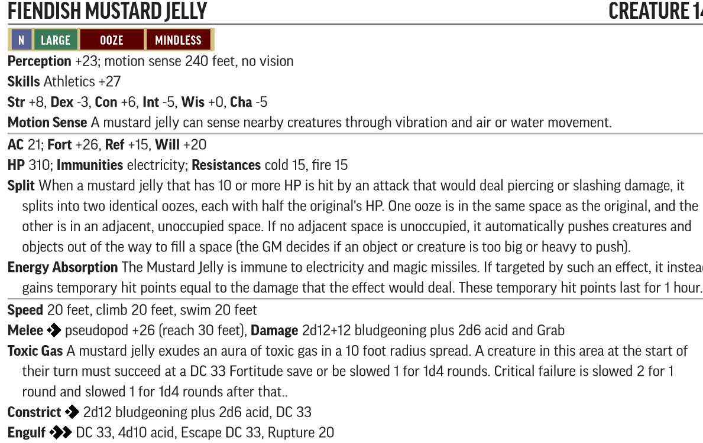
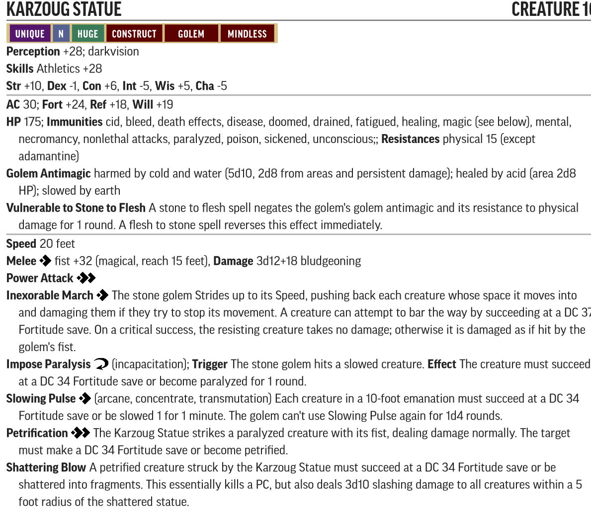

# RotR Sins of the Saviors (levels 13-15)

## Conversion Guide for Pathfinder Second Edition (2E)

- This conversion guide covers the items that have changed in 2E. This includes NPCs and monsters, hazards, DCs, XP, level based treasure, and some tactics.
- The plot, back story, color text, maps, floor plans, images and most tactics requires the original scenario.
- Creatures, hazards, items, poisons, adjustments, etc. that exist in second edition are usually linked to the relevant entry in [Archives of Nethys - second edition](https://2e.aonprd.com/)].
- New creatures are built using [Monster Builder](http://monster.pf2.tools/) and their JSON, PDF and PNG files are in a consolidated sub directory so that you can use or update them for your own campaign as required. In some instances there are several variants available. Note their unique numerical suffixes assigned by monster builder are removed to save updating this document every time the creature is tweaked.
- If you find an issue, error, or omission, have a suggestion for improvement, or a better version of something, then create a pull request. This is a community project, and we welcome and rely on community contributions.

## General GM information

  - Many encounters in this book use standard creatures, sometimes with an elite template, which are easy to generate without guidance. Where that is the case, any location and encounter notes will concentrate on the none-creature aspects.
  - There are encounters where multiple much lower-level creatures are used in 1E. To ensure these stay relevant in 2E, these should be adjusted so they are no lower than the 4 levels below the party level. Apply elite templates as required. 
  - DCs are not converted to 2E, except where they are contained within a creature or hazard statblock, or are particularly significant. This is left up to GM discretion.
  - This is a fan created unofficial guide, and what it contains is therefore a series of suggestions, that you can take, modify, or leave as you see fit.
 
## Party levelling milestones

- Level 13: The PCs should be 13th level when they begin this chapter.
- Level 14: The PCs should reach 14th level after defeating the white dragon Arkrhyst.
- Level 15:  The PCs should reach 15th level by the time they begin exploring the sixth wing of Runeforge (since the exact order in which they explore the wings of this dungeon is fluid, they may hit 15th level earlier if they manage to explore and survive the more dangerous wings of Runeforge earlier than expected).
- Level 15+: The PCs should be well into 15th level by the time they finish this chapter.
 
## Index and XP distribution
  
Title | Max XP 
------|-------
XXX | 500

- XP is allocated, and encounters adjusted, to match the original AP levelling guidelines at fast advancement. 
- Encounters use the 1E Challenge Rating (CR) as their basis. Creature levels are usually the same as CR or 1 or 2 higher. Relatively low CRs tend to need to be raised more to work in 2E.

## TO DO
  - xp & threat rating
  - treasure by level

## Party Level and Target Allocation of Treasure

[Full Level to Wealth Chart](http://2e.aonprd.com/Rules.aspx?ID=581)

## General Encounter Advice

- Apply (double) [Weak](http://2e.aonprd.com/Rules.aspx?ID=791) or (double) [Elite](http://2e.aonprd.com/Rules.aspx?ID=790) templates as appropriate, or add/remove minions, to suit the capabilities and size of your party.  
- If they are finding it hard going then liberally apply weak templates or remove minions.  
- If they are breezing through, then liberally apply elite templates or add minions. 
- Usually, it is more interesting to have several low to moderate threat creatures in the encounter rather than a single severe one.

## Part 1: The Scribbler ( xp)
  
  - **Creatures:** 
    - [The Scribbler PDF](./Statblocks/the_scribbler-1608755911.pdf), by @Primemakes.  
    
    [Fanged falchion PDF](./Statblocks/fanged_falchion-1608756957.pdf), by @Primemakes.
    
    - [Yerrin-ku](https://2e.aonprd.com/Monsters.aspx?ID=101)
    -Consider adding an [Elite Nabasu](https://2e.aonprd.com/Monsters.aspx?ID=600) to the Yerrin-ku encounter for more of a challenge.
    - [Hounds of Lamashtu PDF](./Statblocks/hound_of_lamashtu-1608757137.pdf), by @Primemakes and @Nintendogeek01.
    
    - The Scribbler's suggestion, by @Nintendogeek01:
    
    - Revelation Quill, by @Nintendogeek01:
    **Revelation Quill**: Item 20 [Rare, Artifact, Divination, Magical]
**Usage** held in 1 hand; Bulk L
This quill is fashioned from a peacock's tail feather. Its nib is made of bone, and when held in one's hand, the quill seems strangely heavy. If placed in an empty vial or other glass container of similar size and left there for one hour, a revelation quill fills that container with ink. The ink created is of a random color 50% of the time, otherwise the ink is black. A Revelation Quill can act as a standard writing implement, its true strength lies in its ability to answer questions.
**Activate** 10 minutes (Envision); **Frequency** Once per day; While holding the quill, the user concentrates on a specific future goal, event, or activity occurring within the coming week, the Revelation Quill takes over and writes out a response similar to the way Augury functions except the response can be a short phrase, often in the form of a cryptic rhyme or omen.
**Activate** 10 minutes (Envision); **Frequency** Once per week; Upon activation, the user may use the quill in the same way to ask the mysterious intellect that guides the Revelation Quill up to 10 questions as though the user has rolled a success to cast the Commune Ritual.
**Destruction**: The quill must be tricked into revealing the method of destroying itself without asking it to reveal that method.

## Part 2: Seeking Runeforge ( xp)

- **Creatures:**
  - [Arkhryst](https://2e.aonprd.com/Monsters.aspx?ID=141)
  - Consider adding extra minions to the Arkhryst encounter to make it a severe encounter. @Nintendogeek01 made two Frost Giant rangers called Gunvor and Gunilla, look for it on the discord server.
  - 2x [Elite Elemental Avalanche](https://2e.aonprd.com/Monsters.aspx?ID=186)
  
## Part 3: Runeforge and the Abjurant Halls
 - **Creatures:**
   - Disjunction pulse hazard: Disable Thievery DC 33 (master). The Rod's Counteract Check for the [Disjunction](https://2e.aonprd.com/Spells.aspx?ID=77) effect is DC28.  
   - [Fiendish Mustard Jelly PDF](./Statblocks/fiendish_mustard_jelly-1608758632.pdf) by @Primemakes.
   

## Part 4: The Ravenous Crypts
 - **Creatures:**
   - Replace Wraiths with [Dread Wraiths](https://2e.aonprd.com/Monsters.aspx?ID=865)
   - 6x [Thassilonian Mummy PDF](./Statblocks/thassilonian_mummy-1608758808.pdf)  by @Primemakes.
   
   - Elite [Clay Golem](https://2e.aonprd.com/Monsters.aspx?ID=240)
   - [Nightwing PDF](./Statblocks/nightwing-1608758979.pdf)  by @Primemakes.
   
   - [Xyoddin Xerriock PDF](./Statblocks/xyoddin_xerriock-1608759484.pdf) by @Primemakes.
   
   - [Azaven PDF](./Statblocks/azaven-1608759104.pdf) by @Primemakes.
   
   - [Staff of Hungry Shadows PDF](./Statblocks/staff_of_hungry_shadows-1608759177.pdf) by @Primemakes.
   
   Negative Energy Portal 
   Necromantic Deathtrap 
   
 ## Part 5: The Vault of Greed
  - **Creatures:**
     - Crushing Door Trap 
    - Morphic Mist 
    - Wind Dispersion, counteract DC38 with wind generating effect to disperse mist for 1d4 rounds
    - Replace Water Mephits with [Double Elite](http://2e.aonprd.com/Rules.aspx?ID=790): [Qatoids](https://2e.aonprd.com/Monsters.aspx?ID=198)
    - [Stone Golem](https://2e.aonprd.com/Monsters.aspx?ID=241)
    - [Ordikon PDF](./Statblocks/ordikon__the_mithral_mage-1608760000.pdf) by @Primemakes.
    
    - [Staff of Mithral Might PDF](./Statblocks/staff_of_mithral_might-1608760065.pdf) by @Primemakes.
    
    - [Zuzuveg](https://2e.aonprd.com/Monsters.aspx?ID=602)
    
## Part 6: The Iron Cages of Lust
  - **Creatures:**
    - [ERYALLA, LELYRIN, VOIVOD, AND ZEVASHALA PDF](./Statblocks/alu_demon_submissive-1608760344.pdf) by @Primemakes.
    
    - Nelevetu Voan - if stats are needed then use an unequipped [Captain of the Guard](https://2e.aonprd.com/NPCs.aspx?ID=937) 
    - Enslaved stone giants: Elite Stone Giants
    - [Delvahine PDF](./Statblocks/delvahine-1608760521.pdf) by @Primemakes.
    
    - Idea for Sadist's Lash by @Primemakes: +2 wounding whip. 15 feet reach **Activate**: Increase the casting time of an enchantment spell (with range touch) by one action: Strike with the lash, delivering the spell on a successful hit. On a critical success the target is stupified 1.
    - [Shining Children](https://2e.aonprd.com/Monsters.aspx?ID=367)

## Part 7: The Shimmering Veils
  - **Creatures:**
      - For the unique Mirrors of Opposition use the 1E stats and the stats from [Darkside Mirror](https://2e.aonprd.com/Hazards.aspx?ID=28) as guides.
      - [False Vraxerises](./Statblocks/FalseVraxeris.pdf) by @Lawrencealot.
    

      - For False Delvahines use either double elite [Succubus](https://2e.aonprd.com/Monsters.aspx?ID=98) OR double weak Delvahine (see above) depending on what you think your party can handle.
      
 ## Part 8: The Festering Maze
  - **Creatures:**
    - Sobloch [Quasit Improved Familiar](https://2e.aonprd.com/Monsters.aspx?ID=97) 
      - As a familiar the Quasit is only its form and it cannot use strikes or any other special abilities of a Quasit
      - The only ability it retains is Invisibility at will.
      - 75HP, AC 36, Fort +29, Ref +23, Will +27 
      - Perception +23, Acrobatics +23, Stealth +23
      - Empathic link to Jordimandus within 1 mile
      - Abilities: Flier, Darkvision, Fast Movement (fly 40ft), Manual Dexterity, Speech (Thassilonian)

    - [Omox Demon](https://2e.aonprd.com/Monsters.aspx?ID=1112)
    - [Elder Water Elemental](https://2e.aonprd.com/Monsters.aspx?ID=200)
    - [Chernobue](https://2e.aonprd.com/Monsters.aspx?ID=775)
    - [Jordimandus PDF](./Statblocks/jordimandus-1608761094.pdf) by @Primemakes.
    
    - Replace Variant Ochre Jellies with [Tallow Oozes](https://2e.aonprd.com/Monsters.aspx?ID=533)
 
 ## Part 9: The Halls of Wrath
  - **Creatures:**
    - [Iron Archer](https://2e.aonprd.com/Monsters.aspx?ID=242) with a longbow (use melee stats for to hit, wrath arrows)
    - [Warriors of Wrath PDF](./Statblocks/warrior_of_wrath-1608761376.pdf) by @Primemakes.
    
    - Consider replacing some or all of the warriors with [Alchemist of Wrath PDF](./Statblocks/AlchemistofWrath.pdf) by @Lawrencealot.
    
    - [Sinspawn Axemen PDF](./Statblocks/sinspawn_axemen-1608761416.pdf) by @Primemakes.
    
    - [Highlady Athroxis PDF](./Statblocks/highlady_athroxis-1608761466.pdf) by @Primemakes.
    
    -[Glabrezu](https://2e.aonprd.com/Monsters.aspx?ID=101)
    
 ## Part 10: Weapons of Power
  - **Creatures:**
    - [Karzoug Statue PDF](./Statblocks/karzoug_statue-1608761703.pdf) by @Primemakes.
    
    
## - End of RotR Sins of the Saviors 2E Conversion Guide -
