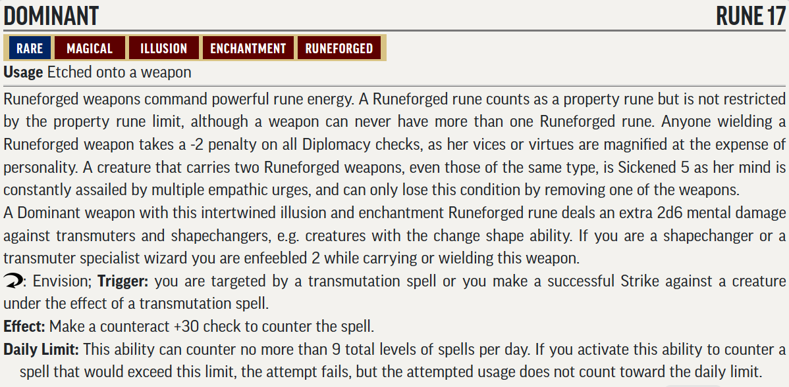

# RotR Sins of the Saviors (levels 13-15)

## Conversion Guide for Pathfinder Second Edition (2E)

- This conversion guide covers the items that have changed in 2E. This includes NPCs and monsters, hazards, DCs, XP, level based treasure, and some tactics.
- The plot, back story, color text, maps, floor plans, images and most tactics requires the original scenario.
- Creatures, hazards, items, poisons, adjustments, etc. that exist in second edition are usually linked to the relevant entry in [Archives of Nethys - second edition](https://2e.aonprd.com/)].
- New creatures are built using [Monster Builder](http://monster.pf2.tools/) and their JSON, PDF and PNG files are in a consolidated sub directory so that you can use or update them for your own campaign as required. In some instances there are several variants available. Note their unique numerical suffixes assigned by monster builder are usually removed to save updating this document every time the creature is tweaked.
- If you find an issue, error, or omission, have a suggestion for improvement, or a better version of something, then create a pull request. This is a community project, and we welcome and rely on community contributions.

## General GM information

  - Many encounters in this book use standard creatures, sometimes with an elite template, which are easy to generate without guidance. 
  - DCs are not converted to 2E, except where they are contained within a creature or hazard statblock, or are particularly significant. This is left up to GM discretion.
  - This is a fan created unofficial guide, and what it contains is therefore a series of suggestions, that you can take, modify, or leave as you see fit.
 
## Party levelling milestones

- Level 13: The PCs should be 13th level when they begin this chapter.
- Level 14: The PCs should reach 14th level after defeating the white dragon Arkrhyst.
- Level 15:  The PCs should reach 15th level by the time they begin exploring the sixth wing of Runeforge (since the exact order in which they explore the wings of this dungeon is fluid, they may hit 15th level earlier if they manage to explore and survive the more dangerous wings of Runeforge earlier than expected).
- Level 15+: The PCs should be well into 15th level by the time they finish this chapter.
 
## Index and XP distribution
  
Part | Title            | Level | Max XP  
-|-|-|-  
1 | The Scribbler       | 13    | 220
2 | Seeking Runeforge   | 13    | 140
3 | Abjurant Halls      | 14/15 | 50/40 
4 | Ravenous Crypts     | 14/15 | 370/220
5 | Vault of Greed      | 14/15 | 260/190 
6 | Iron Cages of Lust  | 14/15 | 220/140
7 | Shimmering Veils    | 14/15 | 220/180 
8 | Festering Maze      | 14/15 | 230/160
9 | Halls of Wrath      | 14/15 | 290/200 
10| Weapons of Power    | 14/15 | 80/60 
  
- XP is allocated, and encounters adjusted, to match the original AP levelling guidelines at fast advancement. 
- Encounters use the 1E Challenge Rating (CR) as their basis. Bosses and single creatures are usually the same as CR or 1 or 2 higher. Minions with low CRs tend to be raised more to work in 2E.

## TO DO
  - treasure by level

## Party Level and Target Allocation of Treasure

[Full Level to Wealth Chart](http://2e.aonprd.com/Rules.aspx?ID=581)

## General Encounter Advice

- Apply [Weak](http://2e.aonprd.com/Rules.aspx?ID=791) or [Elite](http://2e.aonprd.com/Rules.aspx?ID=790) templates as appropriate, or add/remove minions, to suit the capabilities and size of your party.  
- If they are finding it hard going then liberally apply weak templates or remove minions.  
- If they are breezing through, then liberally apply elite templates or add minions. 
- Usually, it is more interesting to have several low to moderate threat creatures in the encounter rather than a single severe one.

## Part 1: The Scribbler (Party Level 13, 220 xp)
  
### The Scribbler (60xp, low threat)
  - [The Scribbler PDF](./Statblocks/the_scribbler-1608755911.pdf), by @Primemakes.  
  - 
  - [Fanged falchion PDF](./Statblocks/fanged_falchion-1608756957.pdf), by @Primemakes.
  - 

### Shrine (40 or 50xp, trivial threat)
  - [Yerrin-ku](https://2e.aonprd.com/Monsters.aspx?ID=101)
  - Consider adding an [Elite Nabasu](https://2e.aonprd.com/Monsters.aspx?ID=600) to the Yerrin-ku encounter for more of a challenge.

### A8 Kennels (60xp, low threat)
  - 6x [Hounds of Lamashtu PDF](./Statblocks/hound_of_lamashtu-1608757137.pdf), by @Primemakes and @Nintendogeek01.
  - 

### A9 Outer Sanctum (60xp, low threat)
  - The Scribbler's suggestion, by @Nintendogeek01:
  - 
  - Revelation Quill, by @Nintendogeek01:
  **Revelation Quill**: Item 20 [Rare, Artifact, Divination, Magical]
  **Usage** held in 1 hand; Bulk L
  This quill is fashioned from a peacock's tail feather. Its nib is made of bone, and when held in one's hand, the quill seems strangely heavy. If placed in an empty vial or other glass container of similar size and left there for one hour, a revelation quill fills that container with ink. The ink created is of a random color 50% of the time, otherwise the ink is black. A Revelation Quill can act as a standard writing implement, its true strength lies in its ability to answer questions.
  **Activate** 10 minutes (Envision); **Frequency** Once per day; While holding the quill, the user concentrates on a specific future goal, event, or activity occurring within the coming week, the Revelation Quill takes over and writes out a response similar to the way Augury functions except the response can be a short phrase, often in the form of a cryptic rhyme or omen.
  **Activate** 10 minutes (Envision); **Frequency** Once per week; Upon activation, the user may use the quill in the same way to ask the mysterious intellect that guides the Revelation Quill up to 10 questions as though the user has rolled a success to cast the Commune Ritual.
  **Destruction**: The quill must be tricked into revealing the method of destroying itself without asking it to reveal that method.

## Part 2: Seeking Runeforge (Party Level 13, 140 xp)

### The Circle (Party level 13, 80xp, moderate threat)
  - [Arkrhyst](https://2e.aonprd.com/Monsters.aspx?ID=141)
  - Consider adding extra minions to the Arkrhyst encounter to make it a severe encounter. @Nintendogeek01 made two Frost Giant rangers called Gunvor and Gunilla, look for it on the discord server.

### The Stairway (Party level 13, 60xp, low threat)  
  - 2x [Elite Elemental Avalanche](https://2e.aonprd.com/Monsters.aspx?ID=186)
  
## Part 3: The Abjurant Halls (Party Level 14/15, 50/40 xp)
 - **Creatures:**
   - Disjunction pulse hazard: Disable Thievery DC 33 (master). The Rod's Counteract Check for the [Disjunction](https://2e.aonprd.com/Spells.aspx?ID=77) effect is DC28.  
   - [Fiendish Mustard Jelly PDF](./Statblocks/fiendish_mustard_jelly-1608758632.pdf) by @Primemakes.
   - [Fiendish Mustard Jelly PNG](./Statblocks/fiendish_mustard_jelly-1608758629.png)

## Part 4: The Ravenous Crypts (Party Level 14/15, 370/220xp)

### Undead Guardians (40/20xp, trivial threat)
 - Replace Wraiths with [Elite Dread Wraiths](https://2e.aonprd.com/Monsters.aspx?ID=865)
 - 1 Wraith per PC
   
### F1 Crypts of the Builders (60/30xp, low/trivial threat)
  - 6x [Elite Thassilonian Mummy PDF](./Statblocks/thassilonian_mummy-1608758808.pdf)  by @Primemakes.
  - 

### F3 The crypt of Lord Mankray (20/10xp, trivial threat)
  - Elite [Clay Golem](https://2e.aonprd.com/Monsters.aspx?ID=240)

### F4 Infusion Chamber (70/50xp, low threat)
  - [Nightwing PDF](./Statblocks/nightwing-1608758979.pdf)  by @Primemakes.
  - 
  
  - Negative Energy Portal
  - 

### F7 Laboratory (30/20xp, trivial threat))
  - [Xyoddin Xerriock PDF](./Statblocks/xyoddin_xerriock-1608759484.pdf) by @Primemakes.
  - 

### F8 Crypt Guardians (60/30xp, low/trivial threat)
  - 6x [Elite Thassilonian Mummy PDF](./Statblocks/thassilonian_mummy-1608758808.pdf)  by @Primemakes.
  - 

### F10 Assembly Room (60/40xp, low/trivial threat)
  - [Azaven PDF](./Statblocks/azaven-1608759104.pdf) by @Primemakes.
  - 
  - [Staff of Hungry Shadows PDF](./Statblocks/staff_of_hungry_shadows-1608759177.pdf) by @Primemakes.
  - 

### F11 (30/20xp, trivial threat)
  - Necromantic Deathtrap
  - 
   

## Part 5: The Vault of Greed (Party Level 14/15, 240/190 xp)

### G1 Pilferer's Bane (40/30xp, trivial threat)
  - Crushing Door Trap
  - 

### G2 Morphic Mist (40/30xp, trivial threat)
  - Morphic Mist
  - 
  - Wind Dispersion, counteract DC38 with wind generating effect to disperse mist for 1d4 rounds

### G3 Trouble with Mephits (20xp, zero threat, roleplaying encounter only)
  - 4 [Water Mephits](https://2e.aonprd.com/Monsters.aspx?ID=195)
  - Award XP for getting information from the Mephits

### G4 Fountains (60/40xp, low/trivial threat)
  - 4 [Stone Golem](https://2e.aonprd.com/Monsters.aspx?ID=241)

### G6 Research Center (40/30xp, trivial threat) 
  - [Ordikon PDF](./Statblocks/ordikon__the_mithral_mage-1608760000.pdf) by @Primemakes.
  - 
  - [Staff of Mithral Might PDF](./Statblocks/staff_of_mithral_might-1608760065.pdf) by @Primemakes.
  - 

### G7 Hall of Golden Repose (40/30xp, trivial threat)  
  - [Zuzuveg](https://2e.aonprd.com/Monsters.aspx?ID=602)

## Part 6: The Iron Cages of Lust (Party Level 14/15, 220/140xp)

### (40/20xp, trivial threat)
  - [ERYALLA, LELYRIN, VOIVOD, AND ZEVASHALA PDF](./Statblocks/alu_demon_submissive-1608760344.pdf) by @Primemakes.
  - 

### H3 (RP encounter)
  - Nelevetu Voan - if stats are needed then use an unequipped [Captain of the Guard](https://2e.aonprd.com/NPCs.aspx?ID=937) 

### H (60/40xp, low/trivial threat)
  - Enslaved [cloud giants](https://2e.aonprd.com/Monsters.aspx?ID=224) 1 per PC

### H (60/40xp, low/trivial threat)   
  - [Delvahine PDF](./Statblocks/delvahine-1608760521.pdf) by @Primemakes.
  - 
  - Idea for Sadist's Lash by @Primemakes: +2 wounding whip. 15 feet reach **Activate**: Increase the casting time of an enchantment spell (with range touch) by one action: Strike with the lash, delivering the spell on a successful hit. On a critical success the target is stupified 1.

### H (60/40xp, low/trivial threat) 
  - 2 (Level 13) [Elite](http://2e.aonprd.com/Rules.aspx?ID=790): [Shining Children](https://2e.aonprd.com/Monsters.aspx?ID=367)
  - Note the incapacitation effect will be one step reduced.

## Part 7: The Shimmering Veils (Party Level 14/15, 220/180 xp)

### I1 Reflected Enmity (60xp, low threat, but potentially multiple times)
  - For the unique Mirrors of Opposition use the 1E stats and the stats from [Darkside Mirror](https://2e.aonprd.com/Hazards.aspx?ID=28) as guides.

### I2 Peacock Shrine (80/60xp, moderate/low threat)
  - The Vraxerises amuse themselves with illusions of objects, scenes, and even imitating other people from runeforge. It is likely one or two of their illusions are active when encountered - adding to the confusion. 
  - [False Vraxerises](./Statblocks/FalseVraxeris.pdf) by @Lawrencealot.
  - 
  - There is 1 Vraxeris per PC.

### I6 Bedroom (80/60xp, moderate/low threat)
  - For False Delvahines use double weak Level 12 Delvahine (see above) and remove the 7th level spells and the magical lash.
  - There is 1 Delvahine per PC.

## Part 8: The Festering Maze (Party Level 14/15, 230/160 xp)

### J1 Sewers
    - Sobloch [Quasit Improved Familiar](https://2e.aonprd.com/Monsters.aspx?ID=97) 
      - As a familiar the Quasit is only its form and it cannot use strikes or any other special abilities of a Quasit
      - The only ability it retains is Invisibility at will.
      - 75HP, AC 36, Fort +29, Ref +23, Will +27 
      - Perception +23, Acrobatics +23, Stealth +23
      - Empathic link to Jordimandus within 1 mile
      - Abilities: Flier, Darkvision, Fast Movement (fly 40ft), Manual Dexterity, Speech (Thassilonian)

### J2 Sluice (70/50xp, low threat)  
  - 2 [Omox Demon](https://2e.aonprd.com/Monsters.aspx?ID=1112)
  - 2 [Elder Water Elemental](https://2e.aonprd.com/Monsters.aspx?ID=200)

### J4 Sump (40/30xp, trivial threat)
  - 2 [Chernobue](https://2e.aonprd.com/Monsters.aspx?ID=775)

### J5 Throne (120/80xp, severe/moderate threat)
  - [Jordimandus PDF](./Statblocks/jordimandus-1608761094.pdf) by @Primemakes.
  - 
  - Replace Variant Ochre Jellies with 1 [Tallow Ooze](https://2e.aonprd.com/Monsters.aspx?ID=533) per PC
 

 ## Part 9: The Halls of Wrath (Party Level 14/15, 290/200 xp)
 
 ### K1 Iron Guardian (30/20xp, trivial threat)
  - [Iron Archer](https://2e.aonprd.com/Monsters.aspx?ID=242) with a longbow (use melee stats for to hit, wrath arrows)

### K3 Barracks (90/60xp, moderate/low threat)
  - The total number of warriors and axemen should equal 50% more than the number of PCs. For a party of 4 that means 6 in total split however you wish.
  - [Warriors of Wrath PDF](./Statblocks/warrior_of_wrath-1608761376.pdf) by @Primemakes.
  -  

  - [Sinspawn Axemen PDF](./Statblocks/sinspawn_axemen-1608761416.pdf) by @Primemakes.
  - 

### K4 Lab (60/40xp, low/trivial threat)
  - There is one warrior per PC.
  - Consider replacing some or all of the warriors with [Alchemist of Wrath PDF](./Statblocks/AlchemistofWrath.pdf) by @Lawrencealot.
   

### K6 Hall (110/80xp, severe/moderate threat)
  - [Highlady Athroxis PDF](./Statblocks/highlady_athroxis-1608761466.pdf) (60/80xp) by @Primemakes.
  -  
  -[Glabrezu](https://2e.aonprd.com/Monsters.aspx?ID=101) (20/30xp)

 ## Part 10: Weapons of Power (Party Level 14/15, 80/60 xp)
  - **Creatures:**
    - [Karzoug Golem PDF](./Statblocks/KarzougGolem.pdf) by @Primemakes.
    - 

- [Dominant Weapon](./Statblocks/DominantWeapon.pdf)
- 
- Designers notes: Discussion of dominant/commanding weapons reasoned that outright countering was not in keeping with other 2E abilities, and that a counteract ability was closest to intent. The current definition borrows from aligned weapons and for the reaction ability from the ring of counterspells and the ring of spell turning. Note that spell DCs of Khalib and Karzoug in book 6 are in the mid 40s so a counteract of 30 is only around a 25% chance of working vs them, though with all PCs having a dominant weapon the odds of one of them working is high. To raise the counteract modifier would require raising the level of the item. Another option considered (of the same level) was an effect based on the foresight spell, effectively allowing 2 saving throws, keep the highest, or 2 targeting rolls, take the lowest.
    
## - End of RotR Sins of the Saviors 2E Conversion Guide -
