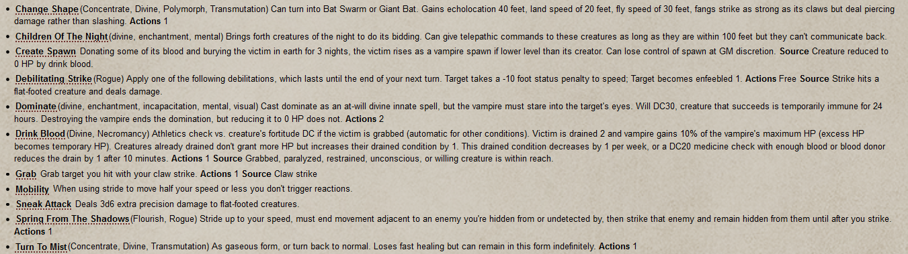

# RotR Spires of Xin-Shalast (levels 15 - 18)

## Conversion Guide for Pathfinder Second Edition (2E)

- This conversion guide covers the items that have changed in 2E. This includes NPCs and monsters, hazards, DCs, XP, level-based treasure, and some tactics.
- The plot, back story, color text, maps, floor plans, images and most tactics requires the original scenario.
- Creatures, hazards, items, poisons, adjustments, etc. that exist in second edition are usually linked to the relevant entry in [Archives of Nethys - second edition](https://2e.aonprd.com/)].
- New creatures are built using [Monster Builder](http://monster.pf2.tools/) and their JSON, PDF and PNG files are in a consolidated sub directory so that you can use or update them for your own campaign as required. In many instances there are several variants available. Note their unique numerical suffixes assigned by monster builder are removed to save updating this document every time the creature is tweaked.
- If you find an issue, error or omission, have a suggestion for improvement, or a better version of something, then create a pull request. This is a community project, and we welcome and rely on community contributions.

## General GM information

  - Many encounters in this book use standard creatures, sometimes with an elite template, which are easy enough to generate without guidance. Where that is the case, then location and encounter notes will concentrate on the none-creature aspects.
  - There are encounters where multiple much lower-level creatures are used in 1E. To ensure these stay relevant in 2E, these should be dynamically adjusted so they are no lower than the 4 levels below the party level. Apply elite templates as required. 
  - DCs are not converted to 2E, except where they are contained within a creature or hazard stat block, or are particularly significant. This is left up to GM discretion.
  - This is a fan created unofficial guide, and what it contains is therefore a series of suggestions, that you can take, modify, or leave as you see fit.
 
## Index and XP distribution
  
Title | Max XP 
------|-------
XXX | 500

- XP is allocated, and encounters adjusted, to match the original AP levelling guidelines at fast advancement. 
- Encounters use the 1E Challenge Rating (CR) as their basis. Creature levels are usually the same as CR or 1 or 2 higher. Relatively low CRs tend to need to be raised more to work in 2E.

## TO DO
  - 7 unique creatures
  - 7 hazards/haunts/traps
  - xp & threat rating & encounter balance
  - treasure by level

## Party Level and Target Allocation of Treasure

[Full Level to Wealth Chart](http://2e.aonprd.com/Rules.aspx?ID=581)

## General Encounter Advice

- Apply [Weak](http://2e.aonprd.com/Rules.aspx?ID=791) or [Elite](http://2e.aonprd.com/Rules.aspx?ID=790) templates as appropriate, or add/remove minions, to suit the capabilities and size of your party.  
- If they are finding it hard going then liberally apply weak templates or remove minions.  
- If they are breezing through, then liberally apply elite templates or add minions. 
- Usually, it is more interesting to have several low to moderate threat creatures in the encounter rather than a single severe one.

## Part 1: Seeking Xin-Shalast (Party Level 15)

## Part 2: WHISPERS IN THE WIND (Party Level 15)

### Vekker's Cabin (??xp)

### The Watcher in the Wastes (??xp)

### B1 The Tailings (xp 40, Trivial)
  - The Horror Tree [Horror Tree PDF](./Statblocks/HorrorTree.pdf)
    - 
    - [Crimson Ooze](https://2e.aonprd.com/Diseases.aspx?ID=14)

### B4 Sack Room
  - Treasure TO DO

### B5 Ore Separation (xp , )
  - Gold Eating Dwarf TO DO

### B6 Ore Shaft (xp , )
  - Haunted Chain TO DO
  - Tipping Stairs TO DO

### B8 Front Porch (xp , )
  - Partially Eaten Dwarf TO DO

### B10 Coatroom 
  - Treasure TO DO

### B13 Strong Room
  - Treasure TO DO

### B14 Living Area (xp , )
  - Cannibal Urgings TO DO

### B15 Larder (xp , )
  - The Hungry Dead TO DO

### Event 1: Cannibal Fury (xp , )
  - Cannibal Fury TO DO

### Event 3: Hungry Ghost (xp 70, moderate)
  - Karivek Vekker [Karivek Vekker PDF](./Statblocks/KarivekVekker.pdf)
    - 
  - [double elite](https://2e.aonprd.com/Rules.aspx?ID=790): [frost worm](https://2e.aonprd.com/Monsters.aspx?ID=677)

### Event 4: The Siege (xp 80, moderate)

  - [Wendigo](https://2e.aonprd.com/Monsters.aspx?ID=409)

## Part 3: On the World's Roof (Party Level 16)

### C Queen of The Icemists (XP 40, Trivial, RP Encounter)

  - Svevenka [Ice Nymph Queen PDF](./Statblocks/Svevenka.pdf)
  - 

### D Sentinels (XP 90, Moderate)

  - Bjormundal [Elite](https://2e.aonprd.com/Rules.aspx?ID=790): [Storm Giant](https://2e.aonprd.com/Monsters.aspx?ID=225)
  - 4x [Elite](https://2e.aonprd.com/Rules.aspx?ID=790): [Cloud Giant](https://2e.aonprd.com/Monsters.aspx?ID=224)

## Part 4: Xin-Shalast (Party Level 16)

### Event 5: Emergence of the Spared

### E Krak Naratha (XP 120, severe)
  - 12 Krak Narath soldiers [Lamia Kin Kuchrecia PDF](./Statblocks/KrakNarathaSoldier.pdf)
  - 
  - For Aurochs use the stats for [Woolly Rhinoceros](https://2e.aonprd.com/Monsters.aspx?ID=789). This is an obstacle rather than  a threat.

### F Golden Road

### G Encampment (XP 0, zero threat, RP encounter)

  - Gyukak [Onidashi](https://2e.aonprd.com/Monsters.aspx?ID=746)

### H Abominable Dome (XP 90, moderate)
  - 6 Abominable Snowman 

### I Lair of the Hidden Beast (xp , )

  - 4 Vampire Skulk 
  - 
  - The Hidden Beast TO DO

### K Heptaric Locus (XP 90, moderate)
  - Gamigin [triple elite](http://2e.aonprd.com/Rules.aspx?ID=790): [Ice Devil](https://2e.aonprd.com/Monsters.aspx?ID=113)
  
  - 2 Scarlet Walker 
  - Scarlet Walker Spells 

### N Hidden Path (XP 40, trivial)
  - Mountain Roper 

### Q Ghlorofaex's Lair (XP 120, severe)

  - Ghlorofaex [Ancient Blue Dragon](https://2e.aonprd.com/Monsters.aspx?ID=132)
  - Choose spellcaster or frenzy/momentum according to taste

## Part 5: Scaling Mhar Massif (Party Level 16)

### Invaders from Leng (xp 90, moderate)

  - 3 [Double Elite](http://2e.aonprd.com/Rules.aspx?ID=790): [Leng Spiders](https://2e.aonprd.com/Monsters.aspx?ID=713)

## Part 6: Pinnacle of Avarice (Party Level 17)

### X1 Entrance Ramp (xp 80, moderate)
  - 4 Wardens of Wind/Thunder [Double Elite](http://2e.aonprd.com/Rules.aspx?ID=790): [Storm Giant](https://2e.aonprd.com/Monsters.aspx?ID=225)

### X2 Kharzoug

### X3 Throne Rooom (xp , )
  - Viorian Dekanti TO DO
  - Wardens of Wind/Thunder [Double Elite](http://2e.aonprd.com/Rules.aspx?ID=790): [Storm Giant](https://2e.aonprd.com/Monsters.aspx?ID=225)

### X4 Lair (xp 30, trivial)
  - Warden of Runes [Rune Giant](https://2e.aonprd.com/Monsters.aspx?ID=226)

### X5 Kin Quarters
  - Treasure TO DO

### X6 Cells (xp 60, moderate)
  - 4 [Lamia Priestess](./Statblocks/lamiaPriestess.pdf)
    - 
    - 

### X7 Den (xp 40, moderate)
  - 2 [Lamia Kin Hungerer](./Statblocks/hungerer.pdf)
    - 

### X8 Prison (xp 30, trivial threat)
  - [Astradaemon](https://2e.aonprd.com/Monsters.aspx?ID=91)

### X9 Chambers 
  - Treasure TO DO

### X10 Door (xp 30, trivial threat, RP potential)
  - Ayruzi [Planetar](https://2e.aonprd.com/Monsters.aspx?ID=544)  

### X11 Doors
  - Aklo Doors [Aklo Doors PDF](./Statblocks/AkloDoors.pdf)
    - 

### X12 The Device (xp 160, Extreme)
  - 12 [Pinnacle of Leng PDF](./Statblocks/PinnacleOfLeng.pdf)
    - 
  - The Thing from Beyond Time TO DO (upscale the Wolf of Tindalos to L17)

### X13 Cells (xp 90, moderate)
  - 3 Wardens of Wind/Thunder [Double Elite](http://2e.aonprd.com/Rules.aspx?ID=790): [Storm Giant](https://2e.aonprd.com/Monsters.aspx?ID=225)
  - Warden of Runes [Rune Giant](https://2e.aonprd.com/Monsters.aspx?ID=226)

### X15 Quarters (xp 40, trivial if encountered here)
  - Khalib L17 TO DO
    - Khalib is likely to join other (non-extreme) combats in the Pinnacle than to be found here

### X16 Reliquary (xp 30, trivial)
  - [Shemhazian Demon](https://2e.aonprd.com/Monsters.aspx?ID=102)

### X17 Chamber of Focus (xp 105, moderate to severe)
  - Most High Ceoptra TO DO
  - 3 Wardens of Wind/Thunder [Double Elite](http://2e.aonprd.com/Rules.aspx?ID=790): [Storm Giant](https://2e.aonprd.com/Monsters.aspx?ID=225)

## Part 7: The Eye of Avarice (Party Level 17)

### The Final Battle (xp 180, Extreme)
  - Karzoug the claimer TO DO (Level 20)
  - [Adult Blue Dragon](https://2e.aonprd.com/Monsters.aspx?ID=131)
  - Warden of Runes [Rune Giant](https://2e.aonprd.com/Monsters.aspx?ID=226)
  - 2 Wardens of Wind/Thunder [Double Elite](http://2e.aonprd.com/Rules.aspx?ID=790): [Storm Giant](https://2e.aonprd.com/Monsters.aspx?ID=225)

## - End of RotR Spires of Xin-Shalast 2E Conversion Guide -