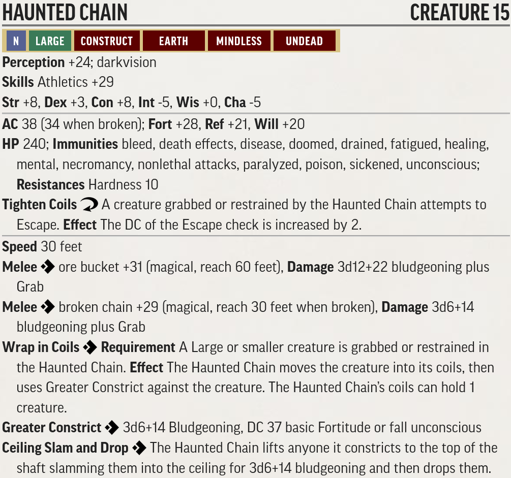
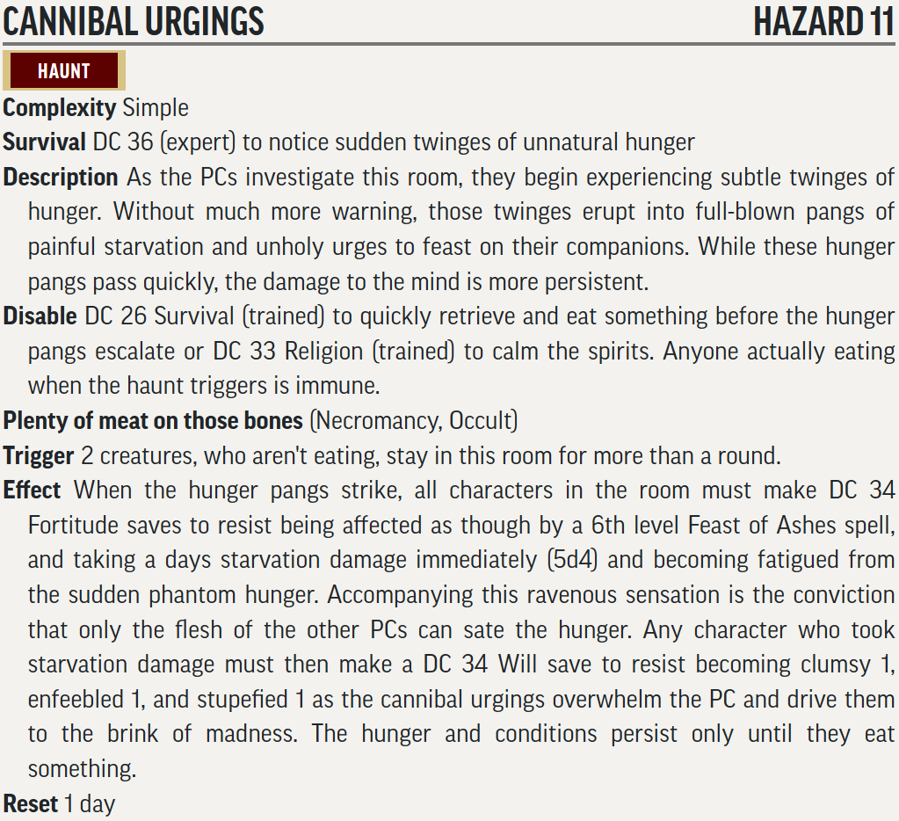
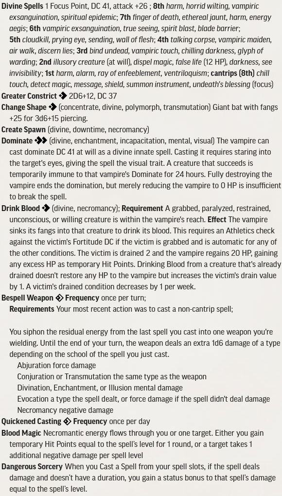
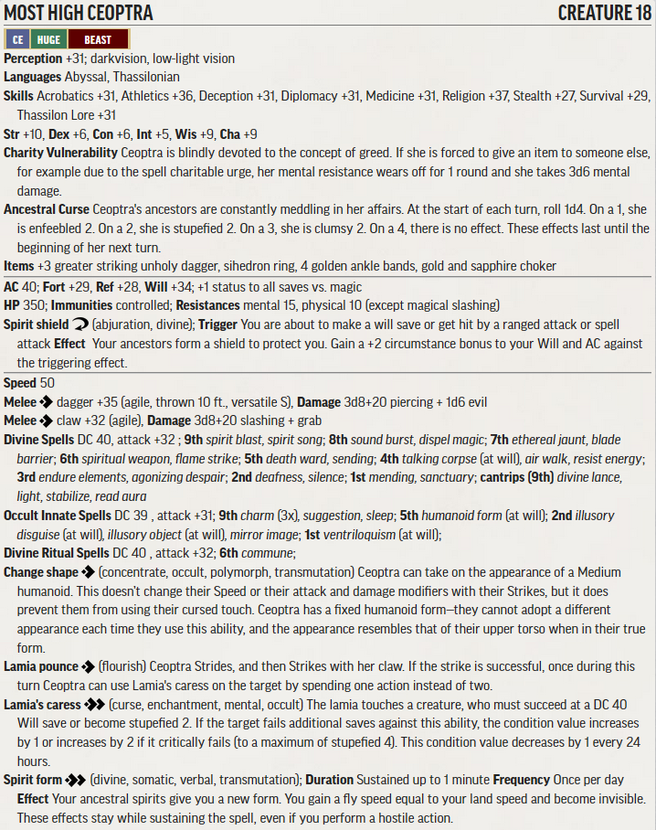
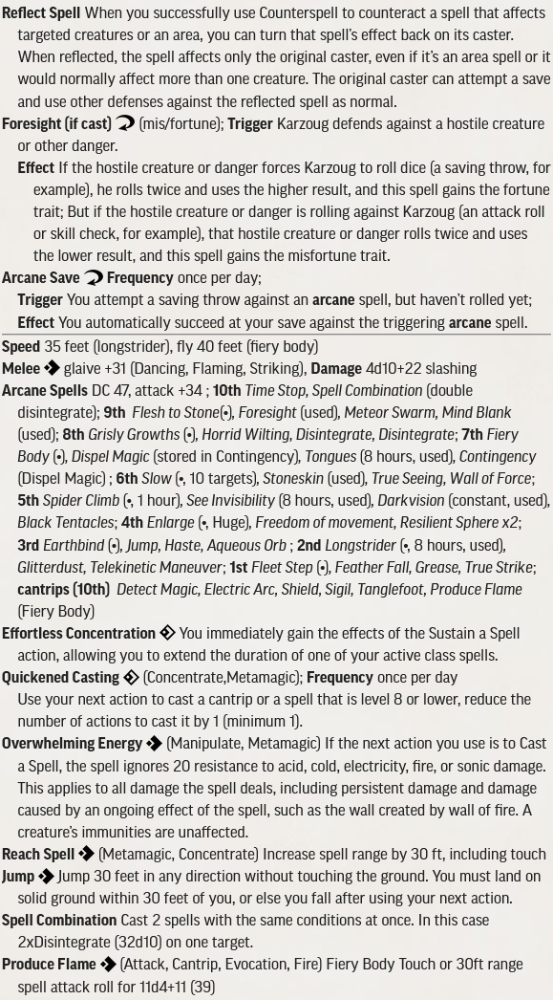

# RotR Spires of Xin-Shalast (levels 15 - 18)

## Conversion Guide for Pathfinder Second Edition (2E)

- This conversion guide covers the items that have changed in 2E. This includes NPCs and monsters, hazards, DCs, XP, level-based treasure, and some tactics.
- The plot, back story, color text, maps, floor plans, images and most tactics requires the original scenario.
- Creatures, hazards, items, poisons, adjustments, etc. that exist in second edition are usually linked to the relevant entry in [Archives of Nethys - second edition](https://2e.aonprd.com/).
- New creatures are built using [Monster Builder](http://monster.pf2.tools/) and their JSON, PDF and PNG files are in a consolidated sub directory so that you can use or update them for your own campaign as required. In some instances there are several variants available. Note their unique numerical suffixes assigned by monster builder are removed to save updating this document every time the creature is updated.
- If you find an issue, error or omission, have a suggestion for improvement, or a better version of something, then create a pull request. This is a community project, and we welcome and rely on community contributions.

## General GM information

  - Many encounters in this book use standard creatures, sometimes with an elite template, which are easy enough to generate without guidance. Where that is the case, then location and encounter notes will concentrate on the none-creature aspects.
  - There are encounters where multiple much lower-level creatures are used in 1E. To ensure these stay relevant in 2E, these should be adjusted so they are no lower than the 4 levels below the party level. Apply elite templates as required.
    - DCs are not converted to 2E, except where they are contained within a creature or hazard stat block, or are particularly significant. This is left up to GM discretion.
  - This is a fan created unofficial guide, and what it contains is therefore a series of suggestions, that you can take, modify, or leave as you see fit.
 
## Index and XP distribution

- XP is allocated, and encounters adjusted, to match the original AP levelling guidelines at fast advancement. 
- Encounters use the 1E Challenge Rating (CR) as their basis. Creature levels are usually the same as CR or 1 or 2 higher, and more for minions. Lower CR creatures need to be raised more to work in 2E.

Part | Title | Level | Max XP 
-|-|-|-
1 | Seeking Xin-Shalast  | 15 | GM Discretion
2 | Whispers In The Wind | 15 | 400
3 | On the World's Roof  | 16 | 160
4 | Xin-Shalast          | 16 | 430
5 | Scaling Mhar Massif  | 16 | 120
6 | Pinnacle of Avarice  | 17 | 900
7 | The Eye of Avarice   | 17 or 18 | 160

## TO DO
  - treasure by level - in progress 

## Party Level and Target Allocation of Treasure

[Full Level to Wealth Chart](http://2e.aonprd.com/Rules.aspx?ID=581)

## General Encounter Advice

- Apply [Weak](http://2e.aonprd.com/Rules.aspx?ID=791) or [Elite](http://2e.aonprd.com/Rules.aspx?ID=790) templates as appropriate, or add/remove minions, to suit the capabilities and size of your party.  
- If they are finding it hard going then liberally apply weak templates or remove minions.  
- If they are breezing through, then liberally apply elite templates or add minions. 
- Usually, it is more interesting to have several low to moderate threat creatures in the encounter rather than a single severe one.

## Part 1: Seeking Xin-Shalast (Party Level 15)

  - GM discretion on wandering monsters

## Part 2: Whispers In The Wind (Party Level 15, xp 400)

### B1 The Tailings (xp 40, Trivial)
  - [Horror Tree](./Statblocks/HorrorTree.pdf)
    - 
    - [Crimson Ooze](https://2e.aonprd.com/Diseases.aspx?ID=14) affects the area damaged.

### B4 Sack Room
  - Treasure TODO

### B5 Ore Separation (xp 10, trivial threat)
  - [Gold Eating Dwarf](./Statblocks/GoldEatingDwarf.pdf)
    - 
    - This haunt is hard to resist though the effects are relatively harmless.

### B6 Ore Shaft (xp 60, low)
  - [Tipping Stairs](./Statblocks/TippingStairs.pdf)
    - 
  - [Haunted Chain](./Statblocks/HauntedChain.pdf)
    - 

### B8 Front Porch (xp 10, trivial)
  - [Partially Eaten Dwarf](./Statblocks/PartiallyEatenDwarf.pdf)
    - 

### B10 Coatroom 
  - Treasure TODO

### B13 Strong Room
  - Treasure TODO

### B14 Living Area (xp 10, trivial)
  - [Cannibal Urgings](./Statblocks/CannibalUrgings.pdf)
    - 

### B15 Larder (xp 30, trivial)
  - [The Hungry Dead](./Statblocks/TheHungryDead.pdf)
    - 

### Event 1: Cannibal Fury (xp 40, trivial)
  - [Cannibal Fury](./Statblocks/CannibalFury.pdf)
    - 
    - 

### Event 3: Hungry Ghost (xp 80, moderate)
  - [Karivek Vekker](./Statblocks/KarivekVekker.pdf)
    - 
  - 2 [elite](https://2e.aonprd.com/Rules.aspx?ID=790): [frost worms](https://2e.aonprd.com/Monsters.aspx?ID=677)

### Event 4: The Siege (xp 60, low)
  - Note the Wendigo Ride the Wind / Wind Walk ability doesnt make sense as described as Wind Walk is ten minute casting time. Decide how you will play this in advance. Perhaps refer to the numerous paizo.com messageboard threads on this... and see if there is errata.
  - [Wendigo](https://2e.aonprd.com/Monsters.aspx?ID=409)

### Vekker Cabin Completion Bonus
  - For laying the haunts to rest award a hero point and bonus 40 XP 

## Part 3: On the World's Roof (Party Level 16, xp 160)

### C. Queen of The Icemists (XP 40, Trivial, RP Encounter)
  - [Svevenka Ice Nymph Queen](./Statblocks/svevenka.pdf)
    - 
    - 
  - xp is awarded for befriending Svevenka

### D. Sentinels (XP 120, Severe)

  - Bjormundal [Elite](https://2e.aonprd.com/Rules.aspx?ID=790): [Storm Giant](https://2e.aonprd.com/Monsters.aspx?ID=225)
  - 5x Wardens of Wind (see below) though no Sihedron Ring

    **Treasure**
    - divide all the book cash values by 2

## Part 4: Xin-Shalast (Party Level 16, xp 430)

### Resources used throughout
  - [Warden of Wind](./Statblocks/WardenOfWind.pdf)
  - 
  - Wardens of Thunder are (L14) [Elite](http://2e.aonprd.com/Rules.aspx?ID=790): [Storm Giant](https://2e.aonprd.com/Monsters.aspx?ID=225) and raise Chain Lightning to 7th level

### Event 5: Emergence of the Spared

### E Krak Naratha (XP 120, severe)
  - 12 [Krak Naratha soldiers](./Statblocks/KrakNarathaSoldier.pdf)
  - 
  - For Aurochs use the stats for [Woolly Rhinoceros](https://2e.aonprd.com/Monsters.aspx?ID=789). This is an obstacle rather than a threat.

### F Golden Road

### G Encampment (XP 0, zero threat, RP encounter)
  - Gyukak [Onidashi](https://2e.aonprd.com/Monsters.aspx?ID=746)

### H Abominable Dome (XP 60, low)
  **Creatures**  
    - 6 Abominable Snowman 
    - Add one Abominable Snowman per PC in the party over 4
  **Treasure**
    - Greater armbands of athleticism (lvl 17 permanent)
    - Divide the cash value of the book items by 2

### I Lair of the Hidden Beast (xp 80, moderate)
  **Creatures**
  
  - 4 Vampire Skulk 
    - 
    - 
    - [The Hidden Beast](./Statblocks/TheHiddenBeast.pdf)
    - 
    -   
    
    - Add one Vampire Skulk per PC in the party over 4
    
  **Treasure**
    - Reward from the skulks:
    - True staff of healing (lvl 16 permanent)
    - Scroll of 9th-level heal (lvl 17 consumable)
    - 2 [Greater Winter wolf elixirs](https://2e.aonprd.com/Equipment.aspx?ID=103) (lvl 16 consumables)

### K Heptaric Locus (XP 60, low)
  - **Creatures**
    - Gamigin [elite](http://2e.aonprd.com/Rules.aspx?ID=790): [Ice Devil](https://2e.aonprd.com/Monsters.aspx?ID=113)
 
    - 4 Scarlet Walker 
    - Scarlet Walker Spells 

  **Treasure**
    - Remove the 8000gp of gems and jewellry
    - Divide the cash value of the coins by 2.
    - +3 greater striking longspear (lvl 16 permanent)

### N Hidden Path (XP 30, trivial)
  - Mountain Roper 

### Q Ghlorofaex's Lair (xp 80, moderate)
  - Ghlorofaex [Ancient Blue Dragon](https://2e.aonprd.com/Monsters.aspx?ID=132)
    - Choose spellcaster or frenzy/momentum according to taste

    **Treasure**
      - [impenetrable scale mail](https://2e.aonprd.com/Equipment.aspx?ID=154) (lvl 17 permanent)
      - scroll of 9th-level heal (lv 17 consumable)
      - 2 [major elixirs of life](https://2e.aonprd.com/Equipment.aspx?ID=91) (lvl 15 consumables)
      - Divide the cash value of the book items by 2

### Xin-Shalast completion bonus
  - For navigating through Xin-Shalast and finding their way up award bonus 80XP and a hero point

## Part 5: Scaling Mhar Massif (Party Level 16, xp 120)

### Invaders from Leng (xp 120, severe)
  **Creatures**
    - 6 [Elite](http://2e.aonprd.com/Rules.aspx?ID=790): [Leng Spiders](https://2e.aonprd.com/Monsters.aspx?ID=713)
  **Treasure**
  -  Each spider has a [Clear Spindle Aeon Stone](https://2e.aonprd.com/Equipment.aspx?ID=407) to traverse the death zone (level 7 permanents)

## Part 6: Pinnacle of Avarice (Party Level 17, xp 900)
  - Be wary of running too many encounters together, or of casting too many area affect spells from groups of identical creatures.
  - Use the politics to your advantage here. While all the leaders (Viorian, Khalib, Ceoptra) are loyal to Karzoug, they each want and expect to be next in line to be the future runelord of greed.

### X1 Entrance Ramp (xp 60, low)
  - There is one warden of wind for each party member

### X2 Karzoug (xp 10 x 6, trivial, RP opportunities)
  - The images provide good opportunities for roleplay and for each side to weigh up the capabilities of their opponents. For example they get to understand the power of Karzoug's spells without major risk and possibly his counterspell / reflect spell ability. Karzoug tries to weigh up who is the greatest threat.
  - each image destroyed is worth 10 xp
  - Karzoug generally only casts through these images if he can help a combat, using spells such as Slow, Wall of Force, Resilient Sphere, Black Tentacles, Earthbind, Aqueous Orb, Telekinetic Maneuver, Grease, Glitterdust (from the staff).
  - Karzoug will however try and counter and potentially reflect any spell he sees being cast.

  - Destroying the images weakens the link between the eye of avarice and xin-shalast and delays Karzoug's return.

### X3 Throne Rooom (xp 90, moderate)
  - [Viorian Dekanti, Champion of Greed](./Statblocks/ViorianDekanti.pdf)
    - 
    - 
  - 2 Wardens of Thunder
  - add a Warden of Thunder for each PC in the party over 4
  - [Chellan, Sword of Greed](./Statblocks/ChellanSwordofGreed.pdf)
  - 

### X4 Lair (xp 30, trivial)
  - Warden of Runes [Rune Giant](https://2e.aonprd.com/Monsters.aspx?ID=226)

### X5 Kin Quarters
  - Treasure TODO

### X6 Cells (xp 60, moderate)
  - 4 [Lamia Priestess](./Statblocks/lamiaPriestess.pdf)
    - 
    - 

### X7 Den (xp 40, moderate)
  - 2 [Lamia Kin Hungerer](./Statblocks/hungerer.pdf)
    - 

### X8 Prison (xp 30, trivial threat)
  - [Astradaemon](https://2e.aonprd.com/Monsters.aspx?ID=91)

### X9 Chambers 
  - Treasure TODO

### X10 Door (xp 30, trivial threat, RP potential)
  - Ayruzi [Planetar](https://2e.aonprd.com/Monsters.aspx?ID=544)  

### X11 Doors (xp 30)
  - [Aklo Doors](./Statblocks/AkloDoors.pdf)
    - 

### X12 The Device (xp 120 + 40 + 40, severe+)
  - 12 [Pinnacle of Leng](./Statblocks/PinnacleOfLeng.pdf)
    - 
  - [The Thing From Beyond Time](./Statblocks/TheThingFromBeyondTime.pdf)
    - 
    - Remember that the Occluding Field stops Angled Entry from working and causes it extreme discomfort and pain.

  - For stopping the completion of the Leng Device award bonus 40 XP and a hero point.

### X13 Cells (xp 100, moderate)
  - 4 Wardens of Wind
  - Warden of Runes [Rune Giant](https://2e.aonprd.com/Monsters.aspx?ID=226)
  - image of Karzoug
  - add another Warden of Wind for each member in the party over 4
  - Khalib is likely to join this combat on round 4 or 5 after prepping

### X15 Quarters (xp 60, low if encountered here)
  - [First Apprentice Khalib](./Statblocks/Khalib.pdf)
    - 
    - 
    - Khalib is likely to join other (less than severe) combats in the Pinnacle rather than be found here
    - If Khalib is encountered alone here, consider adding Wardens to the fight.
    - Khalib is essentialy the practice run for Karzoug - both for the players and for the GM

#### Tactics:
  - Khalib wont go to the assistance of either Viorian or Ceoptra (or they to his).
  - Before combat
    - Khalib casts darkvision, false life, longstrider, see invisibility, tongues, and mind blank on himself every day.
    - Once an alarm is raised, he also casts stoneskin, true seeing, Fiery Body (which can fly) on himself before entering battle.
  - During Combat
    - At the start of combat Khalib casts quickened Slow and Flesh to Stone. On the second round he casts Duplicate Foe (not living so not affected by the occluding field). 
    - Following up with free action sustained Duplicate Foe, and whatever spell he thinks appropriate.
    - He uses (clever) counterspell with reflect spell to target enemy casters.
    - The first attack against him or non-counterspellable effect of each round uses his Foresight reaction.
    - If he has any actions left he casts shield.

### X16 Reliquary (xp 30, trivial)
  - [Shemhazian Demon](https://2e.aonprd.com/Monsters.aspx?ID=102)

### X17 Chamber of Focus (xp 105, severe)
  - [Most High Ceoptra](./Statblocks/MostHighCeoptra.pdf)
  - 
  - 3 Wardens of Wind
  - add a warden of wind for each party member over 4

## Part 7: The Eye of Avarice (Party Level 17, xp 160+)
- This is the epic final battle. Review carefully and balance to your party. Its final makeup should not be over 40XP per PC. Though note with intelligent play the Wardens can change sides.

- Level 18? optionally this can be for level 18 PCs, but you will need to adjust minions accordingly:
  - Replace the Adult blue dragon with an Ancient blue dragon.
  - Remove the WEAK templates from the Rune Giant
  - Add ELITE to the Storm Giants and raise their chain lightnings to 7th level (making them Wardens of Thunder) 
  - For additional PCs add ELITE to the Ancient Blue Dragon and the Rune Giant.

- The layout of this room needs some consideration and potential adjustment: 
  - Consider adjusting the throne to be on a further raised dais and lower the runewell by 20 ft thereby having the entire room on a slope where Karzoug can see down the centre and has line of sight for his spells without getting up.
  - Consider making all the walkways 15ft wide as the dragon and the 3 gaints are all huge
  - The huge dragon has a 60 foot wingspan. If it is to fly consider having all the gold columns stop level with the adjacent walkways, and 40-60ft of free space above them.

### The Final Battle (xp 160-170, Extreme)
  - [Karzoug the Claimer](./Statblocks/Karzoug.pdf)
    - 
    - 
  - [Fulmina - Adult Blue Dragon](https://2e.aonprd.com/Monsters.aspx?ID=131) - consider using the Frenzy/Momentum version as there are quite enough spellcasters here already
  - Warden of Runes WEAK [Teth - Rune Giant](https://2e.aonprd.com/Monsters.aspx?ID=226)
  - 2 normal Storm Giants/weak wardens (Berg and Gil)
  - If there are more than 4 PCs remove the WEAK template from the Rune Giant and add ELITE templates to the Storm Giants and raise their chain lightnings to 7th level (making them Wardens of Thunder). For 6 PCs replace the Adult Blue Dragon with an Ancient Blue Dragon.

#### Tactics:
  - The general tactics are that the Dragon is a distraction, the Rune Giant is a bodyguard to allow Karzoug to keep casting, and the Wardens are ranged support.
  - Before combat
    - Karzoug casts darkvision, longstrider, see invisibility, tongues, and mind blank on himself every day. 
  - ROUND 1: 
    - Karzoug casts time stop and inside that casts Foresight, Stoneskin and Fiery Body (which can fly).
    - The blue dragon begins the fight next to Karzoug’s throne, and flies out toward the PCs to breathe lightning on them, and to position herself to be a wall of dragon. 
    - The rune giant begins between the runewell and the throne. He casts true seeing and then air walks to stay between the PCs and Karzoug as a wall of giant. 
    - A warden of thunder stands atop each of the balconies at area Y2. Each of them casts chain lightning. 
  - ROUND 2: 
    - Karzoug casts quickened Horrid Wilting and Meteor Storm  
    - The blue dragon hinders using physical attacks and breathes lightning if she can.
    - The rune giant defends as Karzoug's bodyguard.
    - The wardens of thunder cast chain lightning again
  - ROUND 3: 
    - Karzoug casts true strike and spell-combination double disintegrate
    - The rune giant continues to protect Karzoug. 
    - The wardens of thunder cast chain lightning again
    - The blue dragon hinders using physical attacks and breathes lightning if she can.
  - REMAINDER OF COMBAT:
    - Karzoug continues casting offensive spells like flesh to stone. He sets his glaive dancing. 
    - The rune giant continues to protect Karzoug. 
    - The blue dragon continues to distract.
    - The wardens of thunder enter melee.
    
  - Morale
    - If the rune giant is killed the Wardens switch sides, and the PCs should be suspecting this might happen by now. 
    - Everyone else fights to the death - unless Karzoug is killed.

    ## - End of RotR Spires of Xin-Shalast 2E Conversion Guide -
