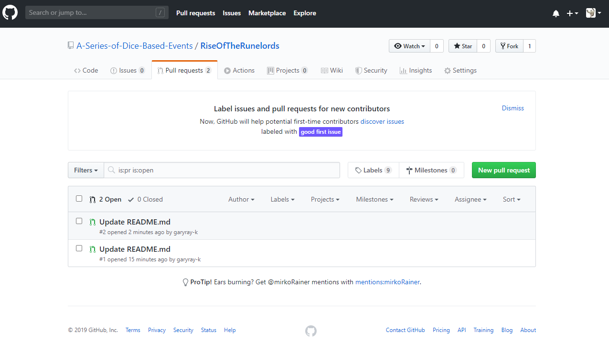

# Rise Of The Runelords

[A Series of Dice-Based Events Discord](https://discord.gg/UQ8UD3H)

A repository to hold tools for those wishing to run and convert RotR to Pathfinder 2E.
The README.md files can have simple breakdowns of modified DCs for various tasks brought up in the Adventure while the individual folders can hold the files for the monster/NPC stat blocks.

* [Book 1: Burnt Offerings](./Book%201)
* [Book 2: The Skinsaw Murders](./Book%202)
* [Book 3: The Hook Mountain Massacre](./Book%203)
* [Book 4: Fortress of the Stone Giants](./Book%204)
* [Book 5: Sins of the Saviors](./Book%205)
* [Book 6: Spires of Xin-Shalast](./Book%206)

## How does this even work?

[What is Github?](https://youtu.be/U1C0F-Au9h4)
On GitHub, you can share text files (usually code) and collaborate with others. The nice thing is that README.md files display as you're browsing the folders of a GitHub Project using [GitHub Markdown](https://guides.github.com/features/mastering-markdown/).
 
### Making Changes

This tutorial should be applicable to any of the AP repositories out there. 
There's an in browser editor that makes it easy to change the files you see and submit a request to chave them permanently changed.
Just click into the file you want to change and select the edit button in the top right.

After changing, there will be a button at the bottom of the browser editor to "Propose file change", feel free to include a message on why it was changed.

After clicking that button, it will show you the changes you've made and have a new button near the top of the page to "Create pull request". 

This sends the changes in to become permanent record in the repository.

Now you can comment on the changes and discuss with others that change before it's solidified.

Members can now approve your changes. 

Once you're added as a member, you can approve changes as well but all the changes are tracked so if we make a mistake, we can refer back to the old version. (just ask @mirkorainer on GitHub or in the [A Series of Dice-Based Events Discord](https://discord.gg/UQ8UD3H))

## Recommended Tool
http://monster.pf2.tools/ uses JSON files (and associated PNG and PDF files) that can be easily imported/exported. This repository holds those files publicly sourced and created, as well as other tools/files.  

Please do not submit PDF files or entire texts, or any images from the AP. Only submit modifications for the DCs and NPCs/Monsters/Hazards plus XP and 2E level based treasure. Please also include a page number/map section label so GMs can cross-reference.
